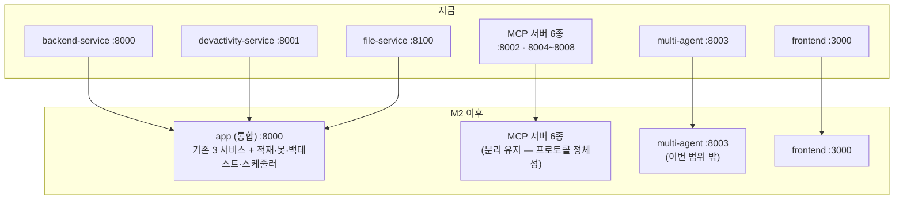
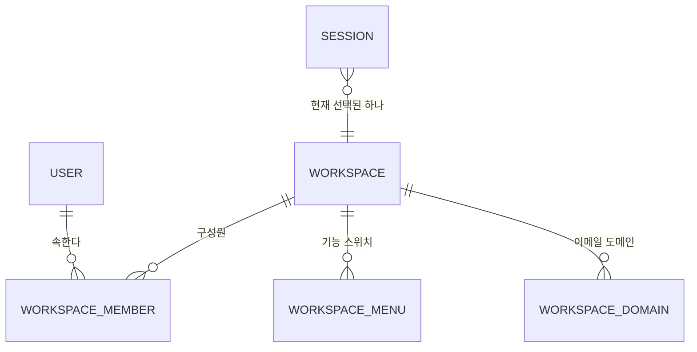
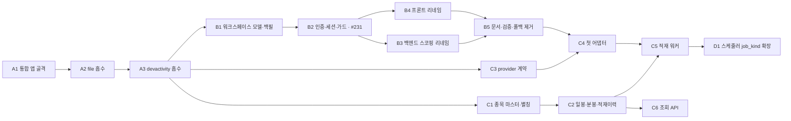

# M2 전환 설계 — 구조를 어떻게 옮기는가

> 이미 서 있는 12개 파이썬 서비스·워크스페이스 기반 멀티테넌시를 **깨뜨리지 않고** 모듈러 모놀리스와 워크스페이스로 옮기는 절차. 무엇을 만들지는 [투자지휘소-개요](투자지휘소-개요.md)·[트레이딩-터미널](트레이딩-터미널.md)·[봇-전략-모델](봇-전략-모델.md)·[시세-데이터-파이프라인](시세-데이터-파이프라인.md) 네 문서가 담고, 이 문서는 **어떻게 옮기는가**만 담는다. 시세 적재의 스키마·어댑터 구현은 [시세적재-구현설계](시세적재-구현설계.md)로 이어진다. 요구사항의 정본은 [PRD](../specs/prd.md), 결정 로그는 [CONTEXT.md](../../CONTEXT.md).

---

## 0. 큰 그림

M2 는 세 가지를 동시에 건드린다 — **프로세스 구조**(파이썬 서비스 12→10), **테넌트 모델**(워크스페이스 단일 FK → 워크스페이스 다대다), **데이터 계층**(시세 적재 신설). 셋을 한 번에 밀면 무엇이 깨졌는지 가릴 수 없으므로, 서로를 막지 않는 지점에서 갈라 순서를 정한다.

**전환의 실익을 정직하게 적는다.** `process-compose` 에 등록된 프로세스는 13개에서 11개로, **2개만** 줄어든다(일회성 `db-migrate` 포함). 진짜 이득은 다른 곳에 있다.

| 이득 | 근거 |
|---|---|
| 새 기능이 새 프로세스를 낳지 않는다 | 적재 워커·봇 엔진·백테스트 러너·스케줄러를 서비스로 만들었다면 프로세스가 4개 더 늘었다 |
| `core/` 3중 복제가 사라진다 | `auth_context.py`·`security.py`·`exception_handler.py` 등이 서비스마다 byte-identical 사본으로 존재하며 lockstep 검증 스크립트로 지탱된다 |
| 서비스 간 HTTP 홉·서비스 토큰이 사라진다 | backend→file 호출이 in-process 가 되어 JWT 발급·검증·네트워크 왕복이 없어진다 |
| 마이그레이션 진입점이 하나가 된다 | `db-migrate` 4단계 → 2단계 |

---

## 1. 무엇이 바뀌고 무엇이 그대로인가

| 축 | 그대로 | 바뀜 |
|---|---|---|
| 레이어 | router → service → repository → schema | — |
| 폴더 모양 | `app/routers/<도메인>/`, `app/services/<도메인>/` … **레이어 우선** | — (§2 참조) |
| 규율 | [anti-patterns-backend.md](../../.claude/docs/anti-patterns-backend.md) 전 룰 (현재 13종) | 룰 5 의 예외 목록에 항목 추가 · 모듈 경계 룰 신설 제안 |
| 네이밍 | `snake_case.py` · 테이블 `tn_` 접두사 · 감사 컬럼 4종 | 대용량 시계열 테이블만 감사 컬럼 예외 |
| 라우트 prefix | kebab-case REST · frontend 프록시와 byte-identical | **흡수 단계에서 변경 금지** |
| 프로세스 | MCP 6종 · multi-agent · frontend · postgres | backend·file·devactivity → 1개 |
| 테넌시 | 3레이어 방어(클라 가드 / API 게이트 / 쿼리 격리) | 이름·관계·세션 필드 |
| DB | 단일 `fintech` · `public`(파이썬) + `frontend`(Prisma) 스키마 분리 | 통합 앱이 `public` 전체를 단독 소유 |

---

## 2. 통합 앱의 폴더·모듈 경계

### 2.1 레이어 우선 폴더를 유지한다

모듈러 모놀리스라고 해서 `modules/<도메인>/{router,service,repository}.py` 형태(수직 슬라이스)로 바꾸지 않는다. 이유는 취향이 아니라 **검출기가 경로에 묶여 있기** 때문이다.

anti-patterns 의 Detection 명령이 전부 `{backend}/app/routers/**/*.py`·`app/services/**/*.py`·`app/repositories/**/*.py` 를 대상으로 한다. 폴더 모양을 바꾸면 13개 룰의 검출이 조용히 0 hit 이 되고, `review-backend`·`scaffold-backend` 에이전트가 통째로 무력해진다. **검출되지 않는 규율은 없는 규율이다.**

따라서 통합 앱의 모듈은 **폴더 이름(도메인 세그먼트)** 으로만 존재한다.

| 모듈 | 출신 | 도메인 세그먼트 |
|---|---|---|
| portfolio · watchlist · nav · research_document · message_queue | backend-service | 그대로 |
| file | file-service | `routers/file/` · `services/file/` · `repositories/file/` |
| scheduler · chat · report | devactivity-service | 그대로 |
| instrument · bar · ingest · quote · data_key | 신설 | [시세적재-구현설계](시세적재-구현설계.md) |
| bot · backtest | 신설 (P2 — M2 는 자리만) | — |

### 2.2 모듈 경계는 import 방향으로 강제한다

프로세스가 갈려 있을 때는 "남의 DB 테이블을 직접 읽는 코드"를 물리적으로 쓸 수 없었다. 합치는 순간 그 보호막이 사라진다. 남는 것은 규율뿐이므로, **규율을 검출 가능한 형태로** 못 박는다.

| 규칙 | 위반의 모습 | 검출 |
|---|---|---|
| 서비스는 **자기 모듈의 리포지토리만** 주입받는다 | `services/scheduler/` 가 `repositories/portfolio/` 를 import | `app/services/<M>/` 안의 `from repositories.<N>` 에서 `N != M` |
| 모듈 간 호출은 **service → service** 만 | 리포지토리끼리 직접 호출 | `app/repositories/` 안의 `from services.` 는 언제나 위반 |
| 모듈 간 테이블 직접 조회 금지 | 남의 모듈 테이블명이 내 리포지토리 SQL 에 등장 | 리뷰 시 테이블명↔모듈 매핑 표 대조 |

이 세 줄은 anti-patterns **룰 14 「모듈 경계 침범」** 으로 추가됐다(헤더 일치 규칙상 `anti-patterns-backend.md`·`review-backend.md`·각 backend `CLAUDE.md` 3곳 동시 갱신).

### 2.3 예외로 인정하는 두 가지

- **cross-service `select_X` 호출** — 룰 3 이 이미 "다른 Service 의 `select_X` 호출은 layer 경계 보호 차원에서 raise 의존 OK"로 인정한다. 모듈 간 존재 검증은 이 경로를 쓴다.
- **file 모듈 접근** — 기존 규약은 "backend 는 `FileServiceClient`(HTTP proxy)로만 접근, SFTP/DB 직접 호출 금지"다. 통합 후에도 **의도는 유지**한다: 다른 모듈은 `FileService` 를 DI 로 주입받아 호출하고, `SftpClient`·`FileRepository` 직접 호출은 금지한다. 규칙의 대상이 "HTTP 클라이언트"에서 "서비스 계층"으로 옮겨갈 뿐이다.

---

## 3. 설정·DI·라우터 등록을 합치는 법

### 3.1 config — 이름을 즉시 통일하지 않는다

세 서비스가 `BACKEND_SQL_DB_*` · `FILE_SQL_DB_*` · `DEVACTIVITY_SQL_DB_*` 세 벌의 DB 좌표를 갖는다. 이미 **같은 `fintech` DB 를 가리킨다.**

| 방식 | 장점 | 대가 | 판정 |
|---|---|---|---|
| 즉시 단일 `APP_SQL_DB_*` 로 통일 | 깨끗함 | `.env.*` 3벌 · 부트스트랩 · compose · 문서를 같은 커밋에서 전부 고쳐야 하고, 하나라도 놓치면 기동 실패 | 흡수 단계에서는 기각 |
| **`BACKEND_SQL_DB_*` 를 정본으로, 나머지는 폴백 별칭** | 기존 `.env` 그대로 기동 · 단계별 롤백 가능 | 한동안 이름이 셋 | **채택** |
| 아무것도 안 바꿈 | 변경 0 | 한 앱이 같은 DB 에 엔진 3개를 열어 커넥션 3배 | 기각 |

폴백 별칭 방식의 안전장치: **세 좌표가 서로 다른 DSN 을 가리키면 기동을 거부한다.** 조용히 한쪽을 무시하면 데이터가 다른 DB 에 쓰인다. 별칭 제거는 M2 마무리 태스크로 예약한다.

**(완료)** 오더 1 안에서 별칭을 넣었다가(T2) 흡수가 끝난 뒤 걷어냈다(T10) — 지금 남은 SQL 좌표 이름은 `BACKEND_SQL_DB_*` 하나다.

엔진은 **하나만** 만든다(`sql_client` 싱글턴 1개). 세 벌 좌표가 같은 DSN 으로 해석되므로 자연스럽게 하나로 접힌다.

### 3.2 DI 컨테이너 — 하나로, 섹션 주석으로 나눈다

세 `Container` 를 하나로 합친다. 규모는 통합 직후 provider 약 20개, M2 완료 시 약 30개다. `providers.Container` 중첩은 이 규모에서 wiring 만 복잡하게 만든다 — **단일 `DeclarativeContainer` + 모듈별 섹션 주석**이 읽기 쉽다.

`wiring_config` 의 `modules` 는 세 서비스의 `router_modules` + `manager_modules` 합집합이다. 흡수할 때마다 이 목록에 줄이 추가된다.

### 3.3 라우터 등록 — 레지스트리 + 충돌 fail-fast

`main.py` 가 `include_router` 를 나열하는 방식은 모듈 수가 늘면 무너진다. `app/modules.py` 하나에 라우터·매니저 목록을 두고 `main.py` 는 순회한다.

**등록 시 prefix 중복을 검사해 기동을 거부한다.** 세 앱을 합치면 경로 충돌이 실제 위험이다(현재는 `/portfolio`·`/watchlist`·`/nav`·`/research-document`·`/file`·`/scheduler`·`/chat` 로 충돌 없음). 충돌을 런타임에 발견하면 "어떤 라우터가 가려졌는지"를 아무도 모른다.

### 3.4 프론트엔드가 겪는 변화는 env 세 줄

프록시 규약(`{SERVICE}_SERVICE_URL + "/{prefix}"` 가 backend `APIRouter(prefix=...)` 를 byte-identical 복제)은 그대로 두고, **URL 만 같은 주소로 맞춘다.**

| env | 지금 | 통합 후 |
|---|---|---|
| `BACKEND_SERVICE_URL` | `http://localhost:8000` | 그대로 |
| `DEV_ACTIVITY_SERVICE_URL` | `http://localhost:8001` | `http://localhost:8000` |
| `NEXT_PUBLIC_FILE_SERVICE_URL` | `http://localhost:8100` | `http://localhost:8000` |

**그래서 흡수 단계에서 라우트 prefix 를 바꾸지 않는 것이 조건이다.** prefix 를 손대면 프론트 라우트 폴더까지 같은 커밋에서 움직여야 하고, 흡수의 회귀 원인이 두 배가 된다.

---

## 4. 마이그레이션(alembic)을 합치는 법

### 4.1 지금의 모습

| 서비스 | 적재 방식 | 버전 테이블 |
|---|---|---|
| backend | 이력 (`alembic upgrade head`) | `alembic_version` (영속) |
| devactivity | 이력 없는 push (`db_push.py`) | `alembic_version_devactivity` (push 끝에 DROP) |
| file | 이력 없는 push (`db_push.py`) | `alembic_version_file` (push 끝에 DROP) |

(A2·A3 완료로 아래 두 줄은 사라졌다 — 통합 앱의 `alembic_version` 하나만 남는다.)

버전 테이블을 가른 이유는 세 서비스가 한 DB 의 `public` 스키마를 공유하기 때문이다. `db_push.py` 는 실행이 끝나면 자기 버전 테이블을 지우므로 **평상시 DB 에는 `alembic_version` 하나만 남는다** — 정리할 잔재가 없다.

### 4.2 합치는 절차

1. 세 `models/schema.py` 를 통합 앱의 `models/schema.py` 하나로 모은다(모델 클래스는 그대로, `Base` 는 하나).
2. `alembic revision --autogenerate` 를 돌리면 devactivity·file 테이블에 대한 `create_table` 이 생성된다. **이 리비전을 손으로 멱등하게 고친다** — 이미 있으면 건너뛰고, 빈 DB 에서는 실제로 만든다.
3. devactivity·file 의 `alembic/` 디렉터리(`env.py`·`db_push.py`·`alembic.ini`)를 삭제한다.
4. `process-compose.yaml` 의 `db-migrate` 를 2단계로 줄인다(`alembic upgrade head` → `prisma db push`).

`include_object` 필터(내 모델에 없는 reflected 테이블을 autogenerate 에서 제외)는 **유지**한다. `frontend` 스키마·pgvector 확장 테이블을 보호한다. 대가도 그대로다 — 모델에서 지운 테이블은 DB 에 남으므로 직접 지운다.

### 4.3 기존 로컬 DB 를 어떻게 하나

결정 로그의 "데이터=재시드"(2026-07-25)가 이미 답을 준다 — 지킬 실데이터가 없다. 그러나 **멱등 가드를 넣는 비용이 몇 줄뿐**이므로 둘 다 한다.

- 기본 경로: 볼륨을 지우고 처음부터 적재 (`docker volume rm fintech-pg-data`)
- 안전망: 리비전이 멱등해 기존 DB 에서도 통과

이 조합이 아니면 "이미 테이블이 있는 DB"에서 `DuplicateTable` 로 죽고, 원인을 찾는 데 시간이 든다.

---

## 5. 흡수 순서와 각 단계의 기동 불변식

한 번에 셋을 합치지 않는다. **작고 의존이 단방향인 것부터.**

| 단계 | 상태 | 내용 | 왜 이 순서 |
|---|---|---|---|
| **A1** | 완료 | 통합 앱 골격 — 모듈 레지스트리 · 단일 컨테이너 · config 폴백 별칭 · prefix 충돌 fail-fast | 흡수 대상이 들어올 자리를 먼저 만든다. 이 단계는 기능 변경 0 |
| **A2** | 완료 | file-service 흡수 | 의존이 단방향(backend→file), 라우터 1개, 매니저 없음 — 가장 작다 |
| **A3** | 완료 | devactivity-service 흡수 (APScheduler 포함) | 매니저·LangGraph·on-behalf 토큰이 붙어 가장 크다. 앞 단계에서 골격이 검증된 뒤에 |

**각 단계가 끝난 시점의 기동 불변식** — 이것이 워커의 증명 의무다.

1. `process-compose up` 이 뜨고 통합 앱이 `/openapi.json` 200 을 응답한다.
2. **흡수 전후의 `/openapi.json` 경로 + `operation_id` 집합이 합집합으로 보존된다** (누락 0, 예기치 않은 추가 0). 흡수는 이동이지 재설계가 아니다.
3. 흡수한 서비스의 대표 엔드포인트가 같은 경로·같은 응답 형태를 낸다.
4. `db-migrate` 를 깨끗한 DB 와 이미 적재된 DB 양쪽에 돌려 둘 다 통과한다.
5. `scripts/verify_auth_lockstep.py` 가 통과한다 — 서비스 폴더를 지우면 이 스크립트의 서비스 목록도 함께 갱신해야 한다.

`--workers=1` 제약은 유지된다. 백그라운드 매니저가 앱 안에서 돌기 때문이며, 통합으로 매니저가 늘어도 제약의 성격은 같다.

---

## 6. 워크스페이스 전환 — 영향권 전수

"회사"를 화면·코드·DB 전 계층에서 "워크스페이스"로 바꾸고(FR-050), 동시에 관계를 다대다로 만든다(FR-023). PRD 가 **같은 작업에서** 하라고 못 박은 이유는 같은 테이블을 두 번 건드리지 않기 위해서다.

### 6.1 크기

추적 파일 기준 전수 검색 결과다(ripgrep 기본 동작으로 `.gitignore` 존중, `node_modules` 제외).

| 패턴 | 결과 |
|---|---|
| `company_id\|companyId\|company_no\|companyNo` | **684곳 / 114파일** |
| `[Cc]ompany\|COMPANY\|회사` | **1,393곳 / 168파일** |

두 번째 숫자가 실제 리네임 표면이다. 기계 치환으로 한 번에 밀면 리뷰가 불가능하고, 무관한 문자열(외부 API 필드·회사명 데이터·과거 이슈 인용)까지 함께 바뀐다.

**(완료)** 아래 표의 전 층이 옮겨졌다. 남긴 예외는 세 갈래다 — ① 투자 도메인의 "회사"(종목 발행사·회사채·`news_company`/`disclosure_company` tool 이름) ② 법적 문서의 "회사"(서비스 제공자) ③ 이력(과거 alembic 리비전·결정 로그·이 문서의 6.1·6.2 인벤토리).

### 6.2 영향권 — 빠뜨리면 격리가 뚫리는 자리

| 층 | 대상 | 성격 |
|---|---|---|
| **DB · Prisma 소유** | `Company`(`tn_company`) · `CompanyMenu`(`tn_company_menu`) · `CompanyDomain`(`tn_company_domain`) · `User.company_id` FK · `BaSession.companyId` | 테이블·컬럼 리네임 |
| **DB · 파이썬 소유** | `tn_watchlist` · `tn_portfolio` · `tn_holding`(세 곳은 **PK 구성 컬럼**) · `tn_nav` · `tn_research_document` · `tn_scheduler` · `tn_scheduler_member` | 컬럼 리네임 |
| **DB · doc-search 자가 DDL** | `workspace_doc_chunk` (모듈 이름은 이미 workspace, **컬럼만 `company_id`**) | 컬럼 리네임 |
| **토큰 발급** | `frontend/lib/auth/auth.ts` — user `additionalFields.company_id` · session `additionalFields.companyId` · `databaseHooks.session.create.before` · jwt `definePayload`/`sign` | **계약 변경** |
| **토큰 검증** | 각 서비스 `core/security.py`(`verify_access_token`·`verify_websocket_token`) · `core/auth_context.py`(`_company_id` ContextVar · `get_company_id` · `require_company_id`) — **byte-identical lockstep** | 계약 변경 |
| **권한 게이트** | `core/authorization.py`(backend·devactivity) · `frontend/lib/auth/withAuth.ts` · `authUtils.ts`(`assertSameCompanyOrSysAdmin`) | 격리 판정 |
| **on-behalf 토큰** | `core/mcp_token.py`(devactivity·multi-agent) — payload 에 요청자 테넌트를 실어 하류 MCP 가 스코핑 | 계약 변경 |
| **서비스 토큰 가드** | doc-search `core/service_guard.py` | 격리 판정 |
| **리포지토리 스코핑** | backend 4종 · devactivity 1종 · portfolio-mcp 1종 · doc-search 1종 | 쿼리 격리 |
| **프론트 화면·서비스** | `components/features/Common/System/Company/*` 5개 · `AdminUserDetailForm` · `services/common/companyService.ts` · `schemas/common/company.ts` · `hooks/shared/useSessionContext.ts` | 화면 |
| **프론트 API 경로** | `app/api/common/system/company/**`(경로 세그먼트 자체) · adminuser · signup · mypage · menu/navigation · email-log | URL 변경 |
| **검증 스크립트** | `scripts/verify_auth_lockstep.py` · `verify_tenant_isolation.py` · `verify_onbehalf_token.py` · `verify_scheduler_gating.py`(46곳) | 회귀 그물 |
| **CI** | `.github/workflows/ci.yml` | 파이프라인 |
| **문서** | `saas-멀티테넌트.md`(13) · `인증토큰전략.md`(7) · `fastapi-백엔드개발.md`(11) · 각 서비스 `CLAUDE.md` · `design-patterns-backend.md` · 동시성 문서 | SoT 갱신 |

**`core/security.py`·`core/auth_context.py` 는 모든 `*-service` 에 byte-identical 로 복제돼 있고 `scripts/verify_auth_lockstep.py` 가 이를 검증한다.** 통합으로 3벌이 줄어도 나머지는 남는다 — MCP 서버들과 에이전트 서비스다. 이 파일들은 **한 커밋에서 동시에** 바꿔야 lockstep 검증이 통과한다.

---

## 7. 워크스페이스 데이터 모델과 데이터 이행

### 7.1 관계

| 테이블 | 키 | 비고 |
|---|---|---|
| `tn_workspace` | `id`(기존 `tn_workspace.id` 승계) | 리네임 — id 보존이라 기존 데이터가 그대로 산다. `is_personal` 추가 — 사용자 1명 소유의 개인 워크스페이스 표시로, 공용 워크스페이스를 세는 곳(OEM 배정·배정 드롭다운·마지막 활성 가드)에서 제외된다 |
| `tn_workspace_member` | `(workspace_id, user_id)` | **신설**. `role`(owner/member/viewer) · `is_default`. 행이 있으면 **현재** 구성원이다 (§7.5) |
| `tn_workspace_menu` · `tn_workspace_domain` | 기존 승계 | 리네임만 |
| `ba_session.workspace_id` | — | 의미가 "소속"에서 **"지금 선택된 워크스페이스"** 로 바뀐다 |

`is_default` 는 M2 의 "화면은 워크스페이스 하나만 쓴다"(FR-023)를 지탱한다. P2 의 전환 UI 는 세션 필드만 갱신하면 되도록 지금 설계해 둔다 — 그래서 `is_default=false` 행은 "전환해 들어갈 수 있는 워크스페이스"를 뜻하며, 떠난 소속을 여기에 남기지 않는다(§7.5).

### 7.2 되돌리기 비싼 결정 — 멤버십의 사용자 키

| 후보 | 근거 | 대가 |
|---|---|---|
| `user_id` = `tn_user.email` | 기존 `AuthorMember.user_id`·`tn_research_document.user_id` 가 email 을 쓴다 — **일관성** | 이메일은 변경 가능한 자연키. FK 무결성 없음 |
| **`user_id` = `tn_user.id`(uuid v7) + FK** | FK 무결성 · 이메일 변경 내성 · 인덱스가 짧다 | 기존 `AuthorMember` 와 키가 달라 **비일관** |

**권고는 `tn_user.id` + FK 이며, 이는 사용자 결정 사항으로 남긴다**(§12). 기존 패턴이 email 을 자연키로 쓰는 것은 명백히 약한 설계지만, 이번 범위에서 `AuthorMember` 까지 바꾸면 권한 경로가 함께 흔들린다 — 지적만 남기고 별도 이슈로 분리한다.

Postgres 는 FK 컬럼을 자동으로 인덱스하지 않는다. `tn_workspace_member` 의 `user_id` 에 인덱스를 명시한다(내 워크스페이스 목록 조회가 이 축이다).

### 7.3 데이터 이행

| 단계 | 내용 | 되돌리기 |
|---|---|---|
| 1 | `tn_workspace` → `tn_workspace` 리네임 (id 보존) · 컬럼 리네임 | `RENAME` 역방향 |
| 2 | `tn_workspace_member` 생성 후 백필 — `workspace_id` 가 있는 사용자마다 `(그 워크스페이스, user.id, role=owner, is_default=true)` | 테이블 DROP |
| 3 | 워크스페이스가 없는 사용자(시스템관리자 등)에게 개인 워크스페이스 1개 생성 + 멤버십 | 생성분 삭제 |
| 4 | 읽기 경로를 멤버십·세션 기반으로 전환 | 코드 롤백 |
| 5 | `tn_user.workspace_id` 컬럼 **제거** — 4가 안정된 뒤 | 컬럼 재추가 + 백필 |

**PostgreSQL 의 `ALTER TABLE ... RENAME` 은 메타데이터만 바꾼다** — 데이터 복사가 없고 잠금이 짧다. PK 구성 컬럼(`tn_portfolio.workspace_id` 등)도 인덱스가 따라오므로 그대로 가능하다.

**함정: Prisma 는 push 방식이라 컬럼 리네임을 `DROP` + `CREATE` 로 처리한다** — frontend 소유 테이블은 push 만으로 데이터가 사라진다. 대응은 둘 중 하나다.

- 로컬 개발 데이터뿐이라면 **재시드**(결정 로그 2026-07-25) — M2 시점의 정답
- 지킬 데이터가 있다면 **SQL 리네임을 먼저 적용하고 push 를 no-op 으로 만든다**

이 함정은 M2 이후(사용자 데이터가 생긴 뒤)에 같은 작업을 반복하면 그대로 사고가 되므로, 재시드로 넘어가는 이번 판단을 문서에 남긴다.

### 7.4 시세 데이터는 워크스페이스에 속하지 않는다

관심종목·봇·레이아웃·API 키·적재 이력은 워크스페이스 스코프다. **종목 마스터와 캔들은 아니다.**

같은 삼성전자 일봉을 워크스페이스 수만큼 중복 저장하는 것은 성립하지 않는다(700만 행 × N). 시세는 공개 시장 데이터이며 테넌트 자산이 아니다.

이것은 NFR-005(워크스페이스별 데이터 격리)의 **명시적 예외**다. 로컬 배포판에서는 모든 워크스페이스가 같은 사람의 것이라 문제가 없다. 호스팅으로 확장할 때는 "A 의 키로 받은 데이터를 B 가 보는 것"이 제3자 제공에 해당할 수 있으므로 재검토 대상이다 — [트레이딩-터미널 §5](트레이딩-터미널.md) 의 결론과 같은 축이다.

### 7.5 멤버십 행은 이력이 아니다 (M2-AD-13)

**`tn_workspace_member` 의 행 하나는 "이 사용자는 지금 이 워크스페이스의 구성원이다"만 뜻한다.** 사용자를 A→B 로 옮기면 A 의 멤버십 행은 `is_default=false` 로 내려가는 것이 아니라 **삭제된다**.

이력 보존과 격리 요구가 부딪힌 자리이며, 격리를 택했다. 근거는 셋이다.

1. **같은 행을 두 소비자가 반대로 읽는다.** 격리 가드(`assertSameWorkspaceOrSysAdmin`)는 이 행을 "접근을 허용할 소속"으로 읽고, P2 의 전환 UI 는 같은 행을 "사용자가 전환해 들어갈 수 있는 워크스페이스"로 읽는다(§7.1). 떠난 흔적을 `is_default=false` 로 남기면 **오늘은 구 워크스페이스 운영자가 그 사용자를 계속 조회·수정·삭제하고**, 내일은 사용자 자신이 떠난 워크스페이스로 되돌아간다. 한 표현에 "현재 소속"과 "과거 소속"을 겹쳐 담는 한 어느 소비자도 옳게 읽을 수 없다.
2. **가드만 기본 멤버십으로 좁히는 대안은 문제를 미룬다.** 그 방향은 판정을 다시 단일 값 비교로 되돌려 다대다(FR-023)를 가드에서 지우고, P2 에서 "정당한 게스트"와 "떠난 사람"을 여전히 구분하지 못해 같은 자리를 또 고치게 된다.
3. **이 행이 담는 이력은 애초에 이력이 아니다.** 떠난 시각도 사유도 없고 `mod_dt` 는 마지막 수정 시각일 뿐이다. 재배정 이력이 필요하면 append-only 이력 테이블이나 감사 로그가 답이며, 그것은 이 테이블의 몫이 아니다.

**삭제 범위는 "기본이었다가 내려가는 행"으로 좁힌다** — 이미 비기본으로 존재하는 다른 멤버십(P2 초대로 생길 게스트 소속)은 건드리지 않는다. 그래서 다대다는 그대로 살아 있고, 관리자 화면의 워크스페이스 변경은 "홈 워크스페이스를 옮긴다"라는 좁은 의미를 유지한다.

**따라오는 불변식** — `tn_workspace_member` 에 행이 있으면 현재 구성원이다. 이 테이블에 이력·상태(예: `left_at`)를 얹으려는 변경은 격리 가드를 반드시 함께 본다.

**아직 DB 가 강제하지 않는 것**: "사용자당 `is_default=true` 는 정확히 1행"은 애플리케이션(`syncDefaultWorkspaceMembership`)만 지킨다. 부분 유니크 인덱스(`WHERE is_default`)는 Prisma 스키마로 표현할 수 없고, 스키마의 정본 적용 경로는 `prisma db push` 다 — 밖에서 만든 인덱스는 push 가 지우지는 않지만(실측) push 가 만들어 주지도 않으므로, 손으로 넣으면 psql 직접 적용 DB 에만 있고 정본 경로 DB 에는 없는 **반쪽 제약**이 된다. 도입은 스키마 도구 문제를 함께 푸는 #253 의 몫으로 남긴다. 대신 로그인 훅(`auth.ts`)의 조회에 `orderBy` 를 박아, 불변식이 깨져도 **로그인마다 테넌트가 바뀌지는 않게**(비결정 → 결정) 했다.

**소속 판정의 단일 술어(M2-AD-13 보정)**: "이 사용자가 워크스페이스 W 소속인가"는 `workspaceScopedUserWhere` 하나로 답한다 — **홈 스칼라(`tn_user.workspace_id`) 또는 멤버십 행** 중 하나라도 W 를 가리키면 소속이다. 목록(`adminuser` GET)·단건 가드·워크스페이스 비활성화 시 세션 무효화가 모두 이 술어를 쓴다. 처음에는 셋이 서로 다른 축을 읽었고, 그래서 멤버십 없이 워크스페이스만 배정된 계정(백필이 건너뛴 승인대기·비활성 사용자)이 목록에는 뜨는데 열면 "사용자를 찾을 수 없습니다"가 됐다. 합집합이어도 격리는 유지된다 — 홈 이동이 스칼라를 덮어쓰고 `syncDefaultWorkspaceMembership` 이 구 기본 멤버십을 지우므로 떠난 워크스페이스는 어느 축에도 남지 않는다.

**P2 에서 다시 볼 것**: 게스트 초대(`is_default=false` 타인 워크스페이스 멤버십)가 생기면 이 술어는 "관리 대상"으로 넓어진다 — 게스트 한 명 때문에 그 워크스페이스 운영자가 계정 **전체**를 지울 수 있다. 전환 UI 와 함께, 파괴적 조작(DELETE)만 홈 워크스페이스 기준으로 좁힐지 정한다. 지금은 비기본 멤버십이 본인 개인 워크스페이스에만 생겨 도달 불가다.

---

## 8. 인증 경로 변경 절차

인증은 이번 전환에서 가장 위험한 곳이다. 발급(frontend) 과 검증(파이썬 서비스 전부)이 **claim 이름으로 결합**돼 있고, 한쪽만 바뀌면 전 서비스가 401 을 낸다.

### 8.1 JWT claim 을 바꿀 것인가

| 후보 | 판정 |
|---|---|
| claim `workspace_id` 유지, 코드·DB·화면만 리네임 | FR-050("전 계층 통일")에 반하고, 6개월 뒤 읽는 사람이 두 이름을 오간다 — 기각 |
| **`workspace_id` 로 바꾸되 검증 측이 한동안 둘 다 읽는다** | 배포 순서와 무관하게 안전 · 롤백 가능 · 표준적인 계약 변경(추가 우선) — **채택** |
| 즉시 전면 교체(호환 없음) | 로컬 단일 기동이라 가능은 하나, 실패 시 전 서비스가 동시에 죽어 원인 격리가 안 된다 — 기각 |

폴백은 `workspace_id` 를 먼저 보고 없으면 구 `company_id` 를 본다(리네임 이력 — 이 폴백은 T10 에서 제거됐다). **검증측 폴백을 발급측 변경보다 먼저 머지한다.** 그리고 **폴백 제거를 같은 마일스톤의 마무리 태스크로 박는다** — 남겨두면 영원히 남는다.

### 8.2 세션

`ba_session` 은 DB 에 있고 JWT 는 1분마다 재발급되므로, 컬럼 리네임 중 stale 세션이 살아남는 창이 있다. `authUtils.ts` 의 `invalidateUserSessions` 가 이미 "워크스페이스/권한 변경 시 세션 무효화"를 규약으로 갖고 있다 — **이행 시점에 전 세션을 무효화**해 같은 규약을 따른다. 사용자는 재로그인 1회를 겪는다.

**세션 말고도 구 이름을 실은 채 떠 있는 것이 하나 더 있다 — 메시지 큐다.** `tn_message_queue` 에 남은 `nav.snapshot` 메시지는 페이로드 키가 구 `company_id` 라, 리네임된 소비자(`nav_service.record_snapshot`)가 `snapshot["workspace_id"]` 에서 KeyError 를 내고 `MAX_RETRIES` 소진 후 데드레터(`failed`)로 간다. 크래시 루프는 아니지만 그 스냅샷들은 유실된다. **배포 전에 큐를 비운다**(발행 중지 → 잔여 소비 → 배포). 소비자에 구 키 폴백을 넣는 대안은 FR-050 이 지운 이름을 되살리는 것이라 택하지 않았다.

### 8.3 #231 — 시스템관리자에게 워크스페이스가 없어 스케줄러가 401

증상은 비대칭이다. 운영자는 되고 시스템관리자는 막힌다. 원인은 시스템관리자가 어떤 워크스페이스에도 속하지 않아 `workspace_id` 가 없는데, 스케줄러가 테넌트 스코핑을 위해 그것을 요구하기 때문이다.

| 후보 | 판정 |
|---|---|
| 시스템관리자에게 테넌트 스코핑 **우회**를 허용 | 격리 구멍의 씨앗. 우회 분기는 반드시 다른 곳으로 번진다 — 기각 |
| **시스템관리자에게도 개인 워크스페이스를 준다** | `require_workspace_id()` 의 fail-closed 를 그대로 두고 비대칭만 없앤다 — **채택** |
| 스케줄러를 워크스페이스 전용 기능으로 정의하고 admin 은 관리자 경로에서만 | FR-025 의 방향과 맞지만, 그것만으로는 "admin 이 자기 봇·스케줄을 못 만든다"가 남는다 — 부분 채택 |

채택안과 부분 채택안을 함께 적용한다. **제품 API 는 워크스페이스 스코프 필수**(admin 도 자기 워크스페이스에서 쓴다), **관리 API 는 워크스페이스 스코프 없이 admin 전용**(FR-025 의 관리자 경로 분리). 이렇게 하면 예외 분기가 하나도 생기지 않는다.

### 8.4 가입 흐름은 어떻게 되나

이메일 도메인으로 워크스페이스를 자동 매칭하고(경로 A) 매칭이 없으면 승인 대기로 두는 것이 전환 전 가입 흐름이었다. 개인 투자 지휘소에서는 "가입하면 자기 워크스페이스가 생긴다"가 자연스럽다.

| 후보 | 성격 | 판정 |
|---|---|---|
| 가입 시 개인 워크스페이스 자동 생성 (도메인 매칭은 "공용 워크스페이스 멤버 추가"로 재해석) | 제품에 가장 맞음 · 승인 대기 경로가 사라져 오픈소스 로컬 배포에 적합 | **채택** (승인 흔적: PR #249 — 독립 리뷰 merge_ok + 사람 머지 2026-07-29) |
| 기존 흐름 유지 + 백필로만 해소 | 변경 최소 · 로컬 배포에서 "승인해 줄 관리자가 나 자신"인 이상함이 남음 | 기각 |
| 로컬/호스팅 모드에 따라 갈림 | 정확하지만 분기 하나가 늘어남 | 기각 |

채택안의 규약은 백필 리비전 `0005` 와 같다 — 코드 `ws-` + 사용자 id 27자, 이름 `{사용자명}의 워크스페이스`, `owner` 멤버십. 두 경로가 다른 모양을 만들면 백필된 계정과 가입한 계정이 갈라진다.

**기본 워크스페이스 규칙** — 도메인이 매칭되면 그 공용 워크스페이스가 기본이고 개인 워크스페이스는 비기본 멤버십으로 함께 갖는다. 매칭이 없으면 개인 워크스페이스가 기본이다. **워크스페이스가 배정된 사용자**의 `is_default` 멤버십이 정확히 1개라는 불변식(M2-AD-9·`0005`)은 그대로 유지된다 — 승인대기·비활성도 포함이다. 이 축을 활성 사용자로 좁히면 운영자 화면의 소속 판정(멤버십)에서 그 계정들이 사라져 승인·재활성화가 막힌다.

**OEM 은 개인 워크스페이스를 만들지 않는다** — 구성원 전원이 고객사 워크스페이스 하나를 함께 쓰는 배포 형태이기 때문이다(제품 형태의 차이). 가입·사용자생성이 배정 대상을 찾을 때 세는 것은 `is_personal=false` 인 활성 워크스페이스뿐이라(`resolveOemSharedWorkspace`), 관리자 개인 워크스페이스나 SaaS 시절 만들어진 개인 워크스페이스가 남아 있어도 OEM 가입은 막히지 않는다. OEM 가입은 유일 활성 공용 워크스페이스 배정 + 항상 승인 대기를 유지한다.

---

## 9. 새 컴포넌트의 자리

"새 서비스로 만들지 않는다"(결정 로그 2026-07-28)의 **서비스**는 *포트를 여는 FastAPI 앱*을 뜻한다. 같은 앱이 관리하는 스레드·자식 프로세스는 여기에 해당하지 않는다 — 이 해석을 명시해 둔다.

| 컴포넌트 | 자리 | 실행 형태 | 근거 |
|---|---|---|---|
| **적재 워커** | 통합 앱 `managers/ingest/` | `lifespan` 에서 `asyncio.create_task` + instance attr 보관 + shutdown `cancel()` | anti-patterns 룰 13 「관련 가이드」가 "앱 수명 백그라운드 루프"에 대해 정확히 이 패턴을 규정. 기존 `message_consumer_manager` 와 동형 |
| **잡 큐** | `tn_ingest_run` 레코드 자체 | 워커가 `status='queued'` 를 폴링 · advisory lock 으로 중복 실행 방지 | 새 큐 테이블·새 인프라 0. 기존 `tn_message_queue` 는 NAV 틱 전용이라 성격이 다르다 |
| **봇 실행 엔진** | 통합 앱 `managers/bot/` | 판정 주기 잡. 지표 계산은 `run_in_threadpool` | 결정론적·LLM 0회(FR-043). CPU 경합이 관측되면 그때 프로세스 풀로 승격 |
| **백테스트 러너** | 통합 앱 + `ProcessPoolExecutor` | 앱이 관리하는 자식 프로세스, 진행 상태는 `tn_backtest_run` | 장시간 CPU 바운드를 스레드풀에 올리면 API 가 함께 느려진다. 룰 13 이 `ProcessPoolExecutor` 를 **정당한 예외**로 명시 |
| **스케줄러** | 통합 앱 `managers/scheduler_manager.py` (devactivity 에서 이동) | APScheduler 하나 | 잡 종류가 늘어난다(리포트·적재·연구 배치·스크리너 재계산) |

**스케줄러 스키마 확장** — `tn_scheduler` 는 지금 리포트 발송 전용(`day_of_week`/`hour`/`minute`/`period_weeks`)이다. `job_kind`(기본값 `activity_report`) + `job_params`(jsonb)를 **추가**한다. 기존 행은 기본값으로 그대로 동작한다(추가 우선).

**cron 의 신원** — 요청 밖 경로라 신원 컨텍스트가 비어 있다. 지금도 스케줄 행에 적힌 테넌트로 컨텍스트를 채워 하류 MCP 의 on-behalf 토큰이 스코핑되게 하는 경로가 있다. 워크스페이스 전환 뒤에도 **같은 자리를 유지**하고 이름만 바꾼다 — 새 우회 경로를 만들지 않는다.

---

## 10. 결정 기록

이 문서와 [시세적재-구현설계](시세적재-구현설계.md)가 `AD-n` 번호를 공유한다. **재번호·폐기 ID 재사용을 하지 않는다** — 오더와 리뷰가 이 ID 로 인용한다.

| ID | 결정 | 막는 것 | 규칙 |
|---|---|---|---|
<!-- (적용) = 오더 1(모듈 통합)·오더 2(워크스페이스 전환)에서 실제로 적용된 결정 -->
| **M2-AD-1** (적용) | 통합 앱은 **레이어 우선 폴더**를 유지하고 모듈은 도메인 세그먼트로만 표현한다 | anti-patterns Detection 명령 13종의 무력화 | `app/{routers,services,repositories,schemas}/<도메인>/` 밖에 비즈니스 코드를 두지 않는다 |
| **M2-AD-2** (적용) | 모듈 경계는 **import 방향**으로 강제하고 검출 가능하게 둔다 | 프로세스 경계 소멸 후 모듈 간 무단 결합 | 서비스는 자기 모듈 리포지토리만 주입받는다. 모듈 간은 service→service |
| **M2-AD-3** (적용) | 흡수 단계에서 **라우트 prefix 를 바꾸지 않는다** | 프론트 프록시 lockstep 동시 변경 | 경로 변경은 흡수와 별도 작업 |
| **M2-AD-4** (적용) | DB 좌표는 `BACKEND_SQL_DB_*` 정본 + 나머지 폴백 별칭, **DSN 불일치 시 기동 거부** | 조용한 이중 DB 쓰기 | 별칭 제거는 M2 마무리 태스크 |
| **M2-AD-5** (적용) | 흡수 순서는 **골격 → file → devactivity**, 각 단계마다 OpenAPI 경로 집합 보존을 증명한다 | 한 번에 밀었을 때의 원인 미분리 | 단계 끝마다 `process-compose up` + 경로 집합 diff 0 |
| **M2-AD-6** (적용) | 통합 앱은 **이력 기반 alembic 하나**를 쓰고 `db_push.py` 는 폐기한다 | 두 메커니즘의 충돌 | 통합 리비전은 멱등하게 작성 |
| **M2-AD-7** (적용) | JWT claim 은 `workspace_id` 로 바꾸되 **검증 측이 한시적으로 둘 다 읽는다** | 발급·검증 비동기 배포 시 전면 401 | 검증측 폴백을 발급측보다 먼저 머지. 폴백 제거 태스크를 같은 마일스톤에 둔다 |
| **M2-AD-8** (적용) | 멤버십은 신설 `tn_workspace_member`, 세션의 워크스페이스 필드는 **"현재 선택된 하나"** 의 의미로 바꾼다 | P2 전환 UI 가 인증 경로를 다시 건드리는 것 | 전환 API 는 세션 필드만 갱신 |
| **M2-AD-9** (적용) | 시스템관리자에게 **개인 워크스페이스를 준다** — 스코핑 우회 분기를 만들지 않는다 | #231 의 재발과 격리 구멍 | 제품 API 는 워크스페이스 필수, 관리 API 는 admin 전용·스코프 없음 |
| **M2-AD-10** | **시세 데이터는 워크스페이스 스코프가 아니다** (인스턴스 전역) | 캔들의 테넌트 수만큼의 중복 저장 | NFR-005 의 명시적 예외 · 호스팅 전환 시 재검토 |
| **M2-AD-11** | 새 컴포넌트는 **새 서비스가 아니라** 통합 앱의 매니저·프로세스 풀로 둔다 | 프로세스 증식 | 백테스트만 `ProcessPoolExecutor` (룰 13 의 명시적 예외) |
| **M2-AD-12** | 적재 잡 큐를 새로 만들지 않고 **`tn_ingest_run` 레코드를 잡으로 쓴다** | 인프라 증식 | 중복 실행은 advisory lock 으로 막는다 |
| **M2-AD-13** (적용) | `tn_workspace_member` 는 **"지금 구성원인가"만** 담는다 — 떠난 소속은 행째 지운다 | 구 워크스페이스 운영자가 이동한 사용자를 계속 지배하는 격리 회귀 | 재배정 이력은 이 테이블 밖의 몫. 상세는 §7.5 |

---

## 11. 복잡도·원칙 이탈 기록

원칙과 어긋나지만 감수하기로 한 것들. 숨기지 않고 남긴다.

| 이탈 | 원칙 | 왜 필요한가 | 기각한 더 단순한 대안 |
|---|---|---|---|
| **RLS 미도입** — 테넌트 격리를 애플리케이션 3레이어로 유지 | "멀티테넌트 격리는 DB(RLS)가 강제한다" | ① 기존 3레이어와 검증 스크립트가 이미 있다 ② raw SQL + 커넥션 풀에서 RLS 를 쓰려면 모든 트랜잭션에 세션 변수를 세팅해야 하고, 누락된 커넥션이 재사용되면 오히려 조용히 뚫린다 ③ 워크스페이스 리네임과 동시에 하면 리뷰가 불가능하다 | RLS 즉시 도입 — 호스팅 모드 승격 시 재검토 조건으로 예약 |
| **claim 폴백 기간** — 검증 측이 한시적으로 두 이름을 읽는다 | "이름은 하나여야 한다" | 발급·검증 동시 변경의 실패 반경이 전 서비스 401 | 즉시 전면 교체 |
| **DB 좌표 별칭 3벌** | 설정은 한 이름 | 흡수 단계에서 `.env`·부트스트랩·compose 를 동시에 고치면 롤백 단위가 사라진다 | 즉시 단일 이름 통일 |
| **대용량 시계열의 감사 컬럼 생략** | 룰 5(감사 컬럼 4종) | 행당 최대 200바이트 × 700만 행. 룰 5 는 "스키마 양쪽에 정의 안 됨 = 의도된 설계"를 예외로 인정하며, `source`·`ingest_run_id` 가 더 정확한 provenance 를 준다 | 전 테이블 일괄 적용 |

---

## 12. 판단 결과 (2026-07-29 리드 확정)

설계 시점에 열어 두었던 항목들이다. **전부 확정됐다** — 근거는 CONTEXT.md 결정 로그(2026-07-29).

| # | 물음 | 확정 | 근거 |
|---|---|---|---|
| **Q1** | 통합 앱의 폴더 이름을 바꿀 것인가 | `backend-service` 유지 / `app`·`server` 로 리네임 | **유지한다** (리드 결정 2026-08-02, #291 — 이 표의 2026-07-29 확정을 뒤집는 재확정). 이 이름을 참조하는 파일이 49개(CI 트리거·훅·compose 3종·검증 스크립트·문서)라, 리네임으로 얻는 것보다 전수 갱신의 위험·비용이 크다고 판단했다 |
| **Q2** | `multi-agent-service` 는 어떻게 하나 | 이번 범위 밖(분리 유지) / 함께 흡수 | **범위 밖 확정.** 다만 에이전트 축의 개념(MCP 소비·on-behalf 토큰)은 통합 설계가 이해하고 있어야 한다 |
| **Q3** | MCP 서버 6종을 한 프로세스에 마운트할 것인가 | 분리 유지(결정 로그) / 통합 마운트 | **분리 유지 확정.** MCP 는 프로토콜 정체성이라 다른 클라이언트에서의 재사용 가치가 프로세스 감축보다 크다 |
| **Q4** | 멤버십의 사용자 키 | `tn_user.id`(uuid)+FK / `email`(기존 `AuthorMember` 와 일관) | **ID 기반 확정** (`tn_user.id` + FK). 기존 email 자연키의 약점은 #238 로 분리 |
| **Q5** | 가입 흐름을 바꿀 것인가 | 개인 워크스페이스 자동 생성 / 기존 도메인 매칭 유지 / 모드별 분기 | **가입 시 개인 워크스페이스 자동 생성** (결정 로그 2026-07-29 · 구현·승인 흔적: PR #249 — 독립 리뷰 merge_ok + 사람 머지 2026-07-29). 도메인 매칭은 유지하되 "공용 워크스페이스 멤버 추가"로 재해석되고 도메인 매칭 사용자는 그쪽이 기본이 된다 — 개인 공간은 함께 생긴다. 개인 지휘소는 가입 즉시 자기 공간이 있어야 성립한다. OEM 은 제외 (보정: 배제 사유는 "불변식이 깨져서"가 아니라 **구성원 전원이 공용 워크스페이스 하나를 함께 쓰는 배포 형태**라서다 — 카운트는 `is_personal=false` 만 세므로 개인 워크스페이스가 있어도 가입은 막히지 않는다. §7.1·§7.5) |
| **Q6** | 데이터 소스 API 키의 저장 형태 | 평문 / env 마스터 키로 대칭 암호화 | ~~암호화 저장 확정~~ → **저장하지 않음** (2026-08-07 리드 결정으로 대체됨). 키는 `.env` 전역 설정에서 읽고 DB 에 담지 않으므로 저장 암호화의 대상이 사라졌다 — `.env` 값을 다시 암호화하면 복호화 키를 둘 자리가 결국 같은 `.env` 다. 방어는 파일 권한·gitignore + 유출 4축(로그·응답·에러·커밋) 그물로 옮겼다. 감수(호스팅 모드 미성립)는 `CONTEXT.md` 결정 로그 |
| **Q7** | 흡수와 워크스페이스 전환의 순서 | 흡수 먼저 / 워크스페이스 먼저 / 병렬 | **흡수 먼저 확정.** 두 작업 모두 전역을 건드려 병렬 시 충돌이 확실하다. 시세 스키마 일부는 병렬 가능(§13) |

---

## 13. 순서와 의존성

| 관계 | 이유 |
|---|---|
| A1 → A2 → A3 **직렬** | 각 단계가 같은 파일(컨테이너·main·config)을 건드린다. 병렬 시 충돌이 확실하다 |
| A3 → B **직렬** | 워크스페이스 리네임이 흡수된 모듈까지 한 번에 훑어야 두 번 건드리지 않는다 |
| B3 ∥ B4 **병렬 가능** | 백엔드와 프론트는 파일이 겹치지 않는다. 단 B2(claim 계약)가 먼저 서야 한다 |
| (C1 → C2) · C3 ∥ B **병렬 가능** | 시세 스키마는 워크스페이스 스코프가 없고(M2-AD-10) 전부 새 파일이다. 단 C1·C2 는 같은 `models/schema.py` 를 건드려 서로는 직렬이다 |
| ~~B5 → C4 **직렬**~~ | 어댑터가 워크스페이스 설정에서 API 키를 받는다(FR-012) — **2026-08-07 결정으로 해소됨**: 키는 `.env` 라 워크스페이스 작업(B5)에 걸리지 않는다 |
| C5 ← C2 · C3 · C4 | 워커는 스키마·계약·첫 어댑터가 모두 서야 돈다 |

**병렬 배정이 가능한 지점은 정확히 세 곳이다** — (B3 ∥ B4), ((C1→C2) ∥ C3), ((C1→C2)·C3 ∥ B). 나머지는 직렬이다.
