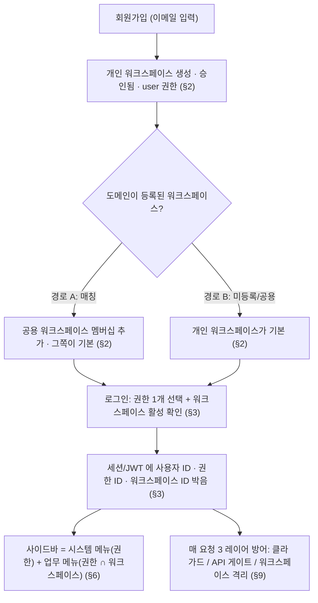
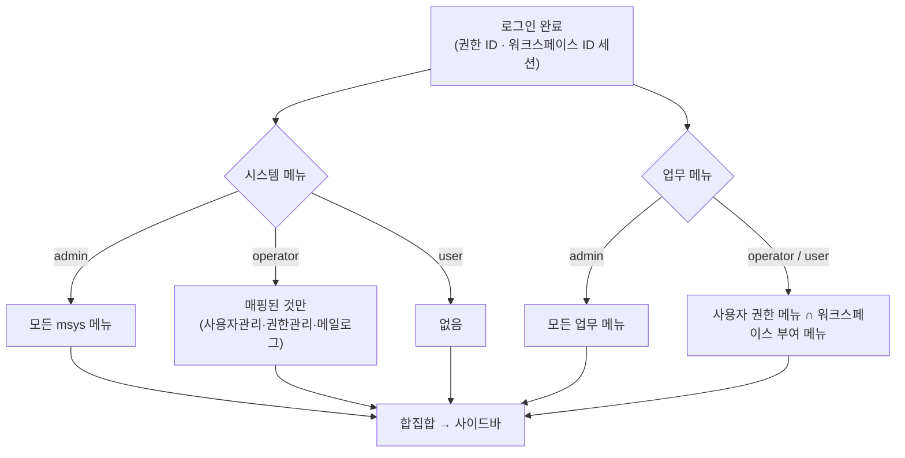
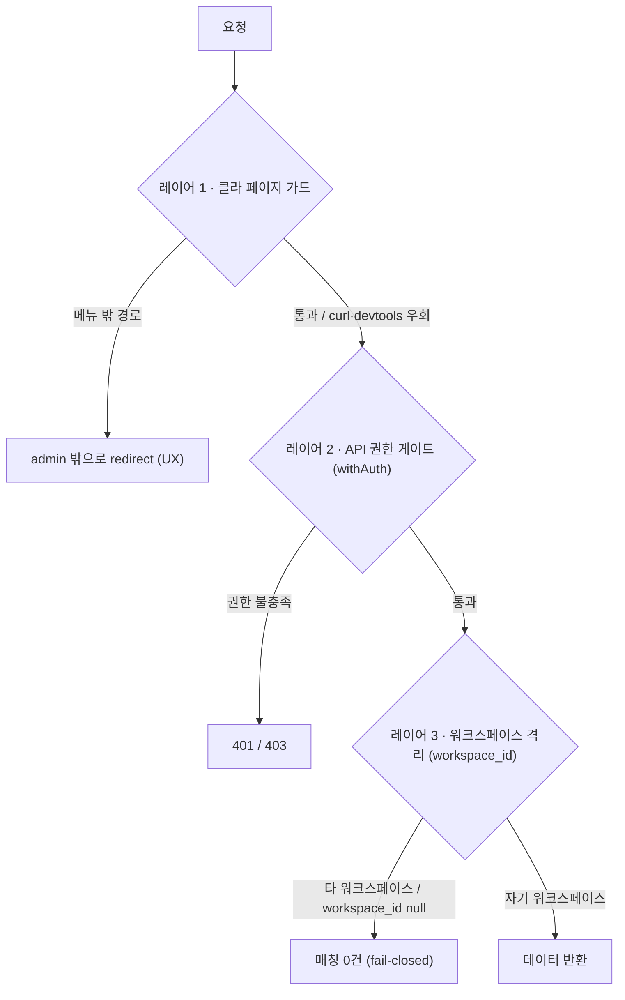
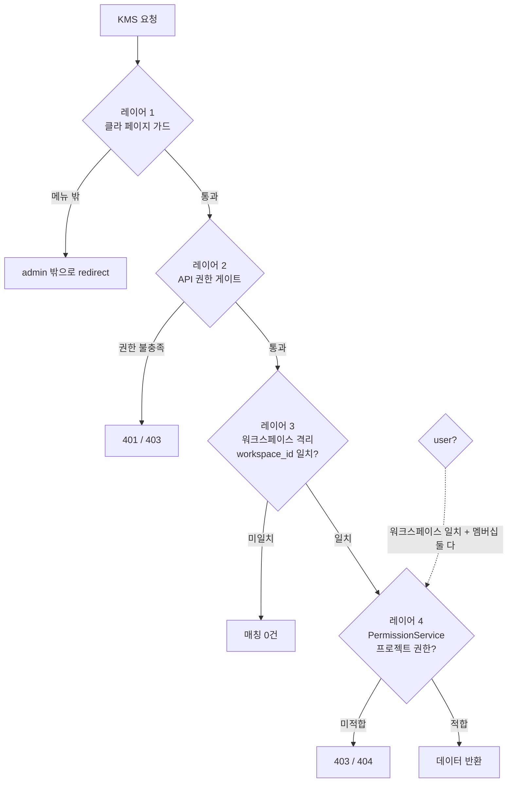

# SaaS 멀티테넌트 설계 — 회원가입부터 권한까지

> 워크스페이스(Workspace) 단위로 사용자·데이터·메뉴가 격리되는 SaaS 구조의 흐름과 결정 근거: AUTH 모델(권한·세션·JWT)은 전 서비스 공통, KMS 전용 비즈니스 도메인 격리(프로젝트/문서/채팅)는 §12.

---

## 0. 한눈에 보기

- 한 인스턴스가 여러 워크스페이스를 동시에 호스팅한다.
- 사용자는 여러 워크스페이스에 속할 수 있고, 그중 하나가 **기본 워크스페이스**다 (세션이 고르는 "지금 선택된 워크스페이스").
- SaaS 에디션은 **가입 시 개인 워크스페이스를 자동으로 만든다.** 이메일 도메인이 워크스페이스에 매핑돼 있으면 그 워크스페이스 멤버십을 함께 갖고, 그쪽이 기본이 된다.
- 권한은 세 단계다 — **시스템관리자 · 운영자 · 일반사용자**.
- 메뉴는 두 종류다 — 워크스페이스별로 부여되는 **업무 메뉴**, 권한별로 자동 따라오는 **시스템 메뉴**.

가입한 사용자가 워크스페이스·권한·메뉴를 얻고, 그게 매 요청에서 어떻게 강제되는지를 한 장으로:

> 권한·워크스페이스가 바뀌면 **세션을 서버에서 즉시 삭제**해 다음 요청부터 새로 그려진다 (§7) — 위 흐름이 한 번 박고 끝이 아니라 변경 시 다시 흐른다는 뜻.

---

## 1. 핵심 개념 세 가지

### 워크스페이스 (Workspace)

테넌트의 단위. 워크스페이스마다 ① 자기에게 부여된 업무 메뉴 세트와 ② 자기 도메인으로 들어오는 신규 가입자를 가진다. 비활성화하면 그 워크스페이스 사용자 전체가 즉시 강제 로그아웃된다.

### 권한 (Author)

세 가지 ID 가 있고 의미가 명확히 분리되어 있다. ID 는 **의미 코드**(`admin`/`operator`/`user`)다 — 숫자처럼 서열 의미를 갖지 않고, 강함은 코드 일치로 판단한다.

|            | ID         | 이름         | 범위            | 누가 갖나                              |
| :--------- | ---------- | ------------ | :-------------- | :------------------------------------- |
|            | `admin`    | 시스템관리자 | 모든 워크스페이스       | 운영팀 (서비스 관리자)                 |
|            | `operator` | 운영자       | 워크스페이스 운영 전권  | 워크스페이스 내부 책임자 (워크스페이스관리 제외)       |
|            | `user`     | 일반사용자   | 자기 워크스페이스       | 가입한 모든 사람의 기본값              |

> **권한은 워크스페이스에 종속되지 않는다.** "운영자"가 워크스페이스마다 따로 있는 게 아니라, 한 명의 운영자가 자기 워크스페이스 데이터에만 닿도록 **API 가 매 요청마다 워크스페이스 격리**를 한다.

필요하면 `expert` 같은 **자유 메뉴 권한**을 추가로 만들 수 있다 — 행동(우회·관리·자동부여)은 없고 메뉴 세트만 다른 권한. 메뉴 가시성은 보유 권한의 **합집합**이라 충돌 없이 더해진다.

### 메뉴 (Menu)

부여 경로가 완전히 다른 두 종류가 있다.

**업무 메뉴** (`mfct*` · `mocr*` · `mdoc*` …)

- 시스템관리자가 **워크스페이스별로** 부여 → 그 워크스페이스 사용자 전체가 후보
- 최종 노출 = `사용자 권한이 가진 메뉴 ∩ 워크스페이스가 가진 메뉴`
- 예) 워크스페이스 A 가 "문서관리"를 가졌고 사용자 X 의 권한에도 "문서관리"가 매핑돼 있으면 → 보임

**시스템 메뉴** (`msys*`)

- 워크스페이스가 부여받을 필요 없음 — **권한 ID 만으로** 결정
- 예) `operator` → 사용자관리·권한관리·메일발송로그 자동 / `admin` → 모든 `msys` 메뉴

> 이렇게 나눈 이유: 새 워크스페이스 등록 시 메뉴 부여 실수를 막는 구조. 시스템 메뉴는 권한 ID로 결정. 워크스페이스별 부여 불필요.

---

## 2. 회원가입 시나리오

가입 폼은 누구나 채운다. **가입하면 누구나 자기 개인 워크스페이스를 갖는다** — 개인 지휘소는 가입 즉시 자기 공간이 있어야 성립한다. 분기는 **입력한 이메일의 도메인**으로 갈리며, 갈리는 것은 "무엇이 기본 워크스페이스인가"다.

### 공통 — 개인 워크스페이스

계정 생성 직후 그 사람의 개인 워크스페이스를 만들고 `owner` 멤버십을 준다. 코드는 `ws-` + 사용자 id 27자, 이름은 `{사용자명}의 워크스페이스` — 기존 사용자에게 개인 워크스페이스를 만든 백필 리비전(`backend-service/alembic/versions/0005_backfill_workspace_member.py`)과 같은 규약이다. 승인 상태 = **승인됨** · 권한 = **`user` 자동 부여**.

### 경로 A — 등록된 워크스페이스 도메인

1. 이메일 도메인이 어떤 워크스페이스에 등록돼 있고, 그 워크스페이스가 활성이면 →
2. 그 **공용 워크스페이스의 멤버십을 함께** 갖는다 (`member`)
3. **기본 워크스페이스는 공용 쪽** — 로그인하면 그 워크스페이스의 업무 메뉴가 보인다. 개인 워크스페이스는 비기본 멤버십으로 남는다 (전환 UI 는 P2 — PRD FR-023)

> 핵심은 **사람 손이 안 닿는다**는 점. 도메인을 한 번 등록해두면 그 도메인 가입자가 자동으로 그 워크스페이스 구성원이 된다.

### 경로 B — 등록되지 않은 도메인 (또는 공용 도메인)

1. 도메인이 어느 워크스페이스에도 없음 (gmail·naver 등 공용 포함)
2. **기본 워크스페이스는 개인 워크스페이스** — 배정을 기다리지 않고 바로 로그인 가능

> **공용 도메인은 워크스페이스 도메인으로 등록 자체가 차단된다** (등록하면 그 도메인 전 세계 사용자가 그 워크스페이스로 빨려들어오므로). 블랙리스트는 코드 상수.

### OEM 에디션은 예외

OEM 은 구성원 전원이 고객사 워크스페이스 하나를 함께 쓰는 단일 고객사 배포다 — 개인 워크스페이스를 만들지 않는다. OEM 가입은 유일 활성 **공용** 워크스페이스로 배정 + **항상 승인 대기**를 유지한다 (`frontend/prisma/init/seed.sql` 머리말).

여기서 세는 것은 `is_personal=false` 인 워크스페이스뿐이다 (`resolveOemSharedWorkspace`). 개인 워크스페이스는 사용자 1명의 것이라 "가입자를 배정할 곳"이 아니며, 세면 관리자의 개인 워크스페이스 하나만으로 배포 전체의 가입이 막힌다 — 실제로 그렇게 막혔다. 같은 이유로 워크스페이스 배정 드롭다운과 "마지막 활성 워크스페이스" 비활성화 가드도 공용만 센다.

---

## 3. 로그인하면 무엇이 결정되는가

로그ιν은 계정 확인을 넘어, **사용자의 워크스페이스·권한을 세션에 박는 시점**이다.

1. 이메일/패스워드 검증
2. **승인 상태 확인** — 승인됨이 아니면 차단
3. **권한 조회** — 보유 권한 중 우선순위(`admin` > `operator` > `user`)로 대표 1개 선택
4. **워크스페이스 활성 확인** — 비활성이면 차단 (단, 시스템관리자는 우회)
5. **세션 생성** — `사용자 ID` · `권한 ID` · `워크스페이스 ID` 를 박음
6. **JWT 발급** — 위 셋을 payload 에 포함

> **JWT 안에 워크스페이스 정보가 같이 들어간다.** docs-service 같은 백엔드가 "이 요청자가 어느 워크스페이스인지"를 DB 재조회 없이 알 수 있어 워크스페이스 격리 쿼리가 즉시 가능.

### 차단 분기 메시지

| 상태        | 메시지                                |
| ----------- | ------------------------------------- |
| 승인 대기   | 관리자 승인 대기 중                   |
| 가입 거부   | 가입이 거부되었습니다                |
| 계정 비활성 | 비활성화된 계정                       |
| 워크스페이스 비활성 | 소속 워크스페이스가 비활성화되었습니다        |

---

## 4. 시스템관리자의 신규 워크스페이스 온보딩

**1단계 · 워크스페이스 등록** — 워크스페이스ID·워크스페이스명만 입력. 처음엔 도메인도 메뉴도 없는 빈 상태.

**2단계 · 이메일 도메인 등록** — `example.co.kr` 추가. 이 시점부터 그 도메인 가입자는 이 워크스페이스 사용자가 된다.

- 공용 도메인(gmail 등) 자동 차단
- 다른 워크스페이스가 이미 등록한 도메인도 차단

**3단계 · 메뉴 부여** — 워크스페이스가 쓸 업무 메뉴를 좌→우로 옮겨 부여.

- 시스템 메뉴는 선택지에서 자동 제외 (권한으로 따라가므로)

**4단계 (선택) · 운영자 지정** — 그 워크스페이스의 첫 가입자를 `operator` 로 승격. 이후엔 운영자가 자기 워크스페이스를 굴린다.

> 온보딩이 끝나면 시스템관리자는 손을 뗀다. 워크스페이스 내부는 운영자가 알아서 관리한다.

### 워크스페이스 비활성화

`use_at` 을 `N` 으로 토글하면 한꺼번에:

- 그 워크스페이스 사용자 **전원 세션 즉시 삭제**
- 다음 요청에서 로그인 화면으로 강제 이동
- 로그인 시도해도 "워크스페이스 비활성" 으로 차단
- 도메인 매핑은 유지 → 재활성화 시 즉시 복원

> **시스템관리자는 워크스페이스 활성 여부와 무관하게 어디든 접근 가능** — 비활성 워크스페이스에 들어가 디버깅/복구해야 하므로.

---

## 5. 운영자의 자기 워크스페이스 관리

운영자가 사용자관리 화면에 들어오면 **자기 워크스페이스 사용자만** 보인다. 다른 워크스페이스 사람은 존재 자체가 안 보인다.

- **신규 등록** → 워크스페이스ID 가 자동으로 자기 워크스페이스로 박힘 (변경 불가)
- **수정** → 워크스페이스ID 변경 불가 · 권한 부여/회수 가능 (단 `admin` 부여는 차단) · 활성 세션 강제 종료
- **삭제** → 자기 워크스페이스 사용자만

**운영자가 운영자를 만들 수 있나?**
자기 워크스페이스에서 타인을 `operator` 로 승격 가능. 의도된 흐름. 단 **`admin` 부여는 불가** — 글로벌 권한. 보안 등급이 다르다.

**권한이 바뀌면?**
**즉시 세션 무효화.** `operator` 가 새로 부여된 사람은 다음 요청에서 강제 로그아웃 → 재로그인 시 새 권한으로 사이드바가 다시 그려진다.

### 워크스페이스 변경의 의미

시스템관리자가 사용자의 워크스페이스를 X → Y 로 옮기면:

| 권한       | 처리                             | 이유                                                         |
| ---------- | -------------------------------- | ------------------------------------------------------------ |
| `operator` | **제거**                         | 이전 워크스페이스의 운영자였다는 사실이 새 워크스페이스엔 무의미             |
| `user`     | **보장** (없으면 추가)           | 새 워크스페이스에서 즉시 일반 사용 가능해야                          |
| `admin`    | **유지**                         | 글로벌이라 워크스페이스 무관                                         |

그리고 세션 즉시 무효화.

---

## 6. 사이드바는 어떻게 결정되는가

**시스템 메뉴** (`msys*`)

- `admin` → 모든 시스템 메뉴
- `operator` → 사전 매핑된 것 (사용자관리·권한관리·메일발송로그)
- `user` → 없음

**업무 메뉴** (`mfct*`·`mocr*`·`mdoc*`)

- `admin` → 모든 업무 메뉴
- 그 외 → `사용자 권한이 가진 메뉴 ∩ 워크스페이스가 가진 메뉴`

> 워크스페이스 단위 교집합이 들어가는 이유: **같은 `user` 권한이라도 어느 워크스페이스에 있느냐에 따라 다른 메뉴를 본다**는 게 SaaS 의 본질. 워크스페이스 A 가 "문서관리"를 안 샀으면 그 워크스페이스 모든 사용자는 문서관리를 못 본다.

---

## 7. 권한 변경의 즉시 반영

권한이 바뀌었는데 사용자가 새로고침을 안 했다면? 두 가지 선택지가 있었다.

1. 클라이언트가 주기적으로 권한 polling
2. 권한이 바뀌는 시점에 그 사용자의 세션을 서버에서 강제 삭제

> **2번을 선택.** 권한 변경 시 세션 서버 삭제. 다음 요청에서 인증이 깨져 강제 로그아웃. 클라이언트 polling 코드 불필요.

### 세션 무효화 트리거

| 트리거                               | 대상           |
| ------------------------------------ | -------------- |
| 워크스페이스 비활성화                        | 그 워크스페이스 사용자 전원 |
| 사용자 워크스페이스 변경/비활성화            | 그 사용자      |
| 권한 부여/회수                       | 그 사용자      |
| 회원탈퇴                             | 그 사용자      |
| 시스템관리자가 사용자 삭제           | 그 사용자      |

> 권한명 변경(예: "운영자"→"워크스페이스관리자")이나 워크스페이스 메뉴 변경은 무효화 대상이 **아니다**. 권한 ID 자체가 안 바뀌므로 다음 요청에서 자연스럽게 새 이름/메뉴가 반영된다.

---

## 8. 보호되는 데이터 vs 풀어둔 데이터

API 가드 분류 원칙.

| 데이터                              | 변경                          | 조회                                                                                             |
| ----------------------------------- | ----------------------------- | ------------------------------------------------------------------------------------------------ |
| 워크스페이스 · 도메인 · 워크스페이스메뉴            | 시스템관리자만                | 시스템관리자만                                                                                   |
| 글로벌 메뉴 정의                    | 시스템관리자만                | 누구나 (사이드바 등)                                                                             |
| 글로벌 코드그룹/코드                | 시스템관리자만                | 누구나 (codeStore)                                                                               |
| 권한 정의 (이름·메뉴 매핑)          | 시스템관리자만                | 누구나                                                                                           |
| 권한 부여 (사용자↔권한)             | 워크스페이스 격리                     | 워크스페이스 격리                                                                                        |
| 사용자 정보                         | 워크스페이스 격리                     | 워크스페이스 격리                                                                                        |
| 이메일 발송 로그                    | — (시스템 자동 생성)          | 시스템관리자 전체 + 운영자 (워크스페이스 등록 사용자 이메일 OR 워크스페이스 등록 도메인 endsWith)                 |
| 활성 세션                           | 자기 워크스페이스 (강제 종료)         | 자기 워크스페이스 (id·IP·UA — raw 토큰은 응답에서 제외)                                                  |

> **조회는 풀어둔 게 많다** — codeStore 처럼 부팅 시 모든 사용자가 받아가야 하는 데이터 때문. 변경은 전부 잠갔다.

> 메일로그에 운영자 필터를 "워크스페이스 사용자 이메일 IN" 과 "워크스페이스 도메인 endsWith" **양쪽** 으로 둔 이유: 워크스페이스 도메인 가입자 뿐 아니라 시스템관리자가 등록한 외부 도메인 사용자(외주 등)도 자기 워크스페이스 발송분으로 보이기 위함.

> 세션 API 응답이 식별자(id)만 노출하고 **raw 토큰은 싣지 않는** 이유: `BA_Session.token` 은 쿠키 값 자체. 누출 시 임퍼소네이션 가능. revoke 도 id 로 처리. 토큰이 클라까지 갈 이유 없음. (운영자에게 강제 종료 권한은 유지 — 시스템관리자 1명 계정 차단 시 푸는 용도.)

### 거부 응답의 의미

- **401 "인증이 만료되었습니다"** — 토큰이 없거나 만료
- **403 "권한이 없습니다"** — 인증은 됐지만 시스템관리자 전용 작업

> 구분한 이유는 UX. 권한 부족인데 "인증 만료"라고 뜨면 사용자가 재로그인을 반복하게 된다.

---

## 9. 방어 레이어 — Defense in Depth

권한 체크가 한 군데에만 있으면 그 한 곳을 뚫리면 끝이다. **3 레이어로 쌓아** 어느 하나가 무력화돼도 다음이 받친다.

### 레이어 1 · 클라이언트 페이지 가드 (UX)

- 사이드바는 사용자가 가진 메뉴만 표시 → 잘못된 메뉴는 시야 밖
- URL 직접 입력으로 우회 시도하면 admin 레이아웃이 메뉴 store 와 비교 → admin 밖(`/`)으로 redirect (정상 사용자라면 사이드바를 거치므로 이 경로 도달 안 함)
- 경로 매칭은 정확 일치 또는 슬래시 경계 (`/admin/foo` 권한이 `/admin/foobar` 를 잘못 통과시키는 over-match 방지)
- 메뉴 store 로드 실패 시 **fail-closed** — always-allowed 경로(마이페이지) 외에는 admin 밖으로

**목적**: 비정상 흐름을 admin 밖으로 즉시 격리
**한계**: dev tools / curl 로 API 직접 호출하면 무력 → 보안 본질이 아니라 UX 가드

### 레이어 2 · API 권한 게이트 (서버 보안 본질)

모든 시스템 API 는 `withAuth` 가 감싸고 옵션으로 강제 조건을 명시한다.

| 옵션                     | 누가 통과                                                          |
| ------------------------ | ------------------------------------------------------------------ |
| `requireSysAdmin`        | `admin` 만                                                         |
| `requireOperatorOrAdmin` | `admin` 또는 `operator`                                            |
| `scopeEmailParam`        | URL 의 사용자 대상이 요청자 워크스페이스 소속이거나 요청자가 `admin`       |
| `protectSysAdminTarget`  | 대상이 `admin` 계정이면 비-`admin` 요청자 차단                     |

**다층 결합**: 단건 사용자 수정 (`PUT /api/.../adminuser/[email]`) 은 `scopeEmailParam + protectSysAdminTarget + requireOperatorOrAdmin` 세 조건을 모두 충족해야 통과한다. 한 조건이 풀려도 나머지가 받친다.

**특히 권한 부여 경로** (`POST /api/.../author/[author_id]/user`) 는:

- `requireOperatorOrAdmin` 으로 일반 user 차단 (일반 user 가 자기를 임의 권한에 추가하는 권한 상승 방지)
- 핸들러 안에서 `target_author === admin → 요청자도 admin` 체크 (운영자가 자기를 admin 으로 올리지 못함)
- 운영자: target 사용자가 자기 워크스페이스 소속인지 추가 검증

### 레이어 3 · 데이터 격리 (워크스페이스 단위)

- 운영자 컨텍스트의 모든 쿼리는 `where workspace_id = session.user.workspaceId` 자동 격리
- `workspaceId` 가 `null` 인 비정상 케이스는 `-1` 로 매칭 0건 (fail-closed)
- 권한 게이트를 통과한 운영자도 자기 워크스페이스 데이터만 봄
- 클라가 보낸 filter URL 파라미터는 tenant 절과 **AND 로 결합** — 같은 key(`workspace_id`·`OR` 등)를 사용자가 보내도 spread merge 로 격리 절을 덮어쓰지 못함

> **한 줄 요약**: 클라이언트는 "보지도 못하게", API 게이트는 "호출해도 막히게", 쿼리는 "통과해도 자기 워크스페이스만". 같은 정책을 **3번 강제** 한다.

요청 하나가 세 레이어를 통과하는 모습 (어느 하나가 뚫려도 다음이 받친다 — KMS 는 §12 의 `PermissionService` 4층을 더 얹는다):

---

## 10. 알려진 갭과 결정 사항

의식적으로 "지금은 안 한다"고 결정한 것들. 향후 요구가 생기면 손볼 자리.

**워크스페이스 메뉴 회수 시 운영자 사이드바가 즉시 갱신되지 않는다**
시스템관리자가 워크스페이스 메뉴에서 "문서관리"를 떼도, 그 워크스페이스 운영자/사용자에게는 **다음 로그인까지 stale**. 사이드바엔 회수된 메뉴가 잠시 보일 수 있으나, 클릭해 들어가도 그 페이지 API 가 별도 권한 검사로 막는다. 데이터 leak 은 없고 UX 만 덜 깔끔해 두고 봤다.

**도메인 신규 등록 시 기존 사용자가 자동 매핑되지 않는다**
그 도메인으로 이미 가입한 사용자는 자동으로 그 워크스페이스에 합류하지 않는다 (개인 워크스페이스만 가진 채로 남는다). 시스템관리자가 손으로 매핑한다. 거부된 사용자(`appr_at = R`)와 단순 대기를 구분 안 하면 위험해서 수동으로 뒀다.

**백필로 만들어진 개인 워크스페이스에는 업무 메뉴가 없다**
사이드바의 업무 메뉴는 "권한 메뉴 ∩ 워크스페이스 메뉴"(§6)다. **가입 흐름이 만드는 개인 워크스페이스에는 기본 업무 메뉴가 함께 부여된다** — 터미널·관심종목(`frontend/constants/protected.ts` 의 `PERSONAL_WORKSPACE_DEFAULT_MENU_IDS`, #251). 대시보드는 화면이 생길 때 이 목록에 더한다(#242·#243).
남는 갭은 **백필 리비전(`0005`)이 만든 개인 워크스페이스**다 — 가입 흐름을 타지 않아 `tn_workspace_menu` 가 비어 있고, 그 계정들은 여전히 업무 메뉴가 안 보인다(시스템관리자는 메뉴 교집합을 우회해 영향 없음). 일회성 백필이 필요하다.

**시스템관리자가 만든 새 사용자는 권한이 자동 부여되지 않는다**
가입(signup)은 `user` 가 자동 붙지만, 사용자관리에서 직접 등록하면 권한이 빈 상태로 시작한다. **의도된 비대칭** — "관리자가 만든 사용자는 권한을 명시적으로 줘야 한다"는 정책 (무심코 자동 부여되면 사고).

---

## 11. 권한 능력 매트릭스

| 능력                         | `admin` | `operator` | `user` |
| ---------------------------- | :-----: | :--------: | :----: |
| 워크스페이스 등록/수정               | ✅      | ❌         | ❌     |
| 워크스페이스 도메인 관리             | ✅      | ❌         | ❌     |
| 워크스페이스가 쓸 메뉴 부여          | ✅      | ❌         | ❌     |
| 글로벌 메뉴 정의 변경        | ✅      | ❌         | ❌     |
| 글로벌 코드 변경             | ✅      | ❌         | ❌     |
| 권한 정의 변경               | ✅      | ❌         | ❌     |
| 모든 워크스페이스 사용자 관리        | ✅      | ❌         | ❌     |
| 자기 워크스페이스 사용자 관리        | ✅      | ✅         | ❌     |
| 자기 워크스페이스 사용자 권한 부여   | ✅      | ✅ (`admin` 제외) | ❌     |
| 활성 세션 강제 종료          | ✅      | ✅ (자기 워크스페이스) | ❌     |
| 문서 프로젝트 생성·관리      | ✅      | ✅         | ❌ (멤버 참여·조회만) |
| 워크스페이스 업무 메뉴 사용            | ✅ (모든 워크스페이스) | ✅ (자기 워크스페이스) | ✅ (자기 워크스페이스) |
| 마이페이지                   | ✅      | ✅         | ✅     |

---

## 12. KMS 도메인 격리 — 프로젝트·문서·채팅 (knowledge-management 전용)

> 이 절만 **KMS(docs-service) 전용**이다. §1~§11 은 전 서비스 공통 AUTH 모델, 여기는 그 위에 얹히는 비즈니스 도메인(프로젝트/문서/채팅) 격리. 다른 서비스에는 이 격리가 없다.

KMS 는 워크스페이스 격리(`workspace_id` 외래키 체인: 워크스페이스 → 프로젝트 → 문서/채팅/메시지) 위에 **프로젝트 단위 3-tier** 를 더한다. 접근 범위가 `user` 만 워크스페이스 공통 모델과 다르다.

- `admin` — 전체 (모든 워크스페이스)
- `operator` — 자기 워크스페이스
- `user` — 자기 워크스페이스 + **멤버십 있는 프로젝트**만

**격리 매트릭스** — 문서/채팅/메시지는 `document_id`/`session_id`/`message_id` → `project_id` 로 환원해 **프로젝트 권한을 그대로 따른다** (`PermissionService`).

| 행위                       | `admin` | `operator` | `user` |
| -------------------------- | :-----: | :--------: | :----: |
| 프로젝트 read              | 전체    | 자기 워크스페이스  | 자기 워크스페이스 & 멤버십 |
| 프로젝트 write             | 전체    | 자기 워크스페이스 + **자신이 생성한** 것만 | ❌  |
| 문서 read/write            | 전체    | 자기 워크스페이스  | 자기 워크스페이스 & 멤버십 |
| 세션 read                  | 전체    | 자기 워크스페이스  | 자기 워크스페이스 & 멤버십 |
| 세션 write (수정/삭제/공유) | 전체    | **본인만** | **본인만** |
| 공유 채팅 read             | 전체    | 자기 워크스페이스  | 자기 워크스페이스 & 멤버십 |
| 메시지 read / 피드백       | 전체    | 자기 워크스페이스  | 자기 워크스페이스 & 멤버십 |

> 세션 write 만 워크스페이스가 아니라 **소유자(본인)** 단위인 이유: 채팅 세션은 개인 작업 공간이라 같은 워크스페이스라도 남의 세션을 수정·삭제·공유하면 안 된다. read 는 워크스페이스 & 멤버십까지 열어 협업을 허용한다.

**inactive 프로젝트 차단**: 모든 write 전 `check_project_active` 호출 → `status='inactive'` 면 `ConflictError` (상태 토글·영구 삭제 endpoint 만 예외).

**4번째 방어 레이어**: §9 의 3층(클라이언트 가드 · API 게이트 · 워크스페이스 격리) 위에, KMS 는 FastAPI **`PermissionService`** 를 도메인 권한 4층으로 더한다 — 문서/세션/메시지를 `project_id` 로 환원해 위 매트릭스를 강제한다. `user` 는 워크스페이스 일치 + 멤버십을 **둘 다** 만족해야 통과(fail-closed).

---

## 부록 — 용어

- **테넌트(Tenant)** — SaaS 의 한 고객 단위. 이 시스템에서는 워크스페이스(Workspace).
- **격리(Isolation)** — 한 테넌트 데이터가 다른 테넌트에게 안 보이는 것. 같은 테이블에 모두 담되 `workspace_id` 컬럼으로 거르는 **row-level isolation** 을 쓴다.
- **denormalize** — `BaSession` 에 `authorId`/`workspaceId` 를 미리 박아두는 것. 매 요청마다 `User → AuthorMember → Workspace` 를 재조회하지 않으려고 데이터 중복을 감수하고 읽기 속도를 산다.
- **글로벌 권한** — 워크스페이스에 종속되지 않는 권한. `admin` 이 유일하다.
- **시스템 메뉴(`msys*`)** — 워크스페이스 부여가 아니라 권한 ID 로만 결정되는 메뉴.

---

관련 문서: [인증 — Better Auth](../../CLAUDE.md)(권한 3종·JWT payload)
