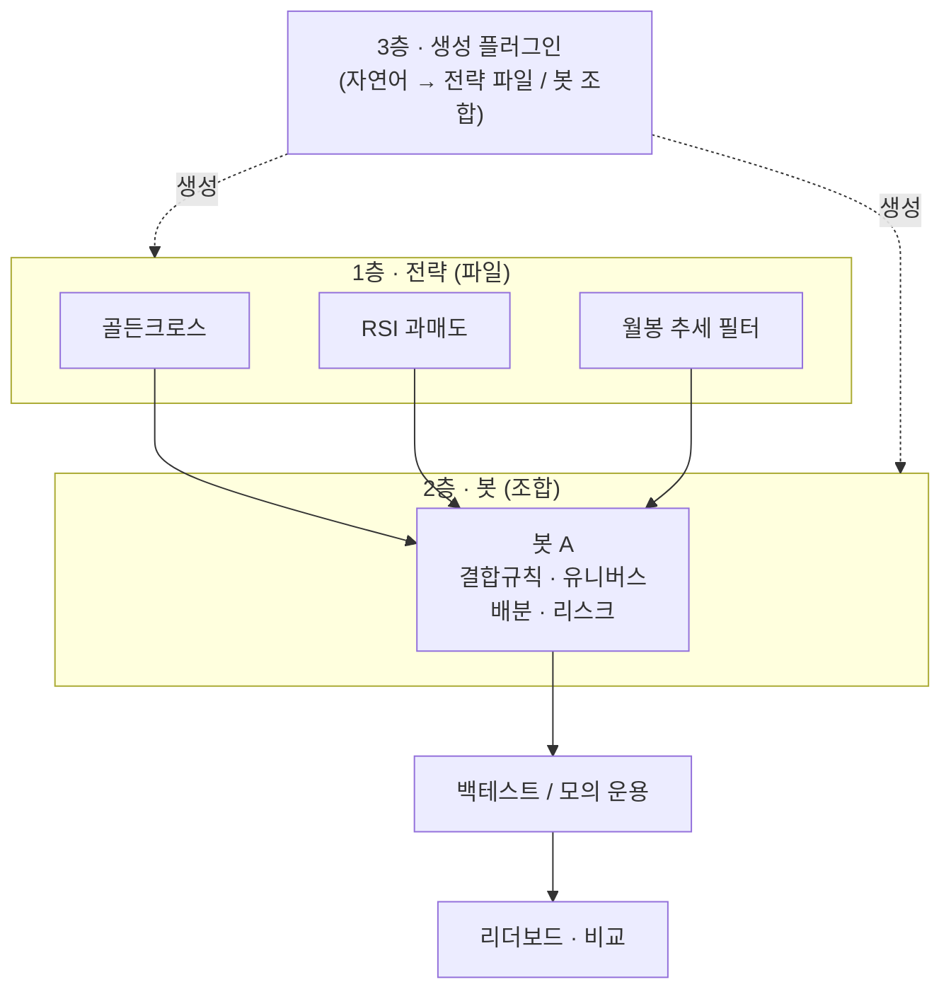

# 봇과 전략 — 파일로 짜고 화면에서 찍어내기

> 전략(파일)과 봇(조합)을 어떻게 나누는지, 멀티 타임프레임이 왜 자연스럽게 성립하는지, 백테스트를 무엇으로 판정하는지, 그리고 전략을 자연어로 만들어내는 생성 플러그인. 제품 전체 그림은 [투자지휘소-개요](투자지휘소-개요.md), 화면은 [트레이딩-터미널](트레이딩-터미널.md).

---

## 0. 큰 그림

**전략은 코드로, 봇은 화면에서.** 전략 유형을 한 번 파일로 만들어 두면, 같은 전략에서 파라미터만 달리한 봇을 배포 없이 계속 찍어낼 수 있다.

---

## 1. 전략 — 판단 단위 하나

전략 하나가 파일 하나다. 규약은 셋뿐이다.

| 요소 | 내용 |
|---|---|
| **파라미터 선언** | 무엇을 조절할 수 있고 범위가 얼마인가 (예: 단기 이평 5~60일) |
| **지표 계산** | 이 전략이 보는 값들 |
| **진입·청산 판정** | 언제 사고 언제 파는가 |

**각 전략은 자기가 보는 캔들 주기를 스스로 선언한다.** 월봉짜리 추세 필터, 일봉짜리 진입 신호, 분봉짜리 타이밍이 한 봇 안에 공존할 수 있다 — 멀티 타임프레임이 별도 기능이 아니라 구조에서 나온다.

**파라미터 선언이 화면 폼을 만든다.** 전략 파일이 "이 값들을 이 범위에서 조절할 수 있다"를 선언하므로, 봇 만들기 화면이 그걸 읽어 입력 폼을 자동 생성한다. 새 전략을 추가해도 화면을 고칠 필요가 없다.

---

## 2. 봇 — 전략들의 조합

봇 하나가 여러 전략을 싣는다. 봇의 성격은 **전략이 아니라 그 위에 붙는 규칙**에서 나온다.

| 규칙 | 정하는 것 |
|---|---|
| **결합** | 전부 만족해야 사는가(AND), 하나라도면 되는가(OR), 각 전략에 점수를 매겨 합산하는가(스코어링) |
| **유니버스** | 어느 종목군을 대상으로 도는가 — 스크리너 후보 풀 전체 / 관심종목만 / 지정 목록 |
| **자금 배분** | 종목당 얼마씩, 최대 몇 종목 |
| **리스크** | 손절·익절, 포지션 상한, 하루 최대 거래 |

같은 전략 셋을 실어도 결합 규칙과 리스크가 다르면 완전히 다른 봇이 된다. **봇을 비교한다는 것은 이 조합을 비교한다는 뜻**이다.

봇은 워크스페이스 안에서 **자기 계정과 역할을 갖는다** — 조회만 하는 봇, 주문을 제안하는 봇, 승인 후 실행하는 봇. 그래서 "어느 봇이 언제 무엇을 했나"가 감사 컬럼에 자동으로 남는다.

---

## 3. 유니버스 — 종목을 어디서 가져오나

**스크리너가 만든 후보 풀 + 관심종목 고정.**

- 스크리너 조건으로 후보 풀을 유지한다(예: 거래대금 상위 N, 시총·밸류에이션 조건). 저녁 배치가 다시 계산한다.
- 내 관심종목은 조건과 무관하게 **항상 포함**된다.
- 봇마다 "풀 전체"인지 "관심종목만"인지 선택한다.
- 조건은 **프리셋 몇 개 + 커스텀 저장**(관심종목처럼 내 조건에 이름을 붙여 보관).

풀 크기가 곧 데이터 수집량이다. 국내는 소스 구조상 전 종목이 부담이 아니지만, 미국은 종목당 호출이라 풀 크기가 곧 비용이다 — [시세-데이터-파이프라인](시세-데이터-파이프라인.md) 참조.

---

## 4. 백테스트 — 우리 DB 에서 읽는다

**외부 API 를 매번 때리는 방식은 성립하지 않는다.** 호출 한도로 불가능하고, 더 중요하게는 **재현되지 않는다** — 외부 소스는 수정주가를 나중에 재계산하므로 같은 백테스트가 다른 결과를 낸다. 그래서 적재된 로컬 시세를 읽는다.

**판정에 들어가야 하는 가정들** — 이 값들이 결과를 좌우하므로 리포트에 함께 표시한다.

| 가정 | 왜 필요한가 |
|---|---|
| 체결 가격 | 종가 체결인가, 다음 봉 시가인가 |
| 수수료·세금 | 빼지 않으면 성과가 부풀려진다 |
| 슬리피지 | 호가 차이를 무시하면 단타일수록 왜곡이 커진다 |
| 기간·유니버스 | 어느 구간, 어느 종목군에서 나온 숫자인가 |

**백테스트는 사용자가 원할 때 돌린다.** 저녁 배치를 기다릴 필요가 없다.

---

## 5. 성과 지표 — 전부 보여주되 순서가 있다

리더보드는 **트레이더가 중요하게 보는 순서**로 열을 배치한다. 정렬은 열 클릭으로 바꾸되 기본은 위험조정 쪽이다.

| 순서 | 지표 | 답하는 질문 |
|---|---|---|
| 1 | **최대 낙폭(MDD)** | 실제로 굴렸다면 견딜 수 있었나 |
| 2 | **샤프 · 칼마** | 얼마나 편하게 벌었나 |
| 3 | 연환산 수익률 | 얼마나 벌었나 |
| 4 | 승률 · 손익비 | 어떤 방식으로 벌었나 |
| 5 | 거래횟수 · 회전율 | 비용이 얼마나 드는 전략인가 |
| 6 | 평균 보유기간 | 내 생활 리듬과 맞나 |
| 7 | 최대 연속 손실 | 심리적으로 버틸 수 있나 |

수익률만으로 줄 세우면 크게 먹고 크게 잃는 봇이 위로 올라온다. 실주문 승격 판단에는 특히 1·2번이 앞선다.

---

## 6. 생성 플러그인 — 자연어로 전략 만들기

전략을 짜는 마찰을 "편집기를 여는 것"에서 "보면서 말하는 것"으로 낮춘다.

흐름은 이렇다. **자연어 요청 → 규약에 맞는 전략 파일 생성 → 즉시 백테스트 → 성과 리포트 → 마음에 들면 커밋, 아니면 프롬프트를 고쳐 재생성.**

이 방식이 좋은 이유는 **결과물이 파일**이라는 점이다. git 에 남아 diff 로 비교되고, "이 봇이 왜 이렇게 샀지?"를 나중에 코드로 되짚을 수 있다. 그리고 **LLM 이 장중에 판단하는 게 아니라 연구 시점에만 코드를 만들어주고, 장중엔 그 코드가 결정론적으로 돈다** — 시간축 분리 원칙과 정확히 맞는다.

봇 조합(어떤 전략들을 어떤 규칙으로 섞을지)도 같은 방식으로 만들 수 있다.

---

## 7. 단계

**지금은 모의 매매 + 실계좌 조회까지.** 실제 잔고·보유는 진짜로 읽어와 화면에 띄우되, 봇의 주문은 모의 체결로 기록한다. 그래서 "내 실제 포트폴리오 vs 봇들이 했다면"을 나란히 비교할 수 있다.

**실주문은 백테스트·검증이 끝난 뒤 승격한다.** 주문 로직 자체는 모의계좌와 실계좌가 같은 API 인 증권사에서 개발해, 실거래 전에 회귀 테스트가 가능하게 한다.
