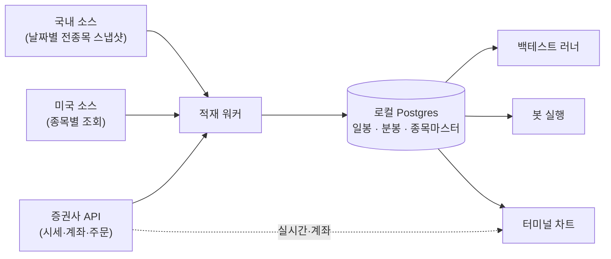

# 시세 데이터 파이프라인 — 적재·저장·추상화

> 시세와 과거 캔들을 어디서 가져와 어떻게 쌓는가. 소스마다 다른 호출 구조, provider 추상화가 왜 선택이 아니라 필수인가, 저장 스키마와 약관이 설계에 거는 조건. 소스별 조사 근거는 이슈로 기록돼 있다. 봇·백테스트 쪽은 [봇-전략-모델](봇-전략-모델.md).

---

## 0. 큰 그림

**백테스트는 로컬 DB 에서 읽는다.** 외부 API 를 매번 때리는 방식은 한도로도 불가능하고, 수정주가 재계산 때문에 **재현되지도 않는다**. 그래서 적재가 먼저다.

**MCP 를 거치지 않는다** — 백테스트 러너와 봇은 DB 를 직접 읽는다. 원시 캔들 수천 개를 MCP 응답으로 흘리면 LLM 컨텍스트만 태운다. MCP 시세 도구는 **LLM 이 대화 중에 몇 개 참조할 때**만 쓴다.

---

## 1. 소스마다 호출 구조가 다르다

이 차이가 유니버스 크기 정책을 결정한다.

| 소스 | 호출 단위 | 함의 |
|---|---|---|
| 국내 공식 오픈API | **날짜별 전종목 스냅샷** | 종목 수가 늘어도 호출 수가 안 는다. **전 종목 적재가 오히려 싸다** |
| 미국 무료 API | **종목당 조회** | 유니버스 크기가 곧 비용. 풀 크기를 정해야 한다 |
| 증권사 API | 종목당, 기간 커서 | 창을 밀며 수년치 수집 가능. 실시간·계좌·주문도 같은 곳 |

즉 **국내는 전 종목 + 스크리너, 미국은 후보 풀 제한**이 자연스러운 정책이다.

---

## 1.1 거래일 캘린더 — 결측·휴장 판정의 기준선

**리드 결정(2026-08-02) — 검증된 라이브러리를 쓴다, 직접 만들지 않는다.** 거래일 캘린더는 예외가 본체인 도메인이다(공휴일·조기폐장·지연개장·임시휴장). 직접 만들면 그 예외를 우리가 영원히 따라가야 한다.

**선례가 예외 없이 위임한다.** zipline-reloaded 도 자체 캘린더를 만들지 않고 `exchange_calendars` 를 그대로 감싼다(`src/zipline/utils/calendar_utils.py`). Lean 은 `market-hours-database.json` 546개 엔트리로 직접 데이터화하지만 한국 주식 엔트리가 없다. backtrader 는 `PandasMarketCalendar` 로 캘린더 데이터 자체는 외부(우리는 KRX)에 의존한다. **직접 구현한 선례가 하나도 없다** — 근거: #240 스파이크 §1.4·§1.5·§2.

### 채택 — `exchange_calendars`

| 항목 | 값 | 확인 방법 |
|---|---|---|
| 이름 | `exchange_calendars` (PyPI), 저장소 `gerrymanoim/exchange_calendars` | — |
| 버전 | 4.13.2 | PyPI API 조회, 2026-08-02 |
| 라이선스 | **Apache-2.0** (단일 `LICENSE` 파일, Copyright 2018 Quantopian, Inc.) | 저장소 클론 후 `LICENSE` 원문 확인, 2026-08-02. `NOTICE` 파일 없음 |
| 유지 상태 | 매우 활발 — 마지막 push 2026-07-31 · ★660 | GitHub API |
| **우리가 쓰는 기능** | `get_calendar("XKRX")`/`get_calendar("XNYS")` 의 세션 목록·개장/폐장 시각 조회(`sessions_in_range`·`schedule`) — **캘린더 계산 API 만** 쓴다. 소스를 고치지 않고 의존성으로만 쓴다 | 아래 §1.1.2 |
| **데이터가 따라오는가** | **따라온다** — 휴장일·지연개장 스케줄이 라이브러리 본체다. 단 이 데이터는 **거래소가 공개한 사실(공휴일 일정)을 코드화한 것**이지 Lean·AlgoSeek 같은 **제3자 상업 시세 데이터셋이 아니다.** 별도 데이터 라이선스·NOTICE 고지가 없음을 확인했다 — Apache-2.0 하나가 코드와 캘린더 데이터를 함께 덮는다 | 저장소에 `NOTICE` 파일 부재 확인, README 에 데이터 출처 표기 없음 확인 |
| 가입 필요 | 없음 — `pip install` | — |
| 전이 의존성 | `korean_lunar_calendar`(XKRX 의 음력 공휴일 계산용) — **MIT** (`usingsky/korean_lunar_calendar_py`, GitHub API 확인) | 양립 |
| **판정** | **MIT 배포와 양립.** Apache-2.0 의존성을 수정 없이 그대로 쓰는 표준 구성이며, 요구되는 것은 라이선스 사본 포함(고지 의무)뿐이다 — THIRD-PARTY-NOTICES 파일 생성은 #287 범위 |

이 판정은 **#279 의 지시를 정확히 겨냥한 확인**이다 — "exchange_calendars 같은 것은 캘린더 데이터를 품고 있다"는 우려에 대해, Lean(코드 Apache-2.0/데이터 AlgoSeek All Rights Reserved)과 달리 **이중 라이선스 구조가 아님**을 저장소 원문으로 확인했다.

### 1.1.1 우리 시장에서 무엇을 해결하는가

| 시장 | 캘린더 | 해결하는 것 |
|---|---|---|
| **KOSPI·KOSDAQ·KONEX** | `XKRX` | 공휴일 + **수능일 지연개장**(1998-11-18 이후 1시간, 이전 30분 — `special_offsets_adhoc` 로 코드화) + 1월 첫 영업일 지연개장 + **2026년 제도 변화 반영**(노동절이 2026년부터 법정공휴일로 편입, 2026-06-03 지방선거 임시공휴일). 2050년까지 선계산 |
| **NASDAQ·NYSE·AMEX** | `XNYS` | **미국은 거래소별 캘린더가 없다** — `exchange_calendars` 는 뉴욕증권거래소(`XNYS`) 하나만 제공한다(`XNAS` 없음, README 캘린더 목록 확인). 세 시장 모두 연방 공휴일 기준으로 개장 스케줄이 동일하므로 **`market` 값과 무관하게 `XNYS` 캘린더 하나로 판정한다** — 스키마 레벨 결정은 [시세적재-구현설계 MD-AD-21](시세적재-구현설계.md) |

### 1.1.2 이걸로 무엇이 가능해지는가

- **§3.1.1 미완성 캔들 판정**과 **§3.1.2 갭 검출**이 이 캘린더 없이는 성립하지 않는다 — "빠진 날"과 "원래 쉬는 날"을 가르는 유일한 기준선이다.
- 백테스트 엔진(별도 스파이크·조사 대상, #240 §2)의 캘린더 요구(B4)도 같은 라이브러리로 충족된다 — zipline 과 동형.

---

## 2. provider 추상화 — 선택이 아니라 전제

시세·브로커 소스가 **2~3개가 되는 것이 확정적이다**(국내 시세 / 미국 시세 / 주문·실시간). 게다가 각각 심볼 표기, 캔들 필드, 수정주가 처리, 한도 정책이 다르다.

**특정 소스의 필드가 도메인 모델까지 새면, 소스를 하나 더 붙일 때 전부 뜯게 된다.** 그래서 처음부터 나눈다.

| 계층 | 책임 |
|---|---|
| **provider 어댑터** | 소스별 인증·페이지네이션·한도·에러를 흡수. 바깥에 소스 사정을 노출하지 않는다 |
| **정규화 모델** | 심볼·시장·캔들·계좌·주문의 공통 표현 |
| **적재 워커** | 정규화 모델을 DB 에 쌓는다. 소스를 모른다 |
| **소비자**(봇·백테스트·화면) | DB 만 읽는다. 소스도 provider 도 모른다 |

새 소스를 붙이는 일이 **어댑터 하나 추가**로 끝나야 한다.

---

## 3. 저장

| 대상 | 성격 |
|---|---|
| 종목 마스터 | 티커·종목명·시장·섹터·상장폐지 여부 |
| 일봉 | 시가·고가·저가·종가·거래량, 수정주가 여부 |
| 분봉 | 확보 가능한 범위 안에서 (§5) |
| 적재 이력 | 언제 어디까지 받았나, 실패·한도 소진 기록 |

**각 행에 `source` 를 태깅한다.** 나중에 특정 소스를 걷어내야 할 때(약관 변경·서비스 종료) 그 소스에서 온 데이터만 골라낼 수 있어야 한다. 태깅이 없으면 전부 지우고 다시 받는 수밖에 없다.

**수정주가 정책을 한 곳에서 정한다.** 소스마다 수정주가 제공 방식이 달라, 섞이면 백테스트 수익률이 조용히 틀어진다. 정규화 계층에서 통일하고, 어느 정책을 썼는지 기록한다.

---

## 3.1 적재 견고성 — 선례가 예외 없이 방어하는 3가지

#240 스파이크가 12개 오픈소스 선례를 실측해 찾은 함정 6건 중 3건이 여기 속한다(나머지 3건은 §3.2). 선례들의 대응과 우리 결정을 나란히 적는다 — 선례만 나열하면 결정이 아니고, 결정만 적으면 근거가 없다.

### 3.1.1 장중 미완성 캔들 처리

**선례**: freqtrade 는 저장된 데이터를 갱신할 때 `drop_incomplete=True` 로 **마지막 캔들을 항상 미완성으로 간주해 버리고 그 지점부터 재수집**한다(`freqtrade/data/history/history_utils.py` `_load_cached_data_for_updating` — "assuming it's incomplete"). jesse 도 `is_partial` 개념을 캔들 스키마 주석에 명시한다.

**문제**: 장중에 적재를 돌리면 그날 캔들은 아직 장이 끝나지 않은 반쪽 값이다. MD-AD-16(upsert)은 "다시 받으면 갱신됨"을 보장할 뿐, "마지막 저장 캔들은 신뢰하지 말고 재수집해야 한다"는 규칙 자체가 지금 문서에 없다.

**우리 결정 — MD-AD-22**: 적재 워커는 매 실행마다 **DB 상 마지막 저장 거래일을 항상 재요청**한다(`fetch_daily` 의 `date_from` 을 "마지막 저장일"로 잡아 그 하루를 다시 받는다). §1.1 의 캘린더가 있으므로 freqtrade 처럼 무조건 최근 N개를 버리는 대신, **그 거래일이 캘린더상 완료된 거래일인지**로 재요청 필요 여부를 가른다. 스케줄 적재(work-order-3 T7)는 원칙적으로 장마감 이후 시각에 걸되, 수동 적재(`POST /ingest/run`)는 장중에도 호출 가능하므로 이 재요청 규칙이 안전망이다.

### 3.1.2 갭 검출 — 결측 vs 휴장 구분

**선례**: freqtrade `ohlcv_fill_up_missing_data`, jesse `_fill_absent_candles` 둘 다 결측 구간을 채운다 — 단 **암호화폐(연중무휴)라 캘린더 대조 없이 무조건 채운다.** 주식은 그대로 이식할 수 없다.

**문제**: `tn_ingest_run` 은 실행 이력이지 완결성 장부가 아니다. "이 종목 이 구간에 빠진 거래일이 있는가"를 묻는 단계가 지금 파이프라인에 없다 — §1.1 캘린더가 전제조건이었기 때문에 캘린더가 없던 지금까지는 이 단계 자체가 설 수 없었다.

**우리 결정 — MD-AD-23**: 캘린더의 "종목 상장일~오늘(또는 상장폐지일)" 세션 목록과 `tn_daily_bar` 의 실제 `trade_date` 목록을 대조해 빠진 거래일을 찾는다. **집계 결과를 저장하지 않고 조회 시점에 계산한다** — 새 컬럼·새 표를 만들면 적재할 때마다 다시 갱신해야 하는 이중 장부가 생긴다. 적재 상태 화면이 종목을 선택했을 때 온디맨드로 계산해 보여준다.

### 3.1.3 응답 내 중복 틱 정리

**선례**: freqtrade `clean_ohlcv_dataframe` 이 같은 응답 안에서 같은 타임스탬프가 중복되면 `groupby(date).agg(open=first, high=max, low=min, close=last, volume=max)` 로 병합한다. **`volume` 도 합(sum)이 아니라 최댓값(max)** 이다 — 별개 거래의 합산이 아니라 같은 스냅샷이 중복 발신됐다고 보기 때문이다.

**문제**: [구현설계 §5.2](시세적재-구현설계.md) "외부 응답은 어댑터 안에서 검증한다"는 Pydantic 파싱까지만 명시한다. 같은 응답에 같은 날짜가 두 번 오는 경우의 규칙이 없다 — MD-AD-16(upsert)은 **배치 간** 중복만 해결하지, **한 응답 안의** 중복은 다루지 않는다.

**우리 결정 — MD-AD-24**: freqtrade 의 병합 규칙을 그대로 채택한다(open=first·high=max·low=min·close=last·volume=max). 정규화 모델로 변환하기 **직전**, 어댑터 안에서 수행한다. 병합은 행 소실이 아니므로 `skipped_rows` 에는 넣지 않고 어댑터 로그에만 병합 건수를 남긴다.

---

## 3.2 스키마 결함 2건 — 별칭 유효기간·분봉 주기 축

나머지 2건은 스키마 결정이라 [시세적재-구현설계](시세적재-구현설계.md) 가 정본이다. 여기서는 무엇이 문제이고 무엇을 결정했는지만 요약한다.

| # | 문제 | 선례 근거 | 결정 |
|---|---|---|---|
| **MD-AD-25** | `tn_symbol_alias` 가 `(instrument_id, alias_kind)` 당 값 1개만 담아 **티커 재사용·변경 이력을 표현 못 한다** (미국 티커가 상장폐지 후 다른 회사에 재사용되는 사례가 실제로 있다) | zipline `equity_symbol_mappings(sid, symbol, start_date, end_date)` — 유효기간이 키의 일부 | `valid_from`/`valid_to` 를 추가하고 PK 를 `(instrument_id, alias_kind, valid_from)` 로 바꾼다. "현재값" 유일성은 `valid_to IS NULL` 조건부 유니크 인덱스로 강제한다. 상세: 구현설계 §1.2 |
| **MD-AD-26** | `tn_minute_bar` PK `(instrument_id, ts)` 에 **주기(interval) 축이 없다** — 5분봉을 함께 적재하면 키가 충돌한다. `fetch_minute(..., interval)` 은 interval 을 받는데 저장 계약엔 없어 스키마와 API 시그니처가 어긋나 보인다 | jesse 유니크 키에 `timeframe` 포함, vnpy `BarOverview` 에 `interval` | PRD 가정("5·15·30·60분봉은 1분봉에서 합성 — 별도 적재하지 않는다")에 따라 `tn_minute_bar` 는 **1분봉 전용**이 원래 계약이었다. 이걸 암묵 가정에서 **스키마 제약**으로 끌어올린다 — `interval_min SMALLINT NOT NULL DEFAULT 1` + `CHECK (interval_min = 1)` 을 추가한다(PK 는 바꾸지 않는다). 상세: 구현설계 §9 MD-AD-26 |

---

## 4. 약관이 설계에 거는 조건

무료 소스 상당수가 **비상업 목적 한정 + 제3자 제공 금지**다. 조사 범위에서 **로컬 저장을 금지한 소스는 없었다** — 걸리는 축은 "저장"이 아니라 **"배포"** 다.

| 실무선 | 이유 |
|---|---|
| **API 키는 각자 자기 `.env` 에** | 사용자가 자기 키로 조회하는 형태여야 한다. 우리 키로 받아 남에게 보여주면 재배포가 된다. (원문은 「워크스페이스 설정에」 — 2026-08-07 리드 결정으로 대체됐다. 로컬 배포판에서는 `.env` 가 같은 목적을 달성한다. **호스팅 모드에서는 성립하지 않으므로 그때 다시 판단한다** — `CONTEXT.md` 결정 로그) |
| 공개 화면에 시세를 그대로 노출하지 않는다 | 제3자 제공 금지 조항 |
| 원시 데이터를 git 에 커밋하지 않는다 | 레포가 공개된다 |
| 소스별 약관 링크를 문서에 남긴다 | 조건이 바뀌면 무엇이 영향받는지 추적 가능해야 한다 |

이 조건들 때문에 **로컬 배포판이 먼저**다 — 각자 자기 키로 자기 컴퓨터에서 받는 형태가 약관과 가장 잘 맞는다.

---

## 4.5 확정된 소스 (2026-07-29)

| 시장 | 소스 | 접근 | 비고 |
|---|---|---|---|
| **국내 시세·종목마스터·재무** | **data.go.kr 금융위 오픈API** | 가입·키 신청 | 이용허락범위 **제한 없음** — 오픈소스 배포에 안전 |
| 국내 공시·지분 | OpenDART | 가입·키 신청 | 개인 20,000/일 |
| **미국 시세(일봉·분봉)** | **Alpaca** | 이메일 가입 | 1~59분봉, 2016년~, 분당 200회 |
| 미국 재무·종목마스터·섹터·기관보유·ETF 흐름 | SEC · FINRA · OpenFIGI | **인증 불요** | 재배포까지 허용 |
| 호가·체결·국내 분봉·수급 | 증권사 API(모의계좌) | 계좌 개설 | 계좌 없으면 해당 패널은 비어 있다 |

**기각한 것**: KRX 오픈API(제3자 제공 금지 — 오픈소스 배포와 충돌) · Twelve Data(무료 티어가 외부 표시 금지) · yfinance 기본 탑재(약관이 personal use only, 스크래퍼 유지 트레드밀) · **합성 데이터**(실전 투자용이라 가짜 캔들 백테스트는 결과가 무의미). 근거는 이슈 #230·#240.

**배포판에는 시세 데이터를 담지 않는다.** 어댑터만 배포하고 키는 사용자가 넣는다 — 이 분야 오픈소스가 예외 없이 택한 방식이다.

**확정된 라이브러리(데이터 소스가 아니다)**: `exchange_calendars`(Apache-2.0, 가입 불요) — 거래일 캘린더 계산 전용. 시세를 조달하지 않으므로 위 "소스" 표와는 다른 축이다. 판정 상세는 §1.1.

---

## 4.6 재조사 (2026-08-08) — 전 종목 과거 적재가 가능한가

퀀트 실험 플랫폼으로 제품이 정의되면서(**전 종목을 계속 둘러본다**) 적재 규모가 처음으로 실질 제약이 됐다. 그래서 다시 뒤졌다.

**근거 등급을 항목마다 붙인다** — 키가 비어 있어(`MARKET_DATA_GOKR_SERVICE_KEY=`, `USE_REAL_API=false`) **실제 호출로 검증한 것은 없다.**

### 4.6.1 결론 — 일봉 전 종목 과거 적재는 싸다

| 항목 | 값 | 근거 등급 |
|---|---|---|
| 조회 단위 | `basDt` **하나로 그날 전 종목** (종목코드 불요) | 복수 실사용 사례. 공식 명세 원문(PDF) 미확인 |
| 호출 한도 | 개발계정 **10,000회/일**, 운영계정은 활용사례 등록 시 증액 | 공식 페이지 문구 |
| 10년치 전 종목 | 2,450 거래일 × 1회 = **2,450회** → **하루면 완료** | 계산 |
| 저장량 | 약 2,800종목 × 245일 × 10년 ≈ **686만 행 ≈ 1.5GB**(인덱스 포함) | 계산 |
| 라이선스 | **이용허락범위 제한 없음**, 무료 | 공식 페이지 문구 |

> **현재 어댑터는 이 경로를 안 쓴다.** `fetch_daily` 가 `likeSrtnCd`(종목 하나씩) + `beginBasDt`/`endBasDt` 로 부른다.
> 종목당 방식이면 2,800종목 × 페이지 수가 되어 한도를 며칠에 나눠 써야 한다. **날짜별 경로를 추가하면 하루로 줄어든다.**
>
> **그리고 이 방식이 시점(as-of) 유니버스를 공짜로 준다** — 그날 응답에 있던 종목이 곧 그날 상장돼 있던 종목이므로,
> 이후 상장폐지된 종목도 자연히 포함된다. 스냅샷 테이블을 따로 만들 필요가 없다. 생존편향·미래참조가 구조적으로 해소된다.

### 4.6.2 수정주가는 소스가 주지 않는다

공공데이터포털 시세는 **원주가만** 준다. 어댑터의 `ADJ_POLICY = "raw"` 는 구현 미비가 아니라 **소스의 사실**이다.

보정하려면 자본변동(액면분할·무상증자·감자·배당) 정보를 따로 받아 계수를 직접 계산해야 하는데, **소스 선택에 라이선스 함정이 있다.**

| 소스 | 제공 | 라이선스 | 판정 |
|---|---|---|---|
| 금융위원회_**주식권리일정정보** | 배당·무상증자·유상증자·주식교환·감자 | **공공누리 제2유형 — 상업적 이용금지.** 상업 활용 시 한국예탁결제원과 별도 계약 | 개인·오픈소스는 가능하나 **호스팅 SaaS 로 가면 깨진다** |
| **OpenDART** | 주식의 총수 현황 · 액면분할 결정 공시 | 상업 이용 허용(FAQ 명시 — 원문 링크는 미확보) | **이쪽을 쓴다** |

> 같은 포털인데 데이터셋마다 이용허락범위가 다르다. **시세정보(제한 없음)를 보고 포털 전체가 안전하다고 넘겨짚으면 안 된다.**

### 4.6.3 토스증권 Open API — 2단 감시에 맞는 물건이 생겼다

2026-05 사전신청을 시작해 단계적 롤아웃 중이다. 결정 로그(2026-07-28)의 *"토스는 2차 시세"* 기록보다 범위가 훨씬 넓다.

| 엔드포인트 | 주는 것 | 조회 단위 |
|---|---|---|
| `/api/v1/candles` | OHLCV, `interval` = `1m` / `1d` | **종목 1개**, `count` 최대 200봉, `before` 로 페이지네이션 |
| `/api/v1/prices` | 현재가 | **최대 200종목 한 번에** |
| `/api/v1/orderbook` | 호가·잔량 | 종목 1개 |
| `/api/v1/trades` | 당일 체결 | 종목 1개, 최대 50건 |

국내(KRX)·미국을 한 API 로 다루고, 인증은 OAuth 2.0 client credentials. **서버는 운영 1개뿐 — 샌드박스가 없다.**

> **용도가 갈린다.**
> - **대량 과거 적재에는 부적합** — `candles` 가 종목당 200봉씩이라 10년 일봉이면 종목당 13회 × 2,800종목 ≈ 36,400회다. `basDt` 전종목 1회와 비교가 안 된다.
> - **2단 감시에는 정확히 맞는다** — `/prices` 가 **200종목 배치**라 후보 풀 크기(100~200)와 그대로 겹친다. 호가·분봉도 여기서 온다.
> - **주문은 여전히 KIS 모의계좌로 개발한다** — 토스는 샌드박스가 없어 첫 주문이 실거래다. 2026-07-28 기각 사유가 이 지점에서는 그대로 유효하다.
>
> 정리하면 **1단 = data.go.kr(과거·전 종목) · 2단 = 토스(감시·호가·분봉) · 주문 = KIS 모의계좌 · 자본변동 = OpenDART** 로 역할이 갈린다.

### 4.6.4 재확인만 하고 채택하지 않은 것

| 소스 | 확인된 것 | 왜 지금 안 쓰나 |
|---|---|---|
| **KRX Open API**(`openapi.krx.co.kr`, 신설) | 유가증권·코스닥·코넥스 일별매매정보, **2010-01-04~**, 인증키 헤더 | 한도·약관이 페이지에 없고 개발명세서를 받아야 보인다. data.go.kr 로 충분하다 — **2010년 이전이 필요해지면 다시 본다** |
| 미국 무료 대안(Alpha Vantage · Finnhub · EODHD · Databento) | 재배포 권리를 **명시적으로 주는 곳은 Databento** 뿐 | 우리 구조는 "어댑터만 배포, 키는 사용자"라 애초에 재배포가 아니다. 나머지는 한도가 Alpaca 보다 빡빡하다 — **Alpaca 유지** |

### 4.6.5 실제 호출로 닫아야 할 것

키 발급 후 5분이면 끝난다.

- `basDt` 단독 조회가 정말 전 종목을 주는가 (종목코드 없이)
- `numOfRows` 최대값 — 10,000 이면 날짜당 1회, 현재 클라이언트 상수는 `PAGE_SIZE = 1000` 이라 날짜당 3회
- 응답에 **상장폐지 종목이 그 시점 기준으로 포함되는가** — 4.6.1 의 "시점 유니버스 공짜" 주장이 여기에 걸려 있다

---

## 5. 열려 있는 항목

- **분봉 가용 범위** — §4.6.3 으로 **절반 닫힘**. 토스 `candles` 가 `1m` 를 종목당 200봉씩 준다(과거 몇 개월치까지인지는 미확인). 저장량이 일봉의 수백 배라 **전 종목 분봉은 여전히 성립하지 않고**, 2단 후보 풀(100~200종목)에 한정한다.
- **실시간 시세·호가** — §4.6.3 으로 **절반 닫힘**. 토스 `/prices` 가 **200종목 배치**, `/orderbook` 이 종목당 호가를 준다. 남은 것은 **호출 한도(rate limit)** 와 스트리밍 채널 유무 — 폴링 주기가 여기서 갈린다.
- **수급·재무·섹터 분류** — 패널을 만들 수 있는지가 여기서 갈린다.
- **캔들 조회 계약 분리** — 현재 시세 도구는 최신순 N개만 주고 기간 지정이 없어 백테스트용으로 부족하다. LLM 대화용(개수 제한 유지)과 적재용(기간 지정, 페이지네이션은 어댑터가 감춤)을 나눈다.
- **갭 검출 결과를 상시 노출할지** — MD-AD-23 은 "조회 시점 계산, 저장 안 함"까지만 정했다. 적재 상태 화면 v1 에 종목별 결측 배지를 바로 넣을지, 아니면 별도 점검 도구로 미룰지는 **UI 설계(work-order 오더 3 이후 프론트 오더) 몫**이라 이 문서 범위 밖이다.
- **`tn_symbol_alias` 과거 구간의 중첩 무결성** — MD-AD-25 는 "현재값" 유일성만 조건부 유니크 인덱스로 강제한다. 과거 유효기간끼리 겹치지 않는지(예: `EXCLUDE USING gist`)까지 DB 가 강제할지는 **btree_gist 확장 설치가 필요해 배포 정책(관리형 Postgres 여부)과 얽힌다 — 사람 결정 필요.** 지금은 애플리케이션 계층 검증으로 시작하고, 필요성이 관측되면 이슈로 분리한다.
- **`tn_minute_bar.interval_min` CHECK 제약을 언제 완화할지** — MD-AD-26 은 지금 1분봉 전용을 스키마로 못 박는다. 다른 주기를 실제로 적재해야 하는 요구가 생기면(예: 소스가 1분봉을 안 주고 5분봉만 주는 경우) PK 자체를 다시 설계해야 한다 — 지금은 그 요구가 없어 미루는 것이지 "안 될 일"로 막는 것이 아니다.
