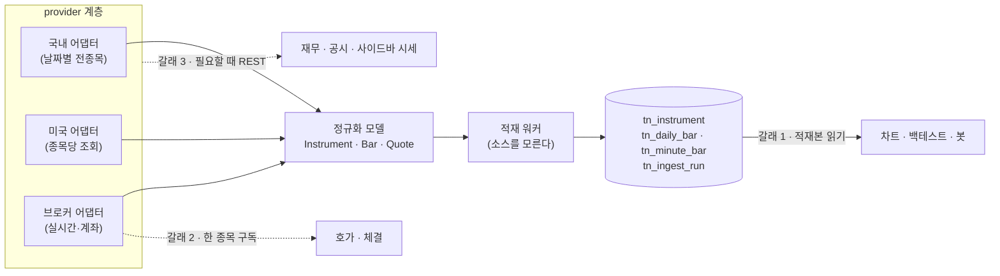
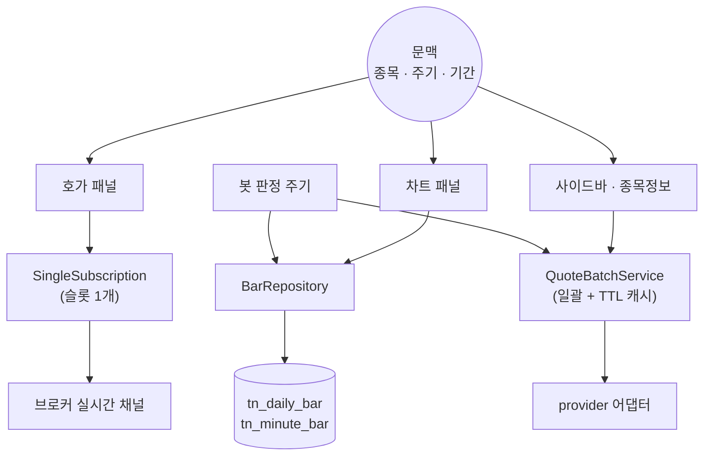

# 시세 적재 구현 설계 — 심볼 키·저장 스키마·provider 경계

> [시세-데이터-파이프라인](시세-데이터-파이프라인.md) 이 "무엇을 어디서 가져오는가"를 정했다면, 이 문서는 **어떤 키로 식별하고, 어떤 표로 쌓고, 소스를 어떻게 격리하며, 데이터가 화면까지 오는 세 갈래를 구조로 어떻게 강제하는가**를 정한다. 전환 절차·모듈 배치는 [M2 전환설계](m2-전환설계.md), 요구사항 정본은 [PRD](../specs/prd.md).

---

## 0. 큰 그림

**소비자는 provider 를 모른다.** 차트·백테스트·봇은 DB 만 읽는다. 이 한 줄이 지켜지지 않으면 소스를 하나 더 붙일 때 전부 뜯게 된다.

---

## 1. 심볼 식별 체계 — 되돌리기 비싼 결정

국내 6자리 코드와 미국 티커가 공존하고, 소스마다 표기가 다르다(단축코드·ISIN·CIK·CUSIP·FIGI). 캔들 700만 행의 키를 무엇으로 잡느냐가 저장량·조인 비용·티커 변경 내성을 한 번에 결정한다.

| 후보 | 캔들 키 크기 | 티커 변경 내성 | 소스 표기 흡수 | 판정 |
|---|---|---|---|---|
| 자연 복합키 `(market, symbol)` | 가변 문자열 2개 | **없음** — 티커가 바뀌면 과거 캔들의 정체성이 흔들린다 | 어댑터마다 변환 필요 | 기각 |
| 문자열 통합키 `KRX:005930` | 문자열 1개 | 없음 | 파싱이 필요한 합성 키 | 기각 |
| ISIN(12자) 또는 FIGI(12자) | 문자열 12바이트 | 있음 | **미국 무료 경로에서 ISIN 이 잘 나오지 않는다** | 기각 |
| **대리키 `instrument_id`(IDENTITY) + 자연키 유니크 + 별칭 표** | int4 4바이트 | 있음 | 별칭 표가 소스별 표기를 흡수 | **채택** |

**MD-AD-13 — 통합 키는 `instrument_id`(int, IDENTITY)다.**

- 순차 ID 는 `IDENTITY`(SQL 표준)로 둔다. 단일 DB 라 분산 ID 가 필요 없고, 랜덤 UUID 를 PK 로 쓰면 삽입이 흩어져 인덱스가 단편화된다.
- **화면과 API 표면은 여전히 `market` + `symbol` 을 쓴다.** 사람이 읽는 것은 종목코드다. 대리키는 내부 조인 전용이다.
- 종목 수는 국내 약 2,800 + 미국 수십이라 종목 마스터 전체를 메모리에 캐시할 수 있다 — 조인 하나가 늘어나는 대가가 작다.

### 1.1 시장·국가 표기

기존 코드가 이미 두 층위를 쓰고 있어 그대로 비준한다.

| 컬럼 | 값 | 쓰는 곳 |
|---|---|---|
| `country` | `KR` · `US` | MCP `market_search` 의 `KR`/`US`/`ALL` 필터가 여기 매핑된다 |
| `market` | `KOSPI` · `KOSDAQ` · `KONEX` · `NASDAQ` · `NYSE` · `AMEX` | 거래소 단위 판정(휴장·정규장 시간·패널 가용성) |

`symbol` 은 **반드시 문자열**이다. 국내 6자리 코드를 숫자로 저장하면 `005930` 이 `5930` 이 된다.

### 1.2 별칭 표 — 소스 표기를 여기서 끝낸다

`tn_symbol_alias(instrument_id, alias_kind, alias_value, valid_from, valid_to)` — `alias_kind` 는 `isin`·`cik`·`cusip`·`figi`·`source:<소스명>` 이다. 유효기간 열의 이유는 아래 MD-AD-25.

이 표가 있어야 **어댑터 밖으로 소스 표기가 새지 않는다.** 어댑터는 자기 표기를 별칭 표로 조회해 `instrument_id` 를 얻고, 그 뒤로는 도메인 키만 다룬다.

**MD-AD-25 — 별칭에 유효기간을 둔다.** 최초 설계(`(instrument_id, alias_kind)` PK, `(alias_kind, alias_value)` 유니크)는 kind 당 값이 하나뿐이라 **티커 재사용·변경 이력을 못 담는다.** zipline 의 `equity_symbol_mappings(sid, symbol, start_date, end_date)` 가 선례다(#240 스파이크 §1.4) — 미국 티커가 상장폐지 후 다른 회사에 재사용되는 사례가 실제로 있어, 유효기간 없이는 과거 캔들이 엉뚱한 종목에 붙는다.

- `tn_symbol_alias(instrument_id Int, alias_kind VarChar(30), alias_value VarChar(50), valid_from Date, valid_to Date NULL, reg_dt, reg_id, mod_dt, mod_id)`
- PK `(instrument_id, alias_kind, valid_from)` — 같은 kind 라도 유효기간마다 다른 행
- 유니크(부분 인덱스) `ux_symbol_alias_current (alias_kind, alias_value) WHERE valid_to IS NULL` — **"지금 유효한" 매핑만** 전역 유일성을 강제한다. 어댑터의 정상 조회 경로(`alias_kind, alias_value` → `instrument_id`)는 이 부분 인덱스 하나로 충분하다
- 과거(닫힌) 구간끼리 겹치지 않는지는 **DB 제약으로 강제하지 않는다** — `EXCLUDE USING gist` 가 필요하고 `btree_gist` 확장 설치가 전제라 배포 환경(관리형 Postgres 여부)에 달렸다. **미결 — 사람 결정**: 지금은 애플리케이션 계층 검증(적재 시 겹침 검사)으로 시작한다

### 1.3 거래일 캘린더 — `market` → 캘린더 코드

**MD-AD-21 — 거래일 캘린더는 `exchange_calendars`(Apache-2.0)를 채택한다.** 판정 근거·라이선스 확인 전문은 [시세-데이터-파이프라인 §1.1](시세-데이터-파이프라인.md)이 정본이다. 여기서는 스키마가 참조하는 매핑만 고정한다.

| `market` 값 | 캘린더 코드 | 비고 |
|---|---|---|
| `KOSPI`·`KOSDAQ`·`KONEX` | `XKRX` | 하나의 캘린더 — KRX 는 시장 구분과 무관하게 같은 거래일·거래시간을 쓴다 |
| `NASDAQ`·`NYSE`·`AMEX` | `XNYS` | `exchange_calendars` 에 `XNAS` 가 없다 — **세 시장 모두 `XNYS` 로 고정**한다. 나중에 시장별 세션 시각이 갈리는 사례가 발견되면 이 매핑을 재검토한다 |

이 매핑은 코드 상수로 `providers/` 밖(예: `app/core/calendar.py` 같은 공용 위치)에 둔다 — provider 어댑터마다 중복 정의하면 매핑이 갈라진다. `get_market_calendar(market: str) -> ExchangeCalendar` 하나가 정본이다.

---

## 2. 저장 스키마

| 테이블 | PK | 성격 | 감사 컬럼 |
|---|---|---|---|
| `tn_instrument` | `instrument_id` | 종목 마스터 — 티커·종목명·시장·국가·통화·업종·상장폐지 여부·상장일 | 4종 유지 |
| `tn_symbol_alias` | `(instrument_id, alias_kind, valid_from)` | 소스·표준 식별자 매핑 — 유효기간 포함 (MD-AD-25) | 4종 유지 |
| `tn_daily_bar` | `(instrument_id, trade_date)` | 일봉 OHLCV | **생략** (§2.2) |
| `tn_minute_bar` | `(instrument_id, ts)` | 분봉 OHLCV — **1분봉 전용**(`interval_min` CHECK, MD-AD-26) — 유니버스 한정 | **생략** |
| `tn_ingest_run` | `run_id` | 적재 이력 겸 잡 레코드 | 4종 유지 |

> **데이터 소스 키 표는 만들지 않는다** (2026-08-07 리드 결정으로 대체됨). 원래 여기 있던
> 워크스페이스별 키 표는 키를 `.env` 전역 설정에서 받기로 하면서 사라졌다 — 저장하지 않으므로
> 저장 암호화 대상도 없다. 읽는 자리는 `services/data_key/` 하나이고, 경계는
> `backend-service/scripts/verify_data_key_env_boundary.py` 가 지킨다. 감수 사항(호스팅 모드
> 미성립)은 루트 `CONTEXT.md` 결정 로그에 적었다.

### 2.1 인덱스

| 인덱스 | 답하는 질의 | 필요한가 |
|---|---|---|
| `tn_daily_bar` PK `(instrument_id, trade_date)` | 한 종목 10년 (차트·백테스트) | 필수 — 주 접근 경로 |
| `tn_daily_bar (trade_date)` | 특정 날짜 전 종목 (스크리너·유니버스 재계산) | 필수 — 이 축이 없으면 700만 행 풀 스캔 |
| `tn_instrument (country, is_active)` · `ux (market, symbol)` | 종목 목록·심볼 조회 | 필수 |
| `tn_instrument (issuer_nm)` 부분 일치 검색 | 종목명 검색 | **당장 두지 않는다** — 1만 행 미만이라 순차 스캔이 충분하다. 체감 지연이 관측되면 그때 `pg_trgm` GIN 을 추가한다 |
| `tn_symbol_alias ux_symbol_alias_current (alias_kind, alias_value) WHERE valid_to IS NULL` | 소스 표기 → 종목 (현재 유효한 매핑만) | 필수 — §1.2 MD-AD-25 |
| `tn_ingest_run (source, status)` · `(started_dt)` | 적재 상태 화면·워커 폴링 | 필수 |

**Postgres 는 FK 컬럼을 자동 인덱스하지 않는다.** `tn_symbol_alias.instrument_id` 는 PK 선두라 커버되지만, `tn_daily_bar.ingest_run_id` 같은 참조 컬럼은 명시적으로 인덱스한다.

### 2.2 대용량 시계열의 감사 컬럼

anti-patterns 룰 5(감사 컬럼 4종)의 예외 조항은 "스키마 양쪽 모두 컬럼 정의 안 됨 → 의도된 설계, 위반 아님"이다. 일봉·분봉은 이 예외를 **명시적으로** 택한다.

- 비용: `reg_id`·`mod_id` 는 varchar(100) 이라 행당 최대 200바이트, 700만 행이면 최대 1.4GB 가 감사 용도로만 쓰인다.
- 대체: `source`(어느 소스에서 왔나) + `ingest_run_id`(어느 실행이 썼나) + `ingested_at`. **행 단위 provenance 로는 감사 컬럼보다 정확하다** — 누가 눌렀는지가 아니라 어느 소스·어느 실행인지가 이 데이터의 실제 감사 축이다.
- 이 예외를 `anti-patterns-backend.md` 룰 5 의 예외 목록에 추가한다(헤더 일치 규칙상 3곳 동시 갱신).

---

## 3. 규모 판정과 파티셔닝

**숫자로 판단한다.** 아래는 계산이며, 종목 수·거래일 수는 미검증 가정이다.

| 대상 | 계산 | 행 수 | 추정 크기 |
|---|---|---|---|
| 국내 일봉 10년 | 2,800종목 × 250거래일 × 10년 | **700만** | 본체 약 0.8GB + 인덱스 약 0.2GB |
| 미국 일봉 10년 | 40종목 × 2,500 | 10만 | 무시 가능 |
| 국내 분봉 1년 (유니버스 200) | 200종목 × 390분 × 250일 | **1,950만/년** | 약 2GB/년 |

### 3.1 일봉 — 파티셔닝하지 않는다

**MD-AD-14 — `tn_daily_bar` 는 단일 테이블이다.** 700만 행·1GB 는 PostgreSQL 에서 파티셔닝 없이 다루는 통상 규모다. PK 가 `(instrument_id, trade_date)` 라 "한 종목 10년"은 인덱스 레인지 스캔 수천 행이고, `(trade_date)` 보조 인덱스가 "하루 전 종목" 2,800행을 받는다. 파티셔닝은 이 규모에서 운영 부담만 늘린다.

### 3.2 분봉 — 처음부터 선언적 파티셔닝

**MD-AD-15 — `tn_minute_bar` 는 `PARTITION BY RANGE (ts)` 월 단위로 만든다.**

파티셔닝이 필요한 이유는 조회 성능이 아니라 **삭제**다. 국내 분봉은 소스 상한이 1분봉·1년이라 보존 기간이 사실상 회전한다. 오래된 구간을 지우는 동작이 실제 운영이 되는데,

- 단일 테이블: `DELETE` 수백만 행 → 긴 트랜잭션 · 테이블 팽창 · VACUUM 부담
- 파티션드: `DROP PARTITION` → 즉시, 잠금 없음

그리고 **나중에 파티셔닝으로 바꾸는 비용은 테이블 전체 재작성**(수 시간·긴 잠금)인 반면, 처음부터 파티션드로 만드는 비용은 0 이다. 되돌리기 비싼 결정의 정확한 사례이므로 지금 결정한다.

대가도 적는다.

| 대가 | 대응 |
|---|---|
| alembic autogenerate 가 파티션드 테이블을 다루지 못한다 | 이 테이블의 리비전은 손으로 작성한다 |
| 유니크 제약에 파티션 키가 포함돼야 한다 | PK 가 `(instrument_id, ts)` 라 `ts` 가 이미 들어 있다 — 제약 없음 |
| 파티션을 미리 만들어야 한다 | 마이그레이션이 **향후 12개월분을 선행 생성**하고, 적재 워커는 시작 전 "대상 구간의 파티션이 있는가"만 확인해 없으면 적재를 거부한다. 런타임에 DDL 을 치지 않는다 |

**더 단순한 대안**(분봉도 단일 테이블로 시작, 5천만 행을 넘으면 이관)은 §8 의 판단 요청으로 올린다.

### 3.3 분봉 주기(interval) 불변식 — 스키마와 API 가 어긋나 보이는 문제

PK `(instrument_id, ts)` 에는 **주기(interval) 축이 없다.** jesse(유니크 키에 `timeframe` 포함)·vnpy(`BarOverview.interval`) 는 둘 다 이 축을 스키마에 갖는다(#240 스파이크 §1.3·§1.7). 그런데 §5.3 의 `fetch_minute(instrument, ts_from, ts_to, interval)` 은 `interval` 을 받는다 — 겉보기엔 스키마가 API 계약을 못 담는 것처럼 보인다.

**MD-AD-26 — `tn_minute_bar` 는 1분봉 전용이며, 이것은 사고가 아니라 PRD 의 명시적 가정이다.** "5·15·30·60분봉은 1분봉에서 합성한다 — 별도 적재하지 않는다"(`prd.md#가정`)에 따라 `IngestService` 는 **저장 목적으로는 언제나 `interval_min=1` 로만** `fetch_minute` 을 호출한다. 어댑터 계약의 `interval` 인자는 소스 쪽 조회 세분화(1분봉을 못 주는 소스가 있을 수 있어 대비)를 위한 것이지, 저장 스키마가 여러 주기를 받는다는 뜻이 아니다.

- 이 불변식을 암묵적 가정에서 **스키마 제약**으로 끌어올린다: `interval_min SMALLINT NOT NULL DEFAULT 1` 컬럼 + `CHECK (interval_min = 1)` 을 추가한다. **PK 는 바꾸지 않는다** — 방어 목적의 CHECK 이지 새 축을 여는 것이 아니다.
- 다른 주기를 실제로 저장해야 하는 요구(예: 소스가 1분봉을 안 주고 5분봉만 주는 경우)가 생기면 이 CHECK 가 먼저 실패해 "PK 를 다시 설계해야 한다"는 신호를 준다 — 조용히 키 충돌로 이어지지 않는다.

---

## 4. 중복·수정주가·source 태깅

### 4.1 중복 방지 (FR-014)

**MD-AD-16 — 유니크 제약 + upsert 로 끝낸다.** `tn_daily_bar` 는 `(instrument_id, trade_date)` 가 PK 이므로 재적재는 `INSERT ... ON CONFLICT DO UPDATE` 다. "같은 구간을 다시 받으면 중복 행이 아니라 갱신"이라는 엣지 케이스가 스키마 수준에서 만족된다.

### 4.2 source 태깅 (FR-011) — 소스를 키에 넣지 않는다

| 후보 | 저장량 | 소스 걷어내기 | 조회 |
|---|---|---|---|
| `(instrument_id, trade_date, source)` 를 키로 | 소스 수만큼 배 | 완전 | 조회할 때마다 소스 우선순위를 골라야 한다 |
| **한 행 + `source` 컬럼 + 시장별 정본 소스 1개** | 1배 | `DELETE WHERE source='X'` 후 정본 소스로 재적재 | 단순 |

**MD-AD-17 — 시장마다 정본 소스를 하나 정하고, 다른 소스는 빈 구간만 채운다.** `source` 태깅의 목적(약관 변경·서비스 종료 시 그 소스 데이터만 골라내기)은 이 방식으로 충족된다. 정본 소스는 적재 잡 정의에 적는다 — 별도 정책 테이블을 만들지 않는다.

### 4.3 수정주가 정책 (FR-015)

소스마다 수정주가 제공 방식이 다르고, 섞이면 백테스트 수익률이 조용히 틀어진다. 더 나쁜 것은 **외부 소스가 나중에 수정주가를 재계산하면 같은 백테스트가 다른 결과를 낸다**는 점이다.

**MD-AD-18 — 무수정 원본을 정본으로 저장하고, 각 행에 적용한 정책을 기록한다.**

| 컬럼 | 값 | 뜻 |
|---|---|---|
| `adj_policy` | `raw` | 무수정 원본 (기본) |
| | `adj_split` | 액면분할만 반영 |
| | `adj_split_div` | 액면분할 + 배당 반영 |

- 우리 DB 가 바뀌지 않으므로 **NFR-006(백테스트 재현성)이 저장 구조에서 만족된다.**
- 수정계수(액면분할·배당)는 `tn_corporate_action` 에 별도로 쌓고 **백테스트가 적용**한다. 소스가 재계산해도 우리 원본은 그대로다.
- **M2 범위는 `adj_policy` 기록 + 원본 저장까지**다. corporate action 소스 확보가 확정되지 않았고, 계수 적용은 백테스트(P2)와 함께 와야 의미가 있다.

### 4.4 응답 내 중복 틱 정리

MD-AD-16(upsert)은 **배치 간** 중복(같은 구간을 다시 적재)만 해결한다. **한 응답 안에서** 같은 타임스탬프가 두 번 오는 경우의 규칙이 없었다.

**MD-AD-24 — 어댑터가 정규화 모델로 변환하기 직전에 응답 내 중복을 병합한다.** freqtrade `clean_ohlcv_dataframe` 의 `groupby(date).agg(...)` 규칙을 그대로 채택한다(#240 스파이크 §1.2):

| 필드 | 병합 규칙 |
|---|---|
| `open` | first |
| `high` | max |
| `low` | min |
| `close` | last |
| `volume` | **max**(합계 아님 — 별개 거래의 합산이 아니라 같은 스냅샷의 중복 발신으로 간주) |

병합은 행 소실이 아니므로 `tn_ingest_run.skipped_rows` 에 넣지 않는다. 병합 발생 건수는 어댑터 로그에만 남긴다 — 정상적인 응답 패턴이라 적재 이력에 노이즈를 만들 필요가 없다.

### 4.5 미완성(장중) 캔들 재수집

**MD-AD-22 — 적재 워커는 매 실행마다 DB 상 마지막 저장 거래일을 항상 재요청한다.** freqtrade 는 `drop_incomplete=True` 로 저장된 마지막 캔들을 무조건 미완성으로 간주해 버리고 재수집한다(#240 스파이크 §1.2). 우리는 §1.3 의 캘린더가 있으므로 더 정확하게 가른다 — "마지막 저장 거래일이 캘린더상 이미 완료된 거래일인가"로 재요청 여부를 판단한다.

- `IngestService` 는 `fetch_daily` 호출 시 `date_from` 을 항상 "DB 상 이 종목의 마지막 저장 `trade_date`"로 잡는다(새 구간이 아니라 마지막 하루를 다시 포함). MD-AD-16 upsert 가 그 행을 갱신한다 — 새 컬럼·새 플래그가 필요 없다.
- 스케줄 적재(work-order-3 T7)는 원칙적으로 **장마감 이후 시각**에 걸어 이 경로를 거의 타지 않게 한다. 수동 적재(`POST /ingest/run`)는 장중에도 호출 가능하므로 이 규칙이 안전망이다.

---

## 5. provider 어댑터 경계

### 5.1 계층과 책임

| 계층 | 아는 것 | 모르는 것 |
|---|---|---|
| **어댑터** `providers/<소스>/` | 인증·페이지네이션·한도·에러·소스 표기 | 우리 테이블·워크스페이스·화면 |
| **정규화 모델** `providers/models.py` | `Instrument` · `Bar` · `Quote` · `Capability` | 소스 |
| **적재 워커** `managers/ingest/` | 정규화 모델 · 우리 테이블 | 소스가 무엇인지 |
| **소비자** (차트·백테스트·봇) | 우리 테이블 | 소스도 provider 도 |

### 5.2 소스 필드가 새지 않게 하는 구체적 방법

말로 "새면 안 된다"고 적는 것은 규율이 아니다. 검출되는 형태로 못 박는다.

| # | 방법 | 검출·강제 |
|---|---|---|
| 1 | **소스 이름은 `providers/<소스>/` 밖에서 import 되지 않는다** | `app/{services,repositories,routers}` 안에 `from providers.<소스명>` 이 나오면 위반 (룰 15 후보) |
| 2 | **어댑터의 반환 타입은 정규화 모델로만 선언한다** | 어댑터 메서드 시그니처가 `dict` 를 반환하면 위반 — 원본 dict 를 밖으로 내보내는 유일한 통로가 막힌다 |
| 3 | **외부 응답은 어댑터 안에서 검증한다** | 서드파티 응답은 무조건 untrusted. Pydantic 파싱 실패 행은 버리고 `tn_ingest_run` 에 건수를 기록한다 — 조용히 통과시키지 않는다 |
| 4 | **한도·재시도·페이지네이션은 어댑터가 소유한다** | 워커에 `sleep`·`page`·`rate` 가 나오면 위반. 한도 소진은 도메인 예외로 올린다 |
| 5 | **API 키는 어댑터 생성자로 주입받는다** | 어댑터 안에서 `settings.` 를 읽으면 위반. 키의 출처는 `.env` 이고(2026-08-07 리드 결정 — 원문은 "워크스페이스 설정"이었다) 읽는 자리는 `services/data_key/` 하나다. 주입 지점을 하나로 묶어야 키가 가림 등록을 반드시 거친다(`utils/redaction/`) |
| 6 | **`capabilities()` 를 인터페이스에 둔다** | "이 소스가 이 시장에 무엇을 줄 수 있나"를 데이터로 노출한다. 패널의 "해당 시장은 제공되지 않음"(FR-021)이 화면 하드코딩이 아니라 capability 조회가 된다 |

### 5.3 어댑터 인터페이스

Protocol 로 선언하고, 새 소스를 붙이는 일이 **파일 하나 추가**로 끝나게 한다.

| 메서드 | 반환 | 비고 |
|---|---|---|
| `capabilities()` | `Capability` 집합 | 시장 × 데이터종류 × 가용 여부·사유 |
| `list_instruments(market)` | `Instrument` 목록 | 종목 마스터 (FR-008) |
| `fetch_daily(instrument, date_from, date_to)` | `Bar` 목록 | **기간 지정** — 페이지네이션은 어댑터가 감춘다 |
| `fetch_minute(instrument, ts_from, ts_to, interval)` | `Bar` 목록 | 유니버스 한정 (FR-046) |
| `fetch_quotes(instruments)` | `Quote` 목록 | **일괄 조회** — 사이드바·봇이 쓴다 (FR-048·049) |

**LLM 대화용 시세 도구와 적재용 계약을 나눈다**([시세-데이터-파이프라인 §5](시세-데이터-파이프라인.md)의 열린 항목). 기존 MCP `market_ohlc` 는 최신순 N개(1~120)로 **그대로 둔다** — LLM 컨텍스트 보호가 그 계약의 목적이다. 적재는 위 `fetch_daily(from, to)` 를 쓴다. 두 계약은 섞지 않는다.

---

## 6. 데이터가 화면에 오는 세 갈래

FR-047·048·049 는 "어떻게 오는가"가 서로 다른 세 경로다. 문서로 구분하는 것만으로는 지켜지지 않으므로 **주입되는 타입으로 갈라 물리적으로 막는다.**

| 갈래 | 무엇 | 소비자가 주입받는 것 | 주입받지 **못하는** 것 |
|---|---|---|---|
| **1. 적재본 읽기** | 과거 캔들 (차트·백테스트·봇 판정 입력) | `BarRepository` | provider · 실시간 구독 |
| **2. 한 종목 실시간 구독** | 호가·체결 (FR-047) | `SingleSubscription` | 다종목 구독 API 자체가 없다 |
| **3. 필요할 때 REST** | 재무·공시·뉴스 · 사이드바 다종목 시세(FR-048) · 봇 주기 조회(FR-049) | `QuoteBatchService` · MCP 도구 클라이언트 | 구독 API |

**갈래 2 의 상한을 자료구조로 표현한다.** `SingleSubscription` 은 새 구독 요청이 오면 기존 구독을 해제하고 교체한다 — 동시에 두 종목을 구독하는 코드를 **쓸 수 없다**. 증권사 실시간 채널의 동시 구독 상한(조사 기준 40건, 실질 20종목)이 근거다. "종목을 바꾸면 구독을 옮긴다"가 규약이 아니라 타입이 된다.

**갈래 3 은 구독 API 를 갖지 않는다.** `QuoteBatchService.quotes(symbols)` 는 일괄 조회 + TTL 캐시다. 패널 N개가 같은 종목을 동시에 열어도 호출은 한 번이다 — NFR-009(종목 전환 시 응답성)와 NFR-007(한도 초과 금지)이 여기서 갈린다.

---

## 7. 적재 실행 — 잡·한도·재개

### 7.1 잡 레코드가 곧 이력이다

`tn_ingest_run` 하나가 **요청·실행·이력** 셋을 겸한다(M2-AD-12). 새 큐 테이블을 만들지 않는다.

| 컬럼 | 뜻 |
|---|---|
| `run_id` · `source` · `job_kind` | 무엇을 적재하는가 (`instrument_master` · `daily_bar` · `minute_bar`) |
| `scope` · `period_from` · `period_to` | 어디까지 (시장 전체 / 유니버스 / 지정 종목) |
| `status` | `queued` → `running` → `succeeded` · `failed` · `rate_limited` |
| `workspace_id` | 누가 요청했나 (키의 출처 — 적재된 캔들 자체는 워크스페이스 스코프가 아니다, M2-AD-10) |
| `cursor` | **다음 실행이 이어받을 지점** |
| `written_rows` · `skipped_rows` · `failed_reason` | 화면이 보여줄 결과 (FR-010) |

### 7.2 한도 소진은 조용히 실패하지 않는다

NFR-007 이 "한도 도달 시 조용히 실패하지 않아야 한다"고 요구한다. 어댑터가 한도 소진을 도메인 예외로 올리면 워커는

1. 지금까지 받은 것을 커밋하고,
2. `status='rate_limited'` + `cursor` 를 기록하고,
3. 다음 실행이 `cursor` 부터 이어받는다.

적재 상태 화면은 "어디까지 받았고 무엇이 실패했는지"를 이 레코드에서 그대로 읽는다.

조사된 한도(#230)를 근거 값으로 적어 둔다 — 잡 분할 크기를 정하는 입력이다.

| 소스 | 한도 |
|---|---|
| data.go.kr 금융위 | 10,000 / 일 |
| OpenDART | 20,000 / 일 |
| ECOS(한국은행) | 3분당 300회 |
| KOSIS | 분당 200회 |

### 7.3 실행 형태

- 워커는 통합 앱의 `lifespan` 에서 뜨는 백그라운드 루프다(`asyncio.create_task` + instance attr 보관 + shutdown `cancel()`). anti-patterns 룰 13 이 규정한 패턴이다.
- 벌크 insert 는 sync DB 호출이므로 `run_in_threadpool` 로 감싼다(룰 13 의 "N+1 sync DB loop"). 단일 select 까지 감싸지 않는다.
- 중복 실행은 **advisory lock** 으로 막는다. `--workers=1` 이라 사실상 단일이지만, 개발 중 재시작이 겹치는 창을 닫는다.

### 7.4 키 없이도 기동한다 (FR-013)

데이터 소스 키가 없으면 어댑터를 만들 수 없다. 이때 기동을 막지 않고, **capability 조회가 "키 없음"을 사유로 반환**한다. 패널은 그 사유를 그대로 화면에 표시한다 — "왜 비어 있는지"가 코드 분기가 아니라 데이터로 흐른다.

사유에는 **`.env` 의 어느 항목을 채워야 하는지**와 발급 경로가 실린다(`services/data_key/` 의 `unavailable_reason`). **키 값도, 앞자리 몇 글자도 싣지 않는다** — 이 문장은 API 응답으로 나간다. 그 계약은 `backend-service/tests/test_data_source_key_leak.py` 가 실제 키를 꽂고 확인한다.

### 7.5 갭 검출 — 결측 vs 휴장 구분

`tn_ingest_run` 은 실행 이력이지 완결성 장부가 아니다. "이 종목 이 구간에 빠진 거래일이 있는가"는 지금까지 물을 방법이 없었다 — §1.3 의 캘린더가 전제조건이었기 때문이다.

**MD-AD-23 — 갭은 조회 시점에 계산하고 저장하지 않는다.** freqtrade·jesse 는 결측 구간을 무조건 채우지만(암호화폐라 캘린더가 없어도 됨, #240 스파이크 §1.2·§1.3), 우리는 채우지 않고 **탐지만** 한다 — 무엇을 채울지는 백테스트·화면의 몫이지 적재 파이프라인의 몫이 아니다.

- 계산: 종목의 `listed_dt` ~ `min(오늘, delisted_dt)` 구간의 캘린더 세션 목록과 `tn_daily_bar.trade_date` 실제 목록을 대조해 차집합을 구한다.
- **새 컬럼·새 표를 만들지 않는다** — 적재할 때마다 다시 갱신해야 하는 이중 장부가 생기는 대신, `BarService`(work-order-3 T8)나 적재 상태 화면이 종목을 조회할 때 온디맨드로 계산한다.
- 전 종목 상시 스캔(배치 리포트)은 비용이 크므로 M2 범위에 넣지 않는다 — 필요성이 관측되면 별도 태스크로 분리한다.

---

## 8. 판단 결과 (2026-07-29 리드 확정)

| # | 물음 | 확정 | 근거 |
|---|---|---|---|
| **Q8** | 분봉을 처음부터 파티셔닝할 것인가 | 월 파티션 / 단일 테이블로 시작 후 이관 | **월 파티션 확정.** 나중 전환은 테이블 재작성이라 지금이 유일하게 싼 시점 |
| **Q9** | 미국 시세 소스를 무엇으로 확정할 것인가 | Alpaca / Alpha Vantage / M2 는 국내만 | **Alpaca 확정** (사용자 자기 키). 시세·주문·실시간이 한 곳이라 어댑터 수가 줄고, 이메일 가입만으로 1~59분봉을 2016년부터 받는다. **배포판에는 데이터 0바이트** — 어댑터만 배포한다. 합성 데이터·yfinance 기본 탑재는 기각(#240) |
| **Q10** | 정본 소스를 시장마다 하나로 고정하는 것이 맞는가 | 고정 / 데이터 종류별로 다르게 | **시장 단위 고정 확정.** 종류별로 가르면 같은 캔들에 두 소스가 섞일 여지가 생긴다 |
| **Q11** | corporate action(액면분할·배당) 적재를 M2 에 넣을 것인가 | M2 포함 / 백테스트(P2)와 함께 | **적재는 P2, 설계는 M2.** 소스가 확정되지 않았고 계수는 적용할 소비자(백테스트)가 있어야 검증된다. 다만 무수정 원본 저장 + `adj_policy` 기록까지는 M2 에서 갖춰 나중에 계수만 얹으면 되게 한다 |

---

## 9. 결정 기록

**번호 공간은 [M2 전환설계 §10](m2-전환설계.md) 와 독립이다(#343, 2026-08-03 해소).** 원래 이 문서와 m2-전환설계가 번호를 공유하도록 설계됐는데, 두 문서가 각각 독립적으로 13번을 썼다 — 이 문서의 구번호 13(대리키, 지금의 MD-AD-13)과 m2-전환설계의 구번호 13(`tn_workspace_member` 격리, 지금의 M2-AD-13)이 같은 번호로 서로 다른 결정을 가리켰다(2026-08-02 확인). "재번호·폐기 ID 재사용을 하지 않는다"는 원칙상 두 결정 모두 번호(13)는 그대로 두고, **문서별 접두사**(이 문서는 `MD-AD-`, m2-전환설계는 `M2-AD-`)를 붙여 구조적으로 재충돌이 불가능하게 했다 — `scripts/verify_ad_numbering.py` 가 CI 에서 이 불변식(문서 내 번호 유일성 + `MD-AD-`/`M2-AD-` 접두사 형식 준수)을 강제한다. 이 문서가 앞으로 추가하는 결정은 이 문서의 로컬 최댓값(현재 MD-AD-26) 다음 번호를 쓴다 — m2-전환설계 쪽 번호와 더는 맞출 필요가 없다.

| ID | 결정 | 막는 것 | 규칙 |
|---|---|---|---|
| **MD-AD-13** | 통합 키는 대리키 `instrument_id`(IDENTITY) + `(market, symbol)` 유니크 + 별칭 표 | 티커 변경 시 과거 캔들의 정체성 상실, 소스 표기 누출 | 화면·API 는 `market`+`symbol`, 내부 조인만 대리키. `symbol` 은 문자열 |
| **MD-AD-14** | `tn_daily_bar` 는 단일 테이블 | 규모에 맞지 않는 운영 부담 | 700만 행·1GB — 파티셔닝하지 않는다 |
| **MD-AD-15** | `tn_minute_bar` 는 월 단위 선언적 파티셔닝 | 나중 전환 시의 테이블 재작성 | 파티션은 마이그레이션이 12개월 선행 생성. 런타임 DDL 금지 |
| **MD-AD-16** | 중복 방지는 유니크 제약 + upsert | 재적재 시 중복 행 | 애플리케이션 사전 조회에 의존하지 않는다 |
| **MD-AD-17** | 시장별 정본 소스 1개 + `source` 컬럼 (소스를 키에 넣지 않음) | 저장량 수 배 증가와 조회 시 우선순위 로직 | 소스 걷어내기는 `DELETE WHERE source` + 재적재 |
| **MD-AD-18** | 무수정 원본을 정본으로 저장하고 `adj_policy` 를 행에 기록 | 외부 소스 재계산으로 백테스트가 달라지는 것 | 수정계수는 별도 표에 쌓고 백테스트가 적용 |
| **MD-AD-19** | 세 갈래는 **주입 타입**으로 가른다 | 차트가 provider 를 직접 부르거나 사이드바가 다종목 구독을 거는 것 | 갈래 2 는 슬롯 1개 자료구조, 갈래 3 은 구독 API 를 갖지 않는다 |
| **MD-AD-20** | 어댑터는 키를 **생성자로 주입**받는다 (출처는 `.env`, 읽는 자리는 `services/data_key/` 하나) | 키 출처가 여러 자리로 흩어져 가림 등록·경계 검증을 빠져나가는 것 | 어댑터 안에서 `settings.` 를 읽지 않는다. **"워크스페이스 설정에서" 는 2026-08-07 리드 결정으로 대체됐다** — 로컬 배포판 우선이라 워크스페이스별 키가 의미가 없다. 감수(호스팅 모드 미성립)는 `CONTEXT.md` 결정 로그 |
| **MD-AD-21** | 거래일 캘린더는 `exchange_calendars`(Apache-2.0) 채택. `market` → 캘린더 코드는 KOSPI/KOSDAQ/KONEX→`XKRX`, NASDAQ/NYSE/AMEX→`XNYS`(캘린더 하나 공유, `XNAS` 없음) | 캘린더를 직접 구현해 예외를 영원히 따라가야 하는 것 | §1.3. 라이선스 판정 전문은 파이프라인 §1.1 |
| **MD-AD-22** | 적재 워커는 매 실행마다 **DB 상 마지막 저장 거래일을 항상 재요청**한다 | 장중 적재로 반쪽 캔들이 정본에 영구히 남는 것 | §4.5. freqtrade `drop_incomplete` 의 캘린더 인지 버전 |
| **MD-AD-23** | 갭 검출은 **조회 시점에 계산하고 저장하지 않는다** | 결측(빠진 거래일)과 휴장(원래 없는 날)의 혼동, 이중 장부 | §7.5. 캘린더 세션 목록 vs `tn_daily_bar.trade_date` 차집합 |
| **MD-AD-24** | 응답 내 중복 틱은 어댑터가 `open=first·high=max·low=min·close=last·volume=max` 로 병합 | 같은 응답의 중복 타임스탬프가 그대로 적재되는 것 | §4.4. freqtrade `clean_ohlcv_dataframe` 규칙 채택 |
| **MD-AD-25** | `tn_symbol_alias` 에 `valid_from`/`valid_to` 를 추가하고 PK 를 `(instrument_id, alias_kind, valid_from)` 로 바꾼다 | 티커 재사용 시 과거 캔들이 엉뚱한 종목에 붙는 것 | §1.2. "현재값" 유일성은 `valid_to IS NULL` 부분 유니크 인덱스 |
| **MD-AD-26** | `tn_minute_bar` 는 1분봉 전용 — `interval_min SMALLINT DEFAULT 1` + `CHECK (interval_min = 1)` | 다른 주기를 함께 적재해 PK 가 조용히 충돌하는 것 | §3.3. PRD 가정(합성 전용, 별도 적재 없음)을 스키마로 강제 |
