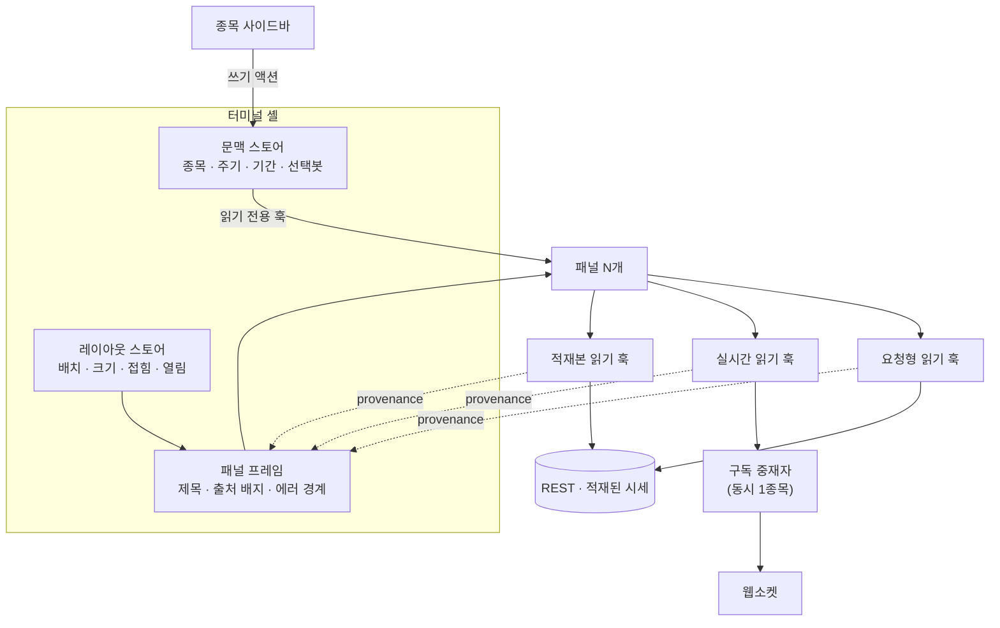

# 터미널 프론트엔드 구조 — UI 라이브러리 교체와 패널 시스템

> M2 터미널 골조를 짓기 위한 프론트엔드 결정. 무엇으로 갈아타는가(그리드·차트·컴포넌트), 89 파일에 퍼진 DevExtreme 을 어떤 순서로 걷어내는가, 패널이 문맥·레이아웃·데이터 세 갈래를 어떻게 공유하는가, 출처 없는 값이 화면에 못 뜨게 하는 장치는 무엇인가. 화면이 무엇을 보여주는지(패널 목록·출처)는 [트레이딩-터미널](트레이딩-터미널.md)이 원본이고, 이 문서는 그것을 **어떤 구조로 지탱하는가**만 담는다. 이 제품 전용.

---

## 0. 큰 그림

터미널은 화면 하나가 아니라 **패널을 꽂는 틀**이다. 틀이 지는 책임은 셋 — 문맥을 한 곳에 두고, 배치를 저장·복원하고, 패널이 규약을 어기지 못하게 막는 것.



> 점선이 이 설계의 핵심이다. 데이터 훅은 값과 함께 **출처(provenance)** 를 반환하고, 배지를 그리는 것은 패널이 아니라 프레임이다. 패널 작성자가 표시를 빠뜨릴 수 없다.

---

## 1. 결정 요약

오더·리뷰가 번호로 인용한다. 번호는 재사용하지 않는다.

| ID | 결정 | 막는 것 |
|---|---|---|
| **FE-AD-1** | 그리드는 `@tanstack/react-table` (헤드리스) — 컬럼·필터·정렬 계약을 우리가 소유한다 | 무료/유료가 섞인 제품을 다시 골라 같은 벽에 부딪히는 것 |
| **FE-AD-2** | 캔들 차트는 `lightweight-charts`. 비-가격 차트는 이미 있는 `echarts` 를 쓴다 | 차트 라이브러리가 둘 이상 늘어나는 것 |
| **FE-AD-3** | 폼·다이얼로그 프리미티브는 `radix-ui` + Tailwind. **기존 래퍼 API 를 유지한 채 내부만 교체** | 소비자 코드(폼 전체)의 동시 개편 |
| **FE-AD-4** | 필터·정렬 JSON 문법은 **바꾸지 않는다**. 새 그리드 어댑터가 같은 형식을 방출한다 | 프론트 교체가 백엔드 3개 서비스로 번지는 것 |
| **FE-AD-5** | 교체는 big bang 이 아니라 **커널 → 파일럿 1화면 → 확산 → 의존성 제거** 순서 | 회귀 테스트 0건 상태에서 89 파일 동시 변경 |
| **FE-AD-6** | 문맥·레이아웃은 zustand 전역 스토어. 패널은 **읽기 전용 훅**으로만 접근한다 | 패널이 문맥을 바꿔 서로를 흔드는 것 |
| ~~**FE-AD-7**~~ | ~~자유 배치는 `react-grid-layout`~~ — **철회(2026-08-15, `#73` S3)**. 자유 배치 자체가 없어졌다(화면 결정 §20.2). 접기·닫기가 패널 프레임 소유라는 뒷절은 그대로 유효하다 | — |
| **FE-AD-8** | 레이아웃 저장은 `schemaVersion` + 순차 마이그레이션. **모르는 패널 타입은 버리지 않고 보존** | 패널이 추가·제거될 때 옛 레이아웃이 조용히 깨지는 것 |
| **FE-AD-9** | 패널은 종목·주기를 props 로 받지 않는다. 훅으로 직접 읽는다 | 문맥 한 번 바뀔 때 셸이 리렌더되어 전 패널이 함께 도는 것 |
| **FE-AD-10** | 데이터 접근은 **세 갈래 전용 훅**만 허용. 실시간 구독은 싱글턴 중재자가 소유 | 패널마다 구독을 걸어 동시 구독 상한을 넘기는 것 |
| **FE-AD-11** | 모든 패널 데이터 훅은 `provenance` 를 **필수 반환**하고, 배지·빈 상태는 프레임이 그린다 | 출처 없는 값이 조용히 화면에 뜨는 것 |
| **FE-AD-12** | Vitest 를 도입하되 **순수 로직 한정** — 컴포넌트 렌더 테스트는 이번 범위 밖 | 브라우저로도 안 보이는 회귀(옛 레이아웃·시장별 가용성)를 놓치는 것 |
| **FE-AD-13** | 아직 없는 백엔드는 `EndpointNotReadyError` 예외 하나로 표현하고, 화면에는 임시 데이터로 뜬다 | 백엔드 계약이 확정될 때까지 패널 개발이 멈추는 것 |
| **FE-AD-14** | 터미널은 **종목 사이드바까지 한 페이지 안에** 담는다. 기존 MDI 탭 섀시의 한 탭으로 들어간다 | 사이드바와 패널이 다른 문서(iframe)에 갈려 문맥 스토어를 공유하지 못하는 것 |

---

## 2. UI 라이브러리 교체

### 2.1 무엇으로 가나

버전·라이선스는 2026-07-28 npm 레지스트리 실측이다.

| 자리 | 채택 | 버전·라이선스 | 근거 |
|---|---|---|---|
| 그리드 | `@tanstack/react-table` (+`@tanstack/react-virtual`) | 8.21.3 · MIT / 3.14.8 · MIT | 헤드리스라 렌더·문자열·필터 형식이 전부 우리 것. 유료 티어가 없어 "이 기능은 유료"라는 벽이 다시 생기지 않는다 |
| 캔들 차트 | `lightweight-charts` | 5.2.0 · Apache-2.0 | 캔들·거래량 서브차트·마커·가격선이 금융 차트용으로 내장. 바닐라 JS 라 React 버전 호환 리스크가 원천적으로 없다 |
| 지표·비가격 차트 | `echarts` + `echarts-for-react` | 이미 의존성(6.1.0 / 3.0.6) | 대시보드가 이미 쓰고 있다. 새로 들이지 않는다 |
| 폼·다이얼로그·탭·툴팁 | `radix-ui` | 1.6.7 · MIT | React 19 를 peer 로 명시. 접근성(포커스 트랩·키보드·ARIA)이 프리미티브에 들어 있다 |
| 분할 화면(Splitter) | `react-resizable-panels` | 4.12.2 · MIT | DevExtreme `Splitter` 직접 import 11 파일의 1:1 대체 |
| 엑셀 쓰기 | `devextreme-exceljs-fork` **유지** | 4.4.11 · MIT | 이름과 달리 exceljs 포크이고 MIT 다. DevExtreme 을 지워도 남길 수 있다 — 버리는 것은 `devextreme/excel_exporter` 브리지뿐 |
| 가상 리스트 | `react-virtuoso` **유지** | 이미 의존성 | 뉴스·공시처럼 높이가 들쭉날쭉한 목록에 이미 쓰인다 |

**shadcn/ui 의 자리** — 의존성이 아니라 **소스 출처**로 쓴다. Radix 프리미티브 위에 Tailwind 스타일을 얹은 컴포넌트 소스를 시작점으로 벤더링하고, 공개 API 는 기존 래퍼 시그니처(`fieldName` · `onValueChanged(fieldName, value)` · `getFieldProps`)를 그대로 유지한다. CLI 로 프로젝트를 초기화하지 않는다 — Tailwind 버전·경로 관례가 이 레포와 다르다.

**기각한 후보**

| 후보 | 라이선스 | 기각 이유 |
|---|---|---|
| AG Grid Community 36.0.2 | MIT | 한 제품 안에 무료(Community)와 유료(Enterprise)가 섞여 있다. 그리드 고급 기능이 필요해지는 순간 DevExtreme 과 같은 지점(유료 라이선스·워터마크)으로 되돌아온다. **어느 기능이 Enterprise 인지는 미검증** — 이 불확실성 자체가 오픈소스 배포판에는 위험이다 |
| dockview 7.0.4 | MIT | 도킹·탭 그룹은 강력하지만 직렬화 포맷이 라이브러리 내부 구조다. 레이아웃 호환을 우리가 아니라 라이브러리가 쥐게 된다(FE-AD-8 과 충돌) |
| Syncfusion Community | 상용(무료 조건부) | CONTEXT 결정 로그에서 이미 기각 — 오픈소스 배포와 조건부 무료 라이선스가 모순 |

### 2.2 기존 래퍼는 흡수막인가 — 코드 실측

한 문장으로: **폼 래퍼는 흡수막이고, 그리드 래퍼는 아니다.**

| 대상 | 파일 수 | 공개 API 가 벤더에 묶였나 | 결론 |
|---|---:|---|---|
| `components/shared/ui/*` | 23 | 아니오 — props 가 전부 프로젝트 소유(`fieldName`·`onValueChanged`·`getFieldProps`), DevExtreme 은 파일 내부에만 등장 | **내부만 교체.** 소비자(모든 DetailForm/DetailView)는 한 줄도 안 바뀐다 |
| `components/shared/DataGrid/*` | 4 | 예 — `dataSource: DataSource`(devextreme/data)와 `columns: DataGridTypes.Column[]` 를 그대로 공개 | **래퍼부터 다시 짠다.** 소비자 22 파일이 벤더 타입을 직접 import 중 |
| `hooks/shared/use*GridData` | 3 | 예 — `DataSource`/`CustomStore`/`LoadOptions` 를 반환·소비 | 데이터층 재작성 |
| `hooks/shared/useFormState` | 1 | 부분 — `getFieldProps` 가 DevExtreme prop 이름(`validationStatus`·`validationError`·`validationMessageMode`·`stylingMode`)을 반환 | 훅 1개 + 래퍼 23개를 **같은 작업에서** 고친다(계약 변경 연쇄) |
| `lib/grid/filters.ts` | 1 | — | **유지.** 아래 |

> `lib/grid/filters.ts` 를 지우면 안 되는 이유: 이 필터·정렬 JSON 문법은 프론트만의 것이 아니다. 프론트 API 라우트 8곳이 쓰고, **파이썬 통합 앱**(`backend-service` 의 `app/utils/common/devextreme_utils.py` — 흡수 전에는 file·devactivity 에도 같은 복제본이 있었다)이 같은 형식을 파싱한다. 그리드를 바꿔도 이 문법은 그대로 두고 새 어댑터가 같은 JSON 을 방출한다 — 그러면 **백엔드는 0줄 변경**이다(FE-AD-4). 모듈 경로에서 벤더명을 떼는 리네이밍은 백엔드와 lockstep 이라 별도 작업으로 분리한다.

교체 방식이 자리마다 다른 이유도 여기서 나온다.

| 상태 | 방식 |
|---|---|
| 공개 API 가 이미 우리 것 (`ui/*`) | **이름 유지 + 내부 교체.** 두 벌이 생기지 않는다 |
| 공개 API 가 벤더 타입 (`DataGrid/*`, `use*GridData`) | **새 이름으로 신설 + 수명 명시.** `components/shared/DataTable/` 이 새것, `components/shared/DataGrid/` 는 확산이 끝나면 삭제 |

### 2.3 89 파일이 실제로 무엇인가

`devextreme` 문자열은 89 파일 · 125 지점에 있다(2026-07-28 실측). 전부가 같은 무게는 아니다.

| 구역 | 파일 | 성격 | 난이도 |
|---|---:|---|---|
| `components/shared/**` | 36 | 위젯 래퍼·패널·레이아웃 — 실제 교체 본체 | 높음 |
| `components/features/**` | 35 | 아래에서 다시 쪼갬 | 낮음~중간 |
| `hooks/shared/**` | 5 | DataSource·CustomStore·엑셀 브리지 | 높음 |
| `app/api/common/**/route.ts` | 8 | `@/lib/grid/filters` **경로 문자열만** — 런타임 무관 | 없음(유지) |
| `lib/grid/**` | 2 | 필터 문법 변환기 — 유지 | 없음 |
| `utils/common/locale/**` | 3 | ko/en 사전 — 함께 폐기 | 없음(삭제) |

`components/features/**` 35 파일의 내역:

| 유형 | 파일 | 하는 일 |
|---|---:|---|
| 컬럼 타입만(`DataGridTypes.Column[]`) | 22 | 타입 이름 치환 — 기계적 |
| `Splitter` 직접 import | 11 | 새 Splitter 로 치환 — 기계적 |
| 위 둘의 중복 | 9 | — |
| 위젯 직접 사용 | 11 | Auth 7 · Mypage 1 · Policy 2 · MenuDetailForm 1. 네이티브 폼 예외(anti-patterns 룰 4 예외 1) — 손으로 다시 짠다 |

> 다시 말해 "89 파일 재작성"이 아니다. **손으로 다시 짜야 하는 것은 shared 36 + hooks 5 + features 위젯 11 = 52 파일**이고, 24 파일은 타입·컴포넌트 이름 치환이며, 13 파일은 건드리지 않는다.

**놀랍게도 안 쓰는 기능** — `MasterGrid` 의 `useGrouping`·`useSummary` 옵션은 `components/features/**` 에서 사용 0건이다(실측). 그룹핑·집계는 "기능 갭"이 아니라 **쓴 적 없는 옵션**이다. 반면 `clientSidePaging={true}` 는 7곳에서 실사용 중이라 새 그리드가 반드시 지원해야 한다.

### 2.4 교체 순서 — 파일럿 먼저

big bang 을 기각하는 이유는 셋이다. 업계에 DevExtreme→오픈소스 자동 변환 도구가 없고, 89 파일 동시 변경은 리뷰가 불가능하며, 프론트 자동 테스트가 0건(#222)이라 회귀를 잡을 그물이 없다.

| 단계 | 무엇 | 완료 판정 |
|---|---|---|
| **S0 차단선** | M2 신규 코드는 DevExtreme 을 쓰지 않는다. anti-patterns 룰 4 를 "신규 코드에서 직접 import 금지"로 강화 | 새 폴더(터미널·패널)에서 `devextreme` grep 0 hit |
| **S1 커널** | 그리드 커널(`GridColumn` 타입·서버 테이블 훅·표시 컴포넌트)과 Splitter 대체를 **새 이름으로** 신설 | 기존 화면은 그대로 돌아간다(아직 안 건드림) |
| **S2 파일럿** | **관심종목(Watchlist) 한 화면**을 새 그리드·Splitter 로 이주 | 서버 필터·정렬·페이징·엑셀·코드 룩업이 한 화면에서 동시에 증명됨 |
| **S3 확산** | 폼 프리미티브 내부 교체(23개) + 나머지 화면 이주 | 화면별 브라우저 확인 |
| **S4 제거** | `devextreme`·`devextreme-react` 의존성 삭제, ko/en 사전 삭제, 라이선스 등록 컴포넌트 삭제, 옛 `DataGrid/` 삭제, 룰 4 폐기 | `git grep devextreme` 0 hit(`devextreme-exceljs-fork` 제외) |

**M2 범위는 S0·S1·S2 까지다.** S3·S4 는 오픈소스로 공개하기 전에 반드시 끝나야 하지만(DevExtreme 의존성이 남아 있으면 받는 사람마다 상용 라이선스 문제가 따라간다) M2 골조를 막지는 않는다.

파일럿을 관심종목으로 고른 이유: 터미널 사이드바가 같은 데이터를 쓰므로 M2 범위 안이고, 서버 원격 조작 + 공통코드 룩업 + 엑셀 + Splitter 가 한 화면에 다 들어 있어 커널을 한 번에 시험한다.

### 2.5 한국어 로케일 — 이전이 아니라 폐기

현재 `utils/common/locale/ko/devextreme.ts` 는 **DevExtreme 위젯이 자체 렌더하는 문자열 730키의 번역 사전**이다. 우리 화면 문구가 아니다.

| 새 스택 | 내장 UI 문자열 | 그래서 |
|---|---|---|
| TanStack Table | 없음(헤드리스) | 페이저·필터 문구는 우리 JSX 의 한국어 리터럴 |
| Radix | 사실상 없음 | `aria-label` 은 우리가 지정 |
| lightweight-charts | 없음 | 축·툴팁 문자열은 우리 포매터 |

따라서 730키 사전은 이전 대상이 아니라 **삭제 대상**이고, 새로 필요한 사전은 "우리가 실제로 화면에 쓰는 문자열"뿐이다. 위치는 `utils/common/locale/{ko,en}/ui.ts` 로 옮기고 부트스트랩(`locale/index.ts`)에서 DevExtreme `loadMessages`/`locale` 호출을 걷어낸다. 날짜·숫자 형식은 이미 있는 `date-fns` 와 `Intl.NumberFormat` 이 담당한다.

> 순효과: 번역 대상이 730키에서 수십 키로 줄고, 사전과 화면이 일치한다. 지금은 우리가 한 번도 안 띄우는 위젯의 문구까지 번역해 두고 있다.

### 2.6 남는 기능 갭

| 기능 | DevExtreme | 대체 | 지금 실사용 |
|---|---|---|---|
| 원격 필터·정렬·페이징 | `RemoteOperations` + `CustomStore` | `useServerTable` 훅이 같은 `{skip, take, filter, sort}` 쿼리를 방출 | 예(전 그리드) |
| 클라이언트 페이징 | `clientSidePaging` | TanStack 클라이언트 행 모델 | 예(7곳) |
| 헤더 필터·필터 로우 | 내장 | 컬럼 정의의 필터 서술 + Radix Popover 로 우리가 렌더 | 예 |
| 컬럼 리사이즈·고정 | 내장 | TanStack column sizing + CSS `position: sticky` | 예 |
| 가상 스크롤 | `Scrolling` | `@tanstack/react-virtual` | 예 |
| 트리(메뉴 계층) | `TreeList` | TanStack `getExpandedRowModel` + sub-rows | 예(1곳) |
| 그룹핑·집계 | `Grouping`/`Summary` | TanStack `getGroupedRowModel`·집계 함수(클라이언트) | **아니오 — 사용 0건** |
| 마스터-디테일 | `MasterDetail` | 미사용. 상세는 별도 패널 구조 | 아니오 |
| 엑셀 내보내기 | `excel_exporter` | 컬럼 정의 + 현재 행 → 워크시트 브리지를 자체 작성, 워크북 쓰기는 MIT 포크 유지 | 예 |
| 토스트·로딩 오버레이 | `Toast`/`LoadPanel` | 자체 구현(이미 `messageStore` 가 있다) | 예 |
| 파일 업로더 | `FileUploader` | 자체 구현 — 기존 ref API(`selectFiles`·`hasExistingFiles`) 유지 | 예 |

### 2.7 폼 프리미티브 커널 (O8-3, #341)

`components/shared/ui/*` 23개(§2.2 표) 를 한 번에 옮기지 않는다(FE-AD-5). 이 절은 뒤의 20개가
따를 규칙이다 — **커널 + 파일럿 3개**(`Button`·`TextBox`·`Popup`) 로 먼저 세우고 검증했다.

**왜 이 셋인가** — 성격이 다른 대표를 하나씩 골랐다: `Button`(단순, 상태 없음) ·
`TextBox`(입력 + `useFormState`/`getFieldProps` 검증 연동) · `Popup`(오버레이, 포커스 트랩·
바깥 클릭·ESC 가 필요). 나머지 20개는 이 세 유형 중 하나로 수렴한다(아래 §"남은 20개" 표).

**`getFieldProps` 검증 렌더링 — `id` + `aria-describedby` 는 커널 계약이다(#391 B2)** —
`useFormState.getFieldProps(fieldName)` 가 `validationStatus: "invalid"` 를 반환할 때, 입력
요소에 `aria-invalid` 만 걸고 에러 메시지 `<div>` 에 `id` 를 주지 않으면 `aria-describedby` 로
그 둘을 연결할 대상이 없다 — 스크린리더 사용자는 "입력이 잘못됨"은 듣지만 **왜 잘못됐는지는
듣지 못한다**. `TextBox` 초판이 정확히 이 결함이었다(main 은 DevExtreme 이 내부적으로
`dx-…` id 를 자동 생성해 연결했는데, 새 구현이 그 연결을 놓쳤다 — 회귀). **따라서 `getFieldProps`
검증 상태를 렌더링하는 모든 입력형 컴포넌트(`NumberBox`·`TextArea`·`SelectBox`·`CheckBox`
등 뒤의 20개 중 입력 계열)는 다음을 지킨다**: 에러 메시지를 그리는 요소에 안정적인 `id`(예:
`React.useId()` 기반)를 주고, invalid 상태의 입력 요소는 `aria-invalid="true"` 와 함께
`aria-describedby={그 id}` 를 건다(에러가 없을 때는 `aria-describedby` 를 생략해 존재하지
않는 id 를 참조하지 않는다). 이 계약은 Props 인터페이스 바이트 동일성(FE-AD-3)과는 별개다 —
공개 API 가 같아도 내부 렌더링이 이 접근성 배선을 빠뜨리면 회귀다.

**벤더링 위치**

```
components/shared/ui/
  primitives/            ← 신설. shadcn/ui 소스를 시작점으로 이 레포 Tailwind 관례에 맞춰
    cn.ts                  다시 쓴 범용 Radix+Tailwind 컴포넌트(앱 계약을 모른다)
    dialog.tsx            (오버레이 계열의 첫 항목 — Popup 이 소비)
  Button.tsx              ← 기존 파일, 내부만 교체. 공개 API(Props) 그대로
  TextBox.tsx              ← 기존 파일, 내부만 교체
  Popup.tsx                 ← 기존 파일, 내부만 primitives/dialog 소비
  ...(20개는 아직 devextreme-react 그대로)
```

`primitives/*` 는 "이 화면이 무엇을 하는지"를 모른다(순수 Radix+Tailwind, `fieldName`/
`onValueChanged` 같은 앱 계약이 없다) — `ui/*.tsx` 가 그 계약을 얹는 어댑터 층이다. 이렇게
나누는 이유는 뒤의 20개 중 여럿(`Lookup`·`DropDownBox`·`Autocomplete`·`Calendar`·`ColorBox`)
이 오버레이가 필요해서 `primitives/`(예: 나중에 추가할 `popover.tsx`)를 재사용하게 하려는
것이다 — Radix 벤더링을 컴포넌트 20개가 각자 다시 하지 않는다.

**Radix 가 전부에 쓰이지 않는다** — `Button`/`TextBox`/`TextArea`/`NumberBox` 처럼 네이티브
HTML 요소(`<button>`/`<input>`)가 이미 폼 시맨틱·키보드·포커스를 갖춘 것들은 Radix 없이
네이티브 요소 + Tailwind 로 충분하다(shadcn/ui 자신도 `Button`/`Input`은 Radix 를 쓰지 않는다).
Radix 는 합성 동작(포커스 트랩·리스트박스·프레즌스)이 실제로 필요한 것에만 쓴다 — `Popup`
(Dialog), 그리고 앞으로의 `Select`/`Checkbox`/`RadioGroup`/`Switch`/`Tabs`/`Slider`/`Popover`.

**클래스 충돌은 `tailwind-merge` 없이 — 위치는 항상 `style`, `@keyframes` 안의 transform 도
예외 없다** — 신규 의존성은 `radix-ui` 하나만 승인됐다(오더 명시). `clsx`/`tailwind-merge`/
`class-variance-authority` 를 들이지 않고 `primitives/cn.ts`(단순 join)만 쓴다. 그 대가로
같은 CSS 속성을 다투는 두 클래스 문자열은 승자를 신뢰할 수 없다(Tailwind 는 클래스 등장 순서가
아니라 생성된 스타일시트 순서로 우선순위를 정한다) — 그래서 **호출부마다 달라지는 값(위치·크기:
`left`/`top`/`width`/`height`/`transform`)은 항상 `style` prop 으로만 제어**하고, 유틸리티
클래스는 그 변경분이 없는 장식(border·shadow·radius·색)에만 쓴다. **이 규칙은 `tailwind.config.mjs`
의 `keyframes` 정의 안에 적는 `transform` 에도 그대로 적용된다** — keyframes 는 유틸리티
클래스와 별개로 취급하기 쉽지만 결국 같은 위치값 문제다. PR #391 이 이 문구를 처음 세운 바로 그
커밋(107a771)에서 `dialog-scale-in/out` keyframes 에 shadcn 원본의 `translate(-50%, -50%)`
잔재를 남겨 사고를 냈다(모든 모달이 열릴 때 자기 크기 절반만큼 어긋났다가 순간 이동, B1) — 문구가
"클래스"라고만 말해 keyframes 를 빠뜨렸던 것이 원인이라, 이 항을 명시적으로 넓혀 못 박는다.
keyframes 는 scale·opacity 만 갖고, 위치(`left`/`top`/`translate` 류)는 절대 담지 않는다.

**centering-wrapper 패턴은 쓰지 않는다 — Radix `Presence` 를 무력화한다** — `DialogPortal`(과
Radix 의 다른 오버레이 프리미티브 Portal)은 **자신의 직계 자식마다** 개별로 `Presence` 를 씌워,
그 자식 노드 자체에 진행 중인 CSS 애니메이션이 있는지로 unmount 시점을 늦춘다. PR #391 의 최초
구현은 `DialogPortal` 자식으로 애니메이션 없는 순수 `<div>`(중앙정렬용 wrapper)를 두고 실제
애니메이션은 그 손자인 `DialogPrimitive.Content` 에 걸었다 — `Presence` 는 wrapper 자신만 보므로
애니메이션이 없다고 판단해 `data-state="closed"` 가 한 번도 관측되지 않고 즉시 unmount 했다(닫힘
애니메이션이 실행될 기회가 없는 죽은 코드, PR #391 리뷰 D1). **고친 방식** — `DialogPrimitive.Content`
자신이 위치(`fixed inset-0 flex items-center justify-center`)와 애니메이션(`data-[state]:animate-*`)
을 함께 갖는 **Portal 의 직계 자식**이 되고, 시각적 "박스"(테두리·배경·그림자·크기)는 그 안의 평범한
`<div>` 로 분리한다. `Content` 가 전체 뷰포트를 덮고 그 중심에서 scale 되므로, flex 로 이미 중앙에
놓인 안쪽 박스를 scale 하는 것과 시각적으로 동일하다 — 이 재구성이 위 keyframes 수정(B1)의 근본
원인도 함께 없앤다(위치를 감당할 wrapper 자체가 사라졌으므로 `translate` 보정이 애초에 불필요).
뒤이어 만들 `popover.tsx` 도 이 패턴(Content 자신이 위치+애니메이션, 내부 div 가 시각적 박스)을
기본값으로 삼는다 — 별도 centering wrapper 를 새로 만들지 않는다.

**디자인 토큰 — 터미널 전용 토큰을 쓰지 않는다** — §5 의 `slate`/`ink`/`signal`/`market` 은
터미널(고밀도 트레이딩 화면) 전용이다. 이 프리미티브는 앱 전역(Auth 제외 모든 CRUD 화면)에서
쓰이므로 이미 이 레포의 자체 구현 프리미티브(`CheckBoxGroup.tsx`·`ExpandableCard.tsx`·
`StarRating.tsx` — 애초에 devextreme 미사용, 이관 대상 아님)가 쓰는 관례를 그대로 따른다 —
Tailwind 기본 팔레트(`gray-*`/`blue-*`) + 기존 에러색 `#d9534f`(그 파일들이 이미 이 값을
쓰고 있었다, DevExtreme 기본 invalid 색과 근사). 새 토큰을 만들지 않았다.

**아이콘 — 잠정 조치, 후속 이슈 필요** — `Button.icon` 은 DevExtreme 아이콘 폰트 클래스
(`dx-icon-*`)를 그대로 문자열로 참조한다. `styles/globals.css` 가 아직 `dx.light.css` 를
임포트하는 동안(§2.4 S4 이전)은 동작한다 — JS 의존은 없고 CSS 클래스 문자열만 재사용하는
것이라 `check-terminal-devextreme-transitive.js`/anti-patterns 룰4 어느 것도 걸리지 않는다.
**S4 에서 그 CSS 를 걷어낼 때 아이콘 세트를 새로 골라야 한다** — 이 문서가 그 결정을 대신하지
않는다. 이슈로 분리해 남긴다(아이콘 자산 결정은 이 PR 범위 밖).

**0 실사용 API 표면 — 타입만 유지, 구현은 실사용이 생기면** — 전수 조사(#341 오더)로 세 컴포넌트
모두 공개 Props 의 상당수가 실제로는 한 번도 안 쓰인다는 게 드러났다(`Popup.position`/
`animation`/`hideOnParentScroll`, `Button.render`(단 1건, Auth 예외 화면)·`elementAttr`,
`TextBox.mask`류). FE-AD-3 이 "바이트 단위로 같은 API"를 요구하므로 타입 시그니처는 그대로
두되, 동작까지 완전히 재구현하지 않았다 — 특히 `TextBox.mask` 는 DevExtreme 마스크 엔진의
부분집합(숫자 자리 `'0'` 만)만 구현했다. 실사용이 나타나면 그때 넓힌다. 뒤의 20개도 같은
원칙을 적용한다 — **전수 조사 없이 완전한 기능 패리티를 목표하지 마라**, 실사용 확인이 먼저다.

**후속(#341 ⑤) — `TextBox` 에 비제어 모드가 붙었다** — Auth·Policy·Mypage 10화면을 옮기면서
`id`/`name`/`defaultValue`/`className` 을 더했다. `value` 없이 `defaultValue` 가 있을 때만
비제어로 들어가므로 기존 객체 state 폼 소비자(전부 `value` 를 넘긴다)의 동작은 안 바뀐다 —
"`value` 가 undefined 면 비제어"로 추론하면 데이터가 도착하기 전의 폼이 조용히 모드를 갈아탄다.
inline `buttons`(TextBox 안 버튼)는 **API 를 새로 만들지 않았다**: 실사용 전수가 전부 비밀번호
표시 토글이라 기존 `showPasswordToggle` 이 그대로 덮었다 — 위 "실사용 확인이 먼저다"의 적용례다.
`Button.render` 의 "단 1건, Auth 예외 화면"은 `Agreettac.tsx` 이며 이관 후에도 그대로 쓴다.

**남은 20개 — 무엇을, 어떤 순서로**

| 그룹 | 컴포넌트 | Radix 프리미티브 | 근거 |
|---|---|---|---|
| 단순(네이티브) | `NumberBox`·`TextArea`·`CheckBox`·`ProgressBar` | 없음 | `Button`/`TextBox` 와 같은 유형 — 네이티브 요소로 충분 |
| 선택형(리스트) | `SelectBox`·`RadioGroup`·`TagBox`·`Switch`·`Slider`·`RangeSlider` | `Select`/`RadioGroup`/`Switch`/`Slider` | Radix 가 키보드 탐색·ARIA 를 갖춘 정확한 대응 프리미티브를 제공 |
| 오버레이(앵커링) | `Autocomplete`·`Lookup`·`DropDownBox`·`Calendar`·`ColorBox` | `Popover`(신규 `primitives/popover.tsx`) | `Popup`(Dialog)과 다른 프리미티브 필요 — 비모달, 트리거에 앵커링 |
| 탭 | `TabPanel` | `Tabs` | — |
| 특수 | `DateBox`·`DateRangeBox`·`HtmlEditor`·`FileUploader` | 상황별 | `HtmlEditor` 가 가장 어렵다(OSS 리치텍스트 대체재 조사 필요 — #341 이슈 본문이 이미 지적) |

권장 순서: **선택형 → 오버레이(Popover 커널 신설) → 탭 → 특수(HtmlEditor 는 마지막)**. 선택형이
Radix 커버리지가 가장 직접적이라 리스크가 낮고, 오버레이는 Popover 커널을 한 번 세우면 5개가
동시에 받는다. `HtmlEditor` 는 대체재 조사(WebSearch 필요 — frontend-senior 담당)가 선행돼야
한다.

---

## 3. 패널 시스템

### 3.1 상태를 어느 층에 두나

레포의 기존 관행부터 확인했다 — 전역 상태는 **zustand 5 + `persist` 미들웨어**(`stores/shared/` 의 5개 스토어, `tabStore` 는 sessionStorage 로 영속), 서버 상태 캐시 라이브러리(React Query·SWR)는 **없다**. 새 수단을 들이지 않고 이 관행을 비준한다.

| 상태 | 층 | 위치 | 왜 그 층인가 |
|---|---|---|---|
| 문맥(종목·주기·기간·선택봇) | 전역 스토어 | `stores/terminal/contextStore.ts` | 패널이 자유 배치라 형제 관계가 아니고 트리 깊이가 가변이다. lifted 불가, prop drilling 3층 초과. Context 는 셀렉터가 없어 값 하나만 바뀌어도 전 구독자가 리렌더되는데, 그 비용이 그대로 종목 전환 지연이 된다 |
| 레이아웃(배치·크기·접힘·열림) | 전역 스토어 + `persist` | `stores/terminal/layoutStore.ts` | 워크스페이스별 저장·복원이 요구사항(FR-005·FR-024) |
| 실시간 구독 상태 | 전역 스토어(싱글턴) | `stores/terminal/realtimeStore.ts` | 동시 1종목 규약을 한 곳에서만 지킬 수 있다(§3.6) |
| 패널 내부 UI(탭·정렬·펼침) | 로컬 `useState` | 패널 컴포넌트 | 다른 패널이 알 필요가 없다 |
| 패널별 사용자 설정(지표 선택 등) | 레이아웃 스토어의 `settings` | 레이아웃과 함께 저장 | 배치와 함께 복원돼야 의미가 있다 |
| 공통코드 | 기존 `codeStore` | 그대로 | anti-patterns 룰 9 |
| 원격 데이터 | 패널별 데이터 훅 | `hooks/terminal/` | 캐시 라이브러리 도입은 별건(§7) |

`stores/terminal/` 은 새 폴더다 — 지금까지 `stores/shared/` 만 있었다. 도메인 스토어 폴더를 여는 것이므로 `frontend/CLAUDE.md` 에 한 줄 추가한다.

### 3.2 문맥 브로드캐스트를 구조로 강제한다

[트레이딩-터미널 §1](트레이딩-터미널.md) 의 규약 "패널은 문맥을 읽기만 한다"를 말이 아니라 모듈 경계로 만든다.

| 모듈 | 내보내는 것 | 누가 import 해도 되나 |
|---|---|---|
| `hooks/terminal/useTerminalContext.ts` | 셀렉터 기반 **읽기 전용** 훅 | 누구나 |
| `stores/terminal/contextActions.ts` | 쓰기 액션(종목·주기·기간·선택봇 변경) | 종목 사이드바 · 차트 컨트롤 · AI 콘솔 **만** |
| `stores/terminal/contextStore.ts` | 스토어 본체 | 위 두 모듈 **만** |

패널 폴더에서 `contextActions`·`contextStore` 를 import 하면 위반이다 — grep 한 줄로 검출된다. 이 경계가 없으면 "패널이 문맥을 안 바꾼다"는 지킬 사람의 기억에만 의존한다.

**패널은 문맥을 props 로 받지 않는다**(FE-AD-9). 셸이 종목을 props 로 내리면 문맥이 바뀔 때마다 셸이 리렌더되고, 그러면 그 종목을 쓰지 않는 패널까지 전부 다시 그린다. 각 패널이 필요한 조각만 셀렉터로 구독하면 리렌더 범위가 실제 사용처로 좁혀진다.

### 3.3 자유 배치 — 라이브러리를 쓴다 (철회)

> **철회 (2026-08-15, `#73` S3).** 화면 결정 §20.2 가 자유 배치를 없앴다 — 패널은 레일이
> 여닫고, 놓이는 자리와 크기는 화면이 정한다. `react-grid-layout` 의존성·`PanelGrid`·
> `gridMath`·`layoutStore.grid` 는 코드에서 사라졌고 레이아웃 스키마는 v2 에서 좌표 배열을
> 뗐다(옛 저장본은 마이그레이션이 좌표만 떼고 열린 패널은 살린다).
>
> **아래는 그 결정이 무엇을 근거로 섰었는지의 기록**이다. 살아남은 것 둘 — ㉠ 저장 형식의
> 소유권이라는 판단 기준(§3.4 가 이어받는다) ㉡ 「드래그만으로는 AA 를 못 넘는다」는 접근성
> 원칙. 옮기고 키우는 항목이 사라진 지금 패널 메뉴에 남은 것은 접기·닫기이고, 그 둘은 여전히
> 키보드로 도달 가능한 메뉴 항목이다.


| 안 | 이동·크기 | 접기·닫기 | 레이아웃 저장 형식 | 판정 |
|---|---|---|---|---|
| `react-grid-layout` | 그리드 스냅 드래그·리사이즈 | 없음(우리가 만든다) | `{i, x, y, w, h}` 평범한 배열 — **우리 것** | **채택** |
| `dockview` | 도킹·탭 그룹·부동 창 | 있음 | 라이브러리 내부 구조 | 기각(FE-AD-8 과 충돌) |
| 직접 구현 | pointer 이벤트 + transform | 있음 | 우리 것 | 기각 — 충돌 해소·리사이즈 경계·키보드 대체 경로를 처음부터 짜는 비용이 M2 골조를 잡아먹는다 |

채택 근거는 **저장 형식의 소유권**이다. `react-grid-layout` 의 레이아웃은 좌표 배열일 뿐이라 라이브러리를 나중에 바꿔도 저장된 레이아웃이 살아남는다. 접기·닫기·다시 열기·패널 헤더는 라이브러리 밖(패널 프레임)에 두어 같은 이유를 지킨다.

**접근성 — 드래그만으로는 AA 를 못 넘는다.** 포인터 드래그는 키보드 사용자에게 닫힌 경로다. 패널 헤더 메뉴에 "위·아래·좌·우로 이동", "크기 키우기/줄이기", "접기", "닫기"를 키보드로 도달 가능한 메뉴 항목으로 둔다. 이것이 배치 기능의 완료 조건에 포함된다.

### 3.4 레이아웃 영속 — 형식과 버전

**M2 의 저장소는 브라우저 로컬 저장소다.** PRD 의 수용 시나리오는 "새로고침해도 유지"와 "워크스페이스를 바꾸면 그 배치가 나온다"까지이고, 다기기 동기화를 요구하지 않는다. 서버 저장을 M2 에 넣으면 레이아웃 테이블이 워크스페이스 리네이밍(FR-050)·백엔드 계약과 얽혀 골조 전체가 그것을 기다리게 된다. 저장 키에 워크스페이스 식별자를 넣어 격리(FR-024)를 지키고, 서버 저장은 다기기·게스트 공유가 실제 요구가 될 때 같은 형식을 그대로 올린다.

| 필드 | 뜻 |
|---|---|
| `schemaVersion` | 정수, 1부터. 형식이 바뀔 때만 올린다 |
| `panels[]` | `{ instanceId, type, collapsed, settings }` — `type` 은 레지스트리 키, `instanceId` 는 인스턴스 식별자(같은 패널을 두 개 열 수 있다) |
| `grid[]` | `{ i: instanceId, x, y, w, h }` — 배치 라이브러리와 1:1 |

**패널이 추가·제거돼도 옛 레이아웃이 깨지지 않는 규칙 넷**

| 상황 | 처리 |
|---|---|
| 레지스트리에 **없는** `type` 이 저장본에 있다 | 렌더하지 않되 **저장본에서 지우지 않는다.** 다른 버전에서 만든 레이아웃을 조용히 파괴하지 않기 위함 |
| 레지스트리에 **있는데** 저장본에 없다 | "닫힌 패널"로 취급. 자동으로 열지 않는다 — 사용자가 패널 목록에서 연다 |
| `schemaVersion` 이 낮다 | `1→2→3` 순차 마이그레이션 함수를 차례로 적용 |
| 읽기·마이그레이션이 실패한다 | 기본 레이아웃으로 폴백하고 **화면에 알린다.** 조용한 초기화 금지 |

> "모르는 타입 보존"의 대가는 저장본이 무한정 자랄 수 있다는 것이다. 감수한다 — 사용자가 버전을 오가거나 워크스페이스를 옮길 때 배치를 잃는 쪽이 더 나쁘다. 폐기된 패널 타입은 마이그레이션 함수가 명시적으로 걷어낸다.

마이그레이션·폴백은 전부 순수 함수다 — §6 테스트의 1순위다.

### 3.5 패널 계약 — 무엇을 받고 무엇을 책임지나

패널을 독립적으로 개발하려면 계약이 먼저다. 패널 하나 = `components/features/{PanelName}/` 폴더 하나(anti-patterns 룰 2 와 정합).

**레지스트리 항목이 선언하는 것**

| 항목 | 뜻 |
|---|---|
| `type` | 레이아웃 저장본이 참조하는 안정 키. 재사용·재명명 금지 |
| `title` | 패널 목록·헤더에 뜨는 이름 |
| `defaultSize` / `minSize` | 그리드 칸 수 |
| `needsSymbol` | 종목 미선택 상태에서 무엇을 보일지 결정(FR-007 브리핑 상태) |
| `capability` | 시장별 가용 여부 판정 키(§4) |
| `load` | 지연 로드 함수. 셸이 모든 패널을 정적 import 하면 코드 분할이 무너진다 |

**패널 컴포넌트가 받는 props** — 셋뿐이다.

| prop | 뜻 |
|---|---|
| `instanceId` | 자기 인스턴스 식별자 |
| `settings` | 레이아웃에 저장된 자기 설정 |
| `onSettingsChange` | 설정 변경을 레이아웃 스토어로 올리는 콜백 |

종목·주기·기간은 props 에 **없다**(FE-AD-9). 훅으로 읽는다.

**책임 분담**

| 셸(패널 프레임) | 패널 |
|---|---|
| 배치·크기·접힘·닫기 | 자기 데이터 취득 |
| 헤더(제목·메뉴·출처 배지) | 로딩·빈·에러 3상태 렌더 |
| 에러 경계 — 한 패널이 던져도 화면 전체가 죽지 않는다 | 문맥이 바뀌면 이전 요청 취소 |
| 지연 로드·스켈레톤 | 자기 설정의 형태 정의 |
| `unavailable` 일 때 본문 대신 이유 표시 | 데이터 훅이 준 `provenance` 를 프레임에 전달 |

> 로딩은 스피너가 아니라 **콘텐츠 자리 스켈레톤**이다. 패널은 크기가 고정돼 있어 스피너로 바꿔치면 배치가 흔들린다.

### 3.6 데이터 세 갈래를 구조로 강제한다

PRD 의 Clarification(FR-047~049)이 정한 세 갈래를 훅 세 개로 못박는다. 패널 폴더에서 `apiCall` 을 직접 부르거나 웹소켓을 직접 만들면 위반이다.

| 갈래 | 훅 | 무엇을 읽나 | 규약 |
|---|---|---|---|
| ① 적재본 | `useLoadedSeries` | 과거 캔들·종목마스터·적재 이력 | REST GET. 같은 (종목·주기·기간) 은 캐시에서 준다 |
| ② 실시간 | `useRealtimeQuote` | 호가·체결 | **구독을 걸지 않는다.** "현재 문맥 종목의 실시간 값을 읽는다"만 한다 |
| ③ 요청형 | `useOnDemand` | 공시·뉴스·재무·문서 | 패널이 열려 있고 보일 때만 요청 |

**구독 중재자가 동시 1종목을 보장한다.** 패널은 구독의 존재를 모른다. 중재자(`realtimeStore`)가 문맥의 종목 하나만 구독하고, 종목이 바뀌면 이전 구독을 끊고 옮긴다. 패널이 10개 열려 있어도 소켓 구독은 1개다 — FR-047 이 코드 구조로 보장된다.

사이드바의 다종목 시세(FR-048)는 **일괄 폴링 훅 하나**(`useQuoteBatch`)가 소유한다. 패널이 개별 종목을 폴링하지 않는다.

**아직 없는 백엔드는 예외 하나로 표현한다**(FE-AD-13). 서비스 함수가 `EndpointNotReadyError` 를 던지면 데이터 훅이 그것을 잡아 `provenance.kind = "placeholder"` 로 바꾼다. 그러면 계약이 확정되지 않은 패널도 골조를 만들 수 있고, 화면에는 임시 데이터임이 자동으로 표시된다. 그 패널의 완료 조건은 "예외가 사라지고 `provenance` 가 `loaded`/`live` 가 되는 것"이다.

### 3.7 성능 — 전환 한 번의 비용에 상한을 둔다

PRD 의 열린 질문(NFR-009 — 패널 수에 상한을 둘 것인가)에 대한 권고는 **패널 개수가 아니라 동시 요청에 상한을 두는 것**이다. 사용자가 화면을 어떻게 짜든 막지 않으면서, 전환 1회의 비용은 유계가 된다.

| 수단 | 내용 |
|---|---|
| 가시성 게이팅 | 접힌 패널·뷰포트 밖 패널은 문맥이 바뀌어도 요청하지 않는다. 펼쳐질 때 가져온다 |
| 동시 요청 상한 | 전환 시 인플라이트 요청을 6개로 제한하고 나머지는 큐에 둔다 |
| 취소 | 이전 문맥의 인플라이트 요청은 `AbortController` 로 취소한다. 늦게 도착한 응답이 새 종목 화면을 덮어쓰지 못하게 하는 것이 더 중요한 이유다 |
| 코드 분할 | 무거운 패널(차트·AI 콘솔)은 지연 로드 |
| 구독 | 실시간은 어차피 1개(§3.6) |

패널 개수 상한이 정말 필요한지는 실측 후 판단한다 — 상한을 먼저 박으면 자유 배치라는 제품 성격과 정면으로 충돌한다.

### 3.8 터미널이 앉는 자리 — 기존 셸이 거는 조건

터미널은 빈 캔버스에 놓이지 않는다. 앱 껍데기가 조건을 건다.

**셸이 둘로 갈렸다 (#73 S2, 2026-08-15).** 예전에는 레이아웃 하나가 제품·관리를 다 덮어서
터미널도 MDI 탭 iframe 안에서 렌더됐다. 지금은 제품 셸(`app/(main)/layout.tsx` — 46px 레일)과
관리 셸(`app/admin/layout.tsx` — MDI 탭 iframe)이 갈라져 있고, **`/terminal` 은 제품 셸에 있어
iframe 밖이다**(`window.self === window.top`).

| 조건 | 내용 | 그래서 |
|---|---|---|
| **메뉴 게이트(fail-closed)** | 두 셸이 같은 훅(`hooks/shared/useMenuAccessGate.ts`)으로 DB 메뉴(`tn_menu`)에서 허용 경로 목록을 받아, 목록에 없는 경로는 토스트를 띄우고 `/` 로 되돌린다. 예외는 코드에 박힌 마이페이지 하나뿐 | 터미널 경로를 **메뉴에 등록하지 않으면 화면 자체가 안 열린다.** 메뉴 등록이 구현의 마지막이 아니라 전제다 |
| **iframe 은 `/admin` 에만** | 관리 셸의 탭 콘텐츠만 iframe 으로 로드된다. 제품 경로는 한 문서 안이다 | 터미널은 더는 iframe 경계에 갇히지 않는다. 다만 **종목 사이드바는 여전히 터미널 페이지가 소유한다**(FE-AD-14) — 아래 |

**터미널 페이지가 자기 종목 사이드바를 소유한다**(FE-AD-14). 처음 근거는 iframe 경계였고 그
경계는 사라졌지만 결론은 그대로다 — 앱의 메뉴 사이드바(레일)와 터미널의 종목 사이드바는 다른
물건이다. 전자는 화면 이동, 후자는 문맥 전환이다. 한 페이지 안에 있어야 문맥 스토어·레이아웃
스토어의 소유가 명확하고, 레일은 어느 화면에서든 같은 것을 해야 한다.

> 이 레포의 교훈 중 하나가 "CSP 자기 차단으로 전 화면이 iframe 백지"였다. `/admin` 은 지금도
> iframe 안에서 렌더되므로, 셸을 건드린 변경의 첫 검증은 반드시 브라우저로 `/terminal` 과
> `/admin` 을 **둘 다** 열어 확인한다.

---

## 4. 출처 표시 — 패널마다 만들지 않는다

NFR-001·FR-019·FR-020·FR-021 은 전부 같은 장치 하나로 처리한다. 패널마다 배지를 만들면 반드시 빠뜨리는 곳이 생기고, 그 순간 SC-005(표시 없는 가짜 값 0개)가 깨진다.

**데이터 훅은 값과 함께 출처를 반환한다.** 선택이 아니라 타입상 필수다.

| `provenance.kind` | 뜻 | 프레임이 그리는 것 |
|---|---|---|
| `live` | 실시간 구독에서 온 값 | 소스명 + "실시간" |
| `loaded` | 우리가 적재한 데이터 | 소스명 + 기준 시각(FR-019) |
| `placeholder` | 아직 소스가 안 붙은 임시 데이터 | **눈에 띄는 임시 데이터 배지**(FR-020) |
| `unavailable` | 이 시장에 그 데이터가 없음 | 본문 대신 **이유가 적힌 빈 상태**(FR-021) — 패널 본문은 렌더하지 않는다 |

| 항목 | 규칙 |
|---|---|
| 누가 그리나 | **패널이 아니라 프레임.** 패널 작성자가 빠뜨릴 수 없다 |
| 안 주면 | 타입에서 필수 — 컴파일이 막는다. `unavailable` 은 `reason` 을 함께 요구하는 형태로 정의해 이유 없는 빈 화면이 나올 수 없게 한다 |
| 시장별 판정 | 패널마다 `if` 를 짜지 않고 **가용성 매트릭스 한 파일**(패널 capability × 시장 → 가용 / 불가 + 이유). [트레이딩-터미널 §2](트레이딩-터미널.md) 표가 그대로 데이터가 된다 |
| 색 | 색만으로 구분하지 않는다 — 아이콘 + 텍스트를 함께 쓴다(WCAG 2.1 AA) |
| 배포 모드 | 로컬/호스팅에 따라 못 여는 패널이 있다([트레이딩-터미널 §5](트레이딩-터미널.md)). M2 는 시장 축만 판정하고, 모드 축은 FR-044(P2) 시점에 같은 함수에 더한다 — 그래서 판정 함수는 처음부터 인자를 객체로 받는다 |

> 이 장치가 **백엔드 대기 상태를 정직하게 흡수한다.** 시세·뉴스 벤더가 아직 안 붙은 패널은 골조를 만들고 `placeholder` 로 표시하면 된다. CONTEXT 의 임시 데이터 규칙이 코드에서 판정 가능한 형태가 된다.

---

## 5. 디자인 토큰 — DevExtreme 테마가 빠진 자리

지금 시각 체계의 상당 부분은 DevExtreme 테마가 제공한다. 걷어내면 그 자리가 빈다. Tailwind 설정에 **최소 토큰 세트**를 먼저 정의하고, 화면마다 임의의 색·여백을 쓰지 않는다.

| 토큰 축 | 내용 |
|---|---|
| 밀도 | 터미널은 정보 밀도가 높다. 행 높이·패딩 스케일을 관리 화면(넉넉)과 터미널(조밀) 두 단계로 정의 |
| 의미색 | 상승·하락·중립·경고·임시데이터·불가 |
| 상승/하락 색 | **국내 관례(상승 적색·하락 청색)를 기본**으로 하되 토큰 하나로 뒤집을 수 있게 둔다 — 미국 관례가 반대다 |
| 색 단독 사용 금지 | 등락은 색 + 부호(+/−) + 화살표를 함께 쓴다(WCAG 2.1 AA) |
| radius·그림자 | 한 단계씩만. 패널이 겹치는 화면에서 그림자를 남발하면 깊이 정보가 무의미해진다 |
| 브레이크포인트 | 데스크톱 터미널이 대상이다(PRD 범위 밖: 모바일 전용 화면). 검증 폭은 1280 / 1440 / 1920 |

---

## 6. 테스트 — 최소로 도입한다

프론트 자동 테스트는 지금 0건이다(#222 — `frontend/package.json` 에 test 스크립트도 러너도 없다). 패널 시스템을 0건인 채로 지으면 회귀를 잡을 수단이 없다.

| 항목 | 결정 |
|---|---|
| 러너 | **Vitest 4.1.10 (MIT)**. 레포가 `"type": "module"` 이고 Next 16·TS 6 이라 Jest 의 ESM 설정 비용이 크다 |
| 범위 | **순수 TS 로직만.** jsdom·Testing Library 를 도입하지 않는다 — 컴포넌트 렌더 테스트는 별도 판단 |
| 첫 대상 | ① 레이아웃 스키마 마이그레이션·폴백 ② 가용성 매트릭스 ③ 그리드 쿼리 직렬화(백엔드 3개 서비스와 문법을 공유하면서 테스트 0건) ④ 구독 중재자 상태 전이 |
| 안 하는 것 | 커버리지 게이트 · E2E · 스냅샷 |

> 레포의 교훈은 "브라우저로 열어보지 않은 화면은 된다고 말하지 않는다"이고 그건 유지된다. 다만 이번 작업의 주 위험은 **브라우저로도 안 보이는** 종류다 — 옛 버전의 레이아웃, 미국 시장 종목, 구독 전환 경합은 특정 입력이 있어야만 재현된다. 브라우저 확인과 순수 로직 테스트는 대체재가 아니라 서로 다른 그물이다.

---

## 7. 결정이 필요한 항목

혼자 정하지 않고 남긴다. 되돌리기 비싼 순서다.

| # | 항목 | 선택지 | 트레이드오프 |
|---|---|---|---|
| 1 | 그리드를 헤드리스로 갈 것인가 | ㉠ TanStack(권고) ㉡ AG Grid Community | ㉠ 은 필터 UI·페이저·리사이즈 UI 를 한 번 만들어야 한다. ㉡ 은 즉시 기능이 많지만 무료/유료 경계가 제품 안에 있다 |
| 2 | 차트 하단 TradingView 로고 | ㉠ 기본값대로 표시(권고) ㉡ 끄고 다른 곳에 링크 표기 | 라이선스가 요구하는 것은 "NOTICE 문구 + tradingview.com 링크를 사용자가 볼 수 있는 페이지에" 두는 것이고, 내장 로고가 그 요건을 충족한다. 끄려면 다른 위치에 링크를 우리가 배치해야 한다 |
| 3 | 레이아웃 저장 위치 | ㉠ M2 는 브라우저 로컬(권고) ㉡ 처음부터 서버 | ㉡ 은 다기기·게스트 공유에 유리하나 워크스페이스 리네이밍(FR-050)·백엔드 계약이 골조를 막는다. PRD 수용 시나리오는 ㉠ 으로 충족된다 |
| 4 | 터미널을 MDI 탭 안에 둘 것인가 | ㉠ 탭 안(권고) ㉡ 탭 섀시 밖 전체 화면 | ㉠ 은 기존 메뉴·권한·탭 흐름을 그대로 쓴다. ㉡ 은 터미널을 제품의 첫 화면으로 세울 수 있지만 앱 껍데기를 손봐야 하고 관리 화면과의 이동 경로를 새로 정해야 한다 |
| 5 | 종목 선택을 URL 에 실을 것인가 | ㉠ 스토어만(권고) ㉡ `searchParams` 병행 | ㉡ 은 공유·새로고침·뒤로가기에 유리하지만 기존 MDI 탭(`tabStore`)과 라우팅이 얽힌다 |
| 6 | 서버 상태 캐시 라이브러리 | ㉠ 도입 안 함(권고) ㉡ React Query 도입 | ㉡ 은 캐시·중복요청 제거·취소를 공짜로 주지만, 레포에 없던 층을 하나 더 세운다. 패널이 늘어난 뒤 판단해도 늦지 않다 |
| 7 | 동시에 열 수 있는 패널 수 상한 (PRD NFR-009) | ㉠ 상한 없음 + 요청 상한(권고) ㉡ 개수 상한 | ㉡ 은 예측 가능하지만 자유 배치라는 제품 성격과 충돌한다 |
| 8 | S3·S4(폼 프리미티브 교체·잔여 화면·의존성 제거) 시점 | ㉠ M2 직후 ㉡ 오픈소스 공개 직전 | 늦출수록 두 스택 공존 기간이 길어진다. 단 공개 전에는 반드시 끝나야 한다 |

---

## 8. 백엔드와 맞물리는 경계

이 문서는 프론트 범위만 확정한다. 아래는 아키텍처 설계와 함께 정해야 하는 지점이다.

| 지점 | 프론트가 필요로 하는 것 | 비고 |
|---|---|---|
| 캔들 조회 | 종목·주기·기간으로 적재본을 읽는 계약 | [시세-데이터-파이프라인 §5](시세-데이터-파이프라인.md) 의 "캔들 조회 계약 분리"와 같은 지점. 확정 전에는 §3.6 의 예외 경로로 임시 데이터 표시 |
| 실시간 채널 | 종목 1개 구독·해제, 재연결 규약 | 동시 구독 상한이 소스 조사 결과에 달려 있다 |
| 다종목 일괄 시세 | 티커 목록 → 현재가 일괄 조회(FR-048) | 종목 사이드바가 소비 |
| 메뉴 등록 | 터미널 경로가 `tn_menu`·권한 매핑에 있어야 화면이 열린다(§3.8) | 시드와 실행 중 DB 양쪽에 필요 — 배포·초기화 절차와 맞물린다 |
| 레이아웃 서버 저장 | **M2 에는 불필요**(로컬 저장) | 다기기·게스트 공유가 요구가 될 때 계약. 그때 워크스페이스 리네이밍(FR-050) 결과 컬럼명을 따른다 |
| 필터 문법 리네이밍 | 없음(지금은 유지) | 바꾸면 파이썬 3개 서비스와 lockstep |

이 계약들이 확정되기 전에도 M2 골조는 진행된다 — 미확정 패널은 §4 의 `placeholder` 로 정직하게 뜬다.

---

관련 문서: [트레이딩 터미널](트레이딩-터미널.md) · [개인 투자 지휘소 개요](투자지휘소-개요.md) · [시세 데이터 파이프라인](시세-데이터-파이프라인.md) · [React/Next.js 프론트 개발](../2-개발가이드/react-nextjs-프론트개발.md)
