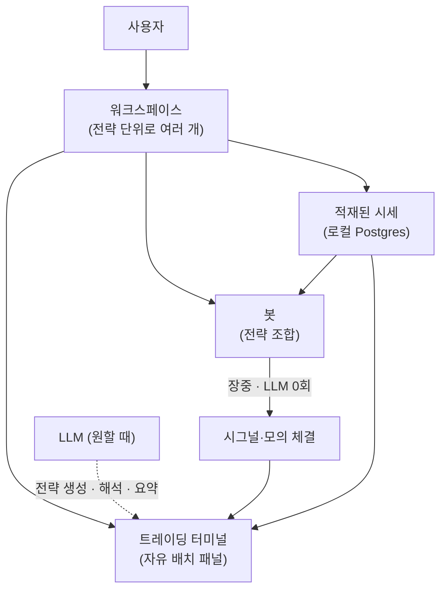

# 개인 투자 지휘소 — 제품 구조 개요

> 트레이딩 봇을 **만들고·검증하고·굴리고·비교하는** 플랫폼의 전체 그림. 시간축을 어떻게 나누는지(장중/저녁/수시), 워크스페이스가 무엇인지, 로컬 배포판과 호스팅이 어떻게 갈리는지. 세부는 [트레이딩-터미널](트레이딩-터미널.md)·[봇-전략-모델](봇-전략-모델.md)·[시세-데이터-파이프라인](시세-데이터-파이프라인.md) 로 이어진다. 목표·결정 로그의 정본은 [CONTEXT.md](../../CONTEXT.md).

---

## 0. 큰 그림

한 사람이 로그인해 자기 **워크스페이스**를 연다. 워크스페이스 안에는 관심종목·봇·전략·문서·레이아웃이 격리돼 있다. 화면은 **트레이딩 터미널** 한 판이고, 종목을 고르면 모든 패널이 그 종목으로 갈아탄다.

**핵심 용어 한 줄**:

- **워크스페이스** = 격리 단위. 데이터 모델상으로는 기존 "워크스페이스"를 그대로 쓴다. 사람마다·전략 실험마다 하나씩 가질 수 있다.
- **전략** = 판단 단위 하나(파일). "골든크로스", "RSI 과매도", "월봉 추세 필터" 각각.
- **봇** = 전략들의 조합 + 유니버스 + 자금 배분 + 리스크 규칙. 실제로 굴러가는 개체.
- **터미널** = 선택한 종목을 문맥으로 여러 패널이 맞물리는 한 화면.
- **배포 모드** = 이 소프트웨어를 내 컴퓨터에서 돌리는가(로컬), 서버에 올려 여럿이 쓰는가(호스팅).

---

## 1. 시간축 — LLM 을 시간에서 분리한다

이 제품의 비용·안정성이 여기서 갈린다. **장중에 LLM 을 부르지 않는다.**

| 언제 | 무엇이 도나 | LLM |
|---|---|---|
| 장중 내내 | 봇이 지표·규칙으로 시그널을 판정하고 모의 체결을 기록 | **0회** |
| 저녁(기본 20:00) | 연구 배치 — 성과 집계, 시그널 복기, 뉴스·공시 요약, 유니버스 재계산 | 1회분 |
| 아침 | 브리핑 — 밤사이 배치 산출물을 **읽기만** | 신규 호출 없음 |
| 수시 | 사용자가 AI 콘솔로 물을 때, 백테스트를 돌릴 때 | 그때만 |

봇이 결정론적이라 장중 상시 실행이 사실상 공짜다. LLM 호출은 "하루 1회 배치 + 내가 부른 만큼"으로 예측 가능해진다. 무료 티어의 일일 토큰 한도 안에 들어가는 유일한 구조다.

**연구 배치는 정해진 시각에 자동으로 돌지만, 같은 작업을 언제든 손으로도 돌릴 수 있어야 한다** — "저녁까지 기다려야 도움을 받는다"가 되면 안 된다. 백테스트도 마찬가지로 사용자가 원하는 때 실행한다.

실행 기반은 기존 스케줄러(APScheduler cron, 부팅 시 활성 스케줄 자가 적재, CRUD 변경 시 동기화)를 그대로 쓴다. cron 은 요청 밖이라 신원이 없는데, 스케줄에 적힌 워크스페이스로 스코핑된 토큰을 발급하는 경로가 이미 있다.

---

## 2. 워크스페이스 — 멀티테넌시를 개인용으로 다시 읽기

기존 구조는 `워크스페이스 → 사용자 → 권한 → 메뉴`의 B2B 관리 골조다. 이것을 버리지 않고 **뜻만 바꿔** 쓴다.

| 기존 개념 | 새 의미 | 그래서 얻는 것 |
|---|---|---|
| 워크스페이스 | **개인 워크스페이스** | 가입하면 자기 전용 공간이 생김. 전략 실험마다 하나씩 만들어 격리 |
| 워크스페이스 메뉴 | **워크스페이스 기능 스위치** | 실험 공간은 모의만, 실전 공간만 주문 활성 |
| 권한(역할) | **위험 등급** | 관리자 / 운영자(주문 승인) / 관전자(읽기 전용) |
| 사용자 | 사람 **+ 봇** | 봇에 계정을 주면 권한 제어와 감사 추적이 공짜로 따라옴 |
| 감사 컬럼 | 봇 행위 추적 | 어느 봇이 언제 무엇을 바꿨는지 자동 기록 |

세 가지가 여기서 나온다.

- **전략별 격리** — "공격형 실험"과 "장기 배당"이 서로의 데이터를 오염시키지 않는다. 터미널 레이아웃도 워크스페이스별로 저장되므로, 전략이 다르면 보는 값도 다르게 둘 수 있다.
- **읽기 전용 초대** — 남에게 내 지휘소를 보여줄 때 관전자로 부른다. 데이터를 넘기지 않고도 보여줄 수 있다.
- **봇 권한** — 조회만 하는 봇, 주문을 제안하는 봇, 승인 후 실행하는 봇을 역할로 구분한다. 하위 도구 호출에 요청자 워크스페이스를 실어 보내는 경로가 이미 있어, 봇 계정이 그 경로를 그대로 탄다.

워크스페이스·권한·메뉴·사용자 관리 화면은 **제품 메뉴에서 빠져 관리자 경로로** 간다. 코드는 지우지 않는다 — 호스팅 모드에서 다시 쓴다.

---

## 3. 배포 모드 — 로컬과 호스팅은 AI 콘솔에서 갈린다

같은 레포, 같은 화면이지만 **AI 콘솔의 뒷단과 주문 활성 여부가 모드에 따라 다르다.**

| | 로컬 배포판 | 호스팅 |
|---|---|---|
| 누가 쓰나 | 각자 자기 컴퓨터 | 서버 한 대에 여럿 |
| AI 콘솔 | Claude Code 임베드 (파일·셸 접근) | 자체 콘솔 (정해진 도구만 호출) |
| 실주문 | 가능 (자기 증권사 키) | 비활성 |
| 데이터 API 키 | 자기 키 | 사용자별 자기 키 |

**왜 나뉘어야 하나**: 호스팅에서 한 사용자의 에이전트가 서버 셸을 가지면, DB 격리와 무관하게 다른 사용자의 데이터·키·환경변수에 닿는다. 멀티테넌시는 SQL 레벨 격리이지 파일시스템 격리가 아니다. 실주문도 같다 — 남의 증권사 자격증명을 우리 서버가 보관하고 대신 주문을 내는 것은 개인 프로젝트가 감당할 영역이 아니다.

**순서**: 로컬을 먼저 완성하고, 그 뒤에 호스팅 확장을 검토한다.

---

## 4. LLM 이 할 수 있는 일의 경계

**기본은 "만들어서 내 앞에 놓기"**다. 전략 파일을 생성하고, 파라미터 조정을 제안하고, 스크리닝 조건을 초안으로 만든다. 적용은 사람이 누른다.

**자동으로 해도 되는 것은 되돌릴 수 있는 것뿐이다.**

| 조치 | 자동 | 이유 |
|---|---|---|
| 봇 정지 · 알림 · 리포트 생성 | ✅ | 다시 켜면 그만 |
| 봇 설정 변경 · 유니버스 교체 · 주문 | 승인 필요 | 되돌리려면 흔적이 남음 |
| 삭제 | ❌ 금지 | 복구 불가 |

이 한 줄 규칙으로 "어디까지 자동인가"를 매번 다시 논쟁하지 않는다.

---

## 5. 데이터의 정직성 규칙

**화면에 뜨는 값은 출처가 있어야 한다.**

- 실데이터 소스가 확보된 패널은 **반드시 실데이터**로 채운다.
- 소스 확보에 추가 조사가 필요한 패널은 **후순위**로 두되 골조는 만들고, **임시 데이터임을 화면에 표시**한다.
- 그 패널의 완료 조건은 "화면이 뜬다"가 아니라 **"실데이터가 연결된다"** 이다.

가짜 숫자를 진짜로 착각하는 것이 화면이 없는 것보다 나쁘다.

---

## 6. 코드 구조 — 모듈러 모놀리스 + MCP 서버

프로세스를 잘게 나누는 것과 코드 규율을 지키는 것은 **다른 축**이다. 규율은 전부 유지하고, 프로세스만 줄인다.

| 묶음 | 이유 |
|---|---|
| 비즈니스 백엔드는 **한 앱의 모듈들**로 | 개인 설치판에서 프로세스가 많으면 그것이 곧 진입장벽. 이미 같은 DB 를 쓰고 있어 통합 비용이 낮다 |
| MCP 도구 서버는 **분리 유지** | MCP 는 "LLM 에게 노출되는 도구 서버"라는 프로토콜 정체성. 나눠야 다른 MCP 클라이언트에서도 재사용된다 |
| 새 기능(적재·봇·백테스트)은 **모듈과 워커**로 | 새 서비스로 추가하면 프로세스가 계속 늘어난다 |

레이어 분리(router/service/repository/schema)·네이밍·테이블 접두사·감사 컬럼·페이지네이션·DI 등 규율의 정본은 [`.claude/docs/anti-patterns-backend.md`](../../.claude/docs/anti-patterns-backend.md) 와 루트 [CLAUDE.md](../../CLAUDE.md) 다. 구조를 바꿔도 이 규칙들은 그대로 적용된다.
