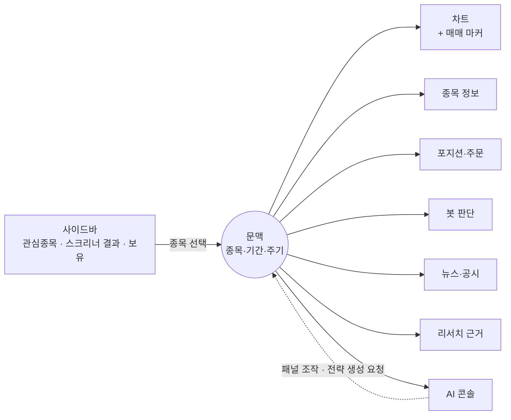

# 트레이딩 터미널 — 문맥 브로드캐스트와 자유 배치 패널

> **참고 (2026-08-19).** 제품 방향의 정본은 [7-제품/제품-정의.md](../7-제품/제품-정의.md)다. 이 문서의 「자유 배치」 서술은 셸 개편(2026-08-09 §20 — 46px 레일 + 372px 사이드 패널 + 고정 보드)으로 대체됐다 — 구조 서술은 이력으로 읽는다.

> 화면의 중심이 되는 **한 판**의 구조. 종목 선택이 모든 패널로 퍼지는 규약, 패널 목록과 각 패널의 데이터 출처, 자유 배치·접기·레이아웃 저장, 그리고 터미널 밖에 남는 화면들. 제품 전체 그림은 [투자지휘소-개요](투자지휘소-개요.md), 이것을 지탱하는 프론트엔드 구조는 [터미널-프론트엔드-구조](터미널-프론트엔드-구조.md).

---

## 0. 큰 그림

관리 화면을 여러 개 나열하는 구조가 아니다. **선택한 종목이 화면 전체의 문맥**이 되고, 패널들이 그 문맥을 함께 바라본다. 사이드바에서 종목을 클릭하면 차트·포지션·뉴스·봇 판단이 동시에 그 종목으로 갈아탄다.

---

## 1. 문맥 브로드캐스트

터미널의 상태는 **하나의 문맥 객체**다. 최소한 이것을 담는다.

| 필드 | 뜻 |
|---|---|
| 종목 | 지금 보고 있는 종목 (시장 구분 포함) |
| 캔들 주기 | 분·일·월 |
| 기간 | 차트가 보고 있는 구간 |
| 선택 봇 | 봇 패널에서 고른 봇 (없을 수 있음) |
| 열린 패널 | 지금 화면에 떠 있는 패널 집합 |

**규약 세 가지**

- 패널은 문맥을 **읽기만** 한다. 바꾸는 것은 사이드바·차트 컨트롤·AI 콘솔 같은 명시적 조작뿐이다.
- 문맥이 바뀌면 각 패널은 **자기 데이터만** 다시 가져온다. 패널끼리 직접 호출하지 않는다.
- **AI 콘솔에는 문맥이 자동으로 실린다.** "이 종목으로 전략 만들어줘"에서 종목을 다시 말할 필요가 없는 이유다.

문맥을 공유 상태 한 곳에 두는 것이 이 화면의 유일한 구조적 요구사항이다. 이게 흔들리면 패널을 아무리 잘 만들어도 한 판으로 안 묶인다.

---

## 2. 패널 목록

각 패널의 **데이터 출처가 확보돼야 만든다.** 출처 확보 상태는 조사 결과에 따라 갱신한다(§5).

| 패널 | 보여주는 것 | 주 출처 | 상태 |
|---|---|---|---|
| **차트** | 캔들(분·일·월), 지표 오버레이(이평·볼린저), 서브차트(거래량·RSI·MACD), **매매 마커**(내 체결 ▲▼, 봇 시그널, 목표가·손절선) | 적재된 시세 + 체결·시그널 기록 | 적재 후 가능 |
| **종목 정보** | 현재가·등락, 시총·PER·PBR·52주 고저, 재무 요약 | 시세 + 공시 | 국내 계좌 있으면 제공받고, 없으면 계산 |
| **포지션·주문** | 이 종목의 내 보유·평단·손익, **봇들의 모의 포지션**, 주문·체결 내역, 목표 수량 | 실계좌 조회 + 모의 포지션 | 증권사 계좌 필요 |
| **봇 판단** | 이 종목을 보는 봇들과 각 봇의 현재 상태(매수 대기/보유/관망). 봇 켜기·끄기·설정 진입 | 봇 실행 상태 | 자체 데이터 |
| **뉴스·공시** | 이 종목 관련 최신 항목 | 뉴스·공시 서비스 | 공시는 실경로 있음 · **뉴스는 벤더 미정** |
| **리서치 근거** | 내가 올린 문서 중 이 종목을 다룬 부분. 챗으로 이어짐 | 문서 검색 | 가능 |
| **AI 콘솔** | 자연어·이미지·파일 입력. 문맥을 물고 답하고, 승인하면 반영 | LLM | 가능 |
| **호가·체결강도** | 10단계 호가·잔량·잔량증감·예상체결·체결강도 | 증권사 실시간 | 국내 가능(계좌 필요, **동시 구독 상한**) · **미국은 1호가만** |
| **수급** | 투자자별 순매수(외국인·기관·개인) | 증권사 / 대체 지표 | 국내 가능(계좌 필요) · **미국은 원 개념 부재** — 기관 보유·공매도 잔고로 대체 |
| **동종업계** | 같은 섹터 종목의 지표 비교 | 업종 분류 + 시세 | 제한적 — **GICS 는 무료 불가**, 국내 업종코드·미국 SIC 로 대체 |

**만들 수 없는 것도 문서에 남긴다** — 미국 10단계 호가창은 무료·유료 어느 쪽으로도 확보되지 않았고, 국내 투자자별 수급은 증권사 계좌 없이는 어떤 무료 소스에도 없다. 이 두 칸은 화면에서 "해당 시장은 제공되지 않음"으로 정직하게 비운다.

**패널마다 시장이 다르게 열린다.** 같은 패널이라도 국내는 되고 미국은 안 되거나 그 반대인 경우가 흔하다. 패널은 "이 시장에서 이 데이터가 있는가"를 스스로 판단해 없으면 빈 상태와 이유를 보여준다.

**사이드바**는 관심종목 / 스크리너 결과 / 보유종목 세 탭이고, 클릭이 곧 문맥 전환이다.

---

## 3. 레이아웃 — 자유 배치 (철회)

> **철회 (2026-08-15, `#73` S3).** 자유 배치를 걷어냈다 — 화면 결정
> [`2026-08-09-screen-db-decisions.md`](../specs/2026-08-09-screen-db-decisions.md) §20.2 가 패널을
> 「레일이 여닫고 보드를 덮지 않는 372px」로 정했고, 놓이는 자리와 크기는 이제 화면이 정한다.
> 아래 세 줄 중 **살아 있는 것은 둘째 줄뿐**이다(워크스페이스별 저장). 다만 저장되는 것은
> 배치가 아니라 「무엇이 열려 있는가」이고, 닫은 패널을 되돌리는 길은 목록이 아니라
> 「기본 패널 구성으로 되돌리기」다.

- ~~패널을 **드래그로 옮기고, 크기를 조절하고**~~, 접는다.
- 구성은 **워크스페이스별로 저장**된다. 전략이 다르면 보는 값도 다르므로, 실험 워크스페이스와 실전 워크스페이스가 서로 다른 화면 구성을 갖는다.
- ~~패널을 닫아도 목록에서 다시 꺼낼 수 있다.~~ 닫은 패널은 기본 구성으로 되돌려 되살린다.

이건 화면 하나가 아니라 **기반 작업**이다 — 배치·크기·접힘 상태를 저장하고 복원하는 틀이 먼저 서야 각 패널을 독립적으로 붙일 수 있다. 그래서 이 틀이 병렬 개발의 전제다.

배치 라이브러리·레이아웃 저장 형식·패널 계약은 [터미널-프론트엔드-구조](터미널-프론트엔드-구조.md) 가 정한다.

---

## 4. 터미널 밖 화면

한 판에 우겨넣으면 오히려 안 보이는 것들은 밖에 둔다.

| 화면 | 왜 밖인가 |
|---|---|
| 봇 리더보드 · 백테스트 비교 | 여러 봇을 나란히 놓고 봐야 해서 넓은 화면이 필요 |
| 봇 만들기 · 전략 목록 | 설정 작업. 문맥 종속이 아님 |
| 스크리너 조건 편집 | 조건을 만드는 곳. 결과는 터미널 사이드바로 흘러들어감 |
| 포트폴리오 전체 | 종목별이 아니라 전체 관점(비중·손익·실계좌 vs 봇 비교) |
| 리서치 문서 · 챗 · 저녁 리포트 | 읽고 쓰는 작업 |
| 운영 (워크스페이스·스케줄·데이터 적재 상태) | 관리 작업 |

**아침 브리핑은 별도 화면이 아니라 터미널의 첫 상태**다. 종목 미선택 상태에서 밤사이 시그널·승인 대기·봇 성과가 중앙에 뜨고, 종목을 고르는 순간 터미널로 전환된다.

---

## 5. 배포 형태가 패널을 가른다

같은 코드라도 **로컬 배포판과 호스팅에서 뜨는 패널이 다르다.** 무료 데이터 소스 상당수가 "개인이 자기 용도로 쓰는 것"만 허용하고 제3자 제공을 금지하기 때문이다.

| | 로컬 배포판 (자기 키) | 호스팅 |
|---|---|---|
| 국내 호가·수급·분봉 | 가능 | **약관상 불가** |
| 국내 일봉·시총·종목마스터·재무 | 가능 | 가능 |
| 미국 재무·종목마스터 | 가능 | 가능 |
| 미국 분봉 | 가능 | 소스 제공자와 별도 합의 필요 |

로컬을 먼저 완성하는 순서라 지금은 제약이 되지 않는다. 호스팅으로 확장할 때 "국내는 로컬 전용, 호스팅은 일봉 기반 리서치 화면으로 축소" 같은 선택을 하게 된다.

## 6. 열려 있는 항목

- **시세·뉴스 벤더 연결** — 두 서비스는 아직 실제 소스가 붙어 있지 않다. 시세 패널과 감성 패널은 어댑터가 먼저다.
- **디자인** — 배치와 데이터가 정해진 뒤에 잡는다.
