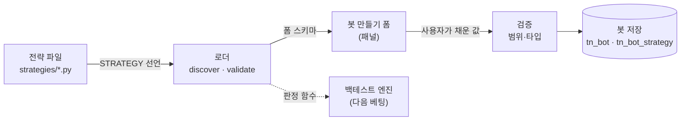

# 전략 파일 규약 — 선언이 폼을 만든다

> 전략 파일 하나가 무엇을 선언해야 하는지, 그 선언이 어떻게 봇 만들기 화면의 폼이 되는지, 그리고 봇이 그 값을 어떻게 저장하는지. 설계 배경은 [봇-전략-모델](../4-아키텍처/봇-전략-모델.md), 화면은 [화면·DB 결정](2026-08-09-screen-db-decisions.md) §23.1, 범위는 [#150](https://github.com/Danwoo/trading-lab/issues/150) B0.

---

## 0. 큰 그림 — 왜 규약이 먼저인가

봇 만들기 화면은 **전략을 모른다.** 전략 파일이 "이 값들을 이 범위에서 조절할 수 있다"를 선언하고, 화면은 그 선언만 읽어 폼을 그린다. 그래서 새 전략을 더해도 화면 코드를 안 고친다 — 이것이 규약의 **유일한 존재 이유**다.



**지금 도는 것은 왼쪽 절반이다.** `indicators`·`entry`·`exit` 는 규약이 요구하되 **호출하는 소비자가 아직 없다**(백테스트 엔진이 no-go). 로더는 그 함수들이 **있는지만** 검사한다.

---

## 1. 파일 배치

```
strategies/
  README.md
  ma_pullback.py            ← 전략 하나 = 파일 하나
  volume_surge_filter.py
```

**레포 루트에 둔다.** 서비스 안이 아니다 — 전략은 사용자가 만들어 git 에 커밋하는 **자기 자산**이고([봇-전략-모델](../4-아키텍처/봇-전략-모델.md) §6 "결과물이 파일이라 git 에 남아 diff 로 비교된다"), 백엔드와 나중의 백테스트 엔진이 **둘 다** 읽는다. 경로는 `STRATEGIES_DIR` 로 바꿀 수 있다(로컬 배포판에서 자기 디렉터리를 쓰는 사람용).

파일 이름이 곧 `key` 는 **아니다** — `key` 는 파일 안에서 선언한다. 파일을 옮기거나 이름을 바꿔도 이미 저장된 봇이 안 깨지게 하려는 것이다.

---

## 2. 전략 파일이 선언하는 것

규약은 셋이다 — [봇-전략-모델](../4-아키텍처/봇-전략-모델.md) §1 그대로.

| 요소 | 형태 | 지금 검사하는 것 |
|---|---|---|
| **파라미터 선언** | 모듈 최상단 `STRATEGY` 딕셔너리 | 전수 검증 (아래 §3) |
| **지표 계산** | `def indicators(bars, params)` | 존재 여부만 |
| **진입·청산 판정** | `def entry(ctx)` · `def exit(ctx)` | 존재 여부만 |

### 왜 딕셔너리인가 — 클래스·데코레이터를 안 쓴 이유

`STRATEGY` 를 우리가 만든 타입(`Strategy(...)`, `@strategy` 데코레이터)으로 선언하게 하면, **전략 파일이 우리 패키지를 import 해야 한다.** 그러면 셋이 따라온다:

- 전략 파일이 백엔드에 결합돼, 사용자가 자기 디렉터리에 둔 전략이 import 경로 때문에 안 열린다
- **LLM 이 전략 파일을 생성할 때**([봇-전략-모델](../4-아키텍처/봇-전략-모델.md) §6) import 를 틀리면 그 파일은 통째로 안 읽힌다 — 틀리기 쉬운 자리를 하나 더 만드는 것이다
- 규약을 바꾸면 이미 있는 전략 파일이 전부 깨진다

**순수 데이터 선언은 반대다.** 전략 파일은 아무것도 import 하지 않고, 로더가 스키마로 검증해 **어디가 왜 틀렸는지** 말해 준다. 타입 체크를 작성 시점에 못 받는 것을 감수한다 — 대신 로더의 오류 메시지가 그 자리를 메운다.

### 예시

```python
"""이동평균 눌림목 — 20일 평균선 아래로 눌린 자리를 잡는다."""

STRATEGY = {
    "key": "ma_pullback",
    "name": "이동평균 눌림목",
    "summary": "평균선 아래로 눌렸다가 돌아서는 자리를 잡는다",
    "timeframe": "1d",
    "params": [
        {
            "name": "ma_period",
            "label": "평균선 기간",
            "type": "int",
            "default": 20, "min": 5, "max": 120, "step": 1,
            "unit": "일",
            "help": "길수록 큰 흐름만 본다.",
        },
        {
            "name": "pullback_pct",
            "label": "눌림 깊이",
            "type": "percent",
            "default": 3.0, "min": 0.5, "max": 15.0, "step": 0.5,
        },
    ],
}


def indicators(bars, params):
    """이 전략이 보는 값들을 계산해 돌려준다."""
    ...


def entry(ctx):
    """산다고 판정하면 True."""
    ...


def exit(ctx):
    """판다고 판정하면 True."""
    ...
```

---

## 3. 선언 스키마

### 3.1 전략

| 키 | 필수 | 값 |
|---|:---:|---|
| `key` | ● | 소문자·숫자·`_` 만, 2~40자. **저장된 봇이 전략을 가리키는 이름** — 한 번 정하면 안 바꾼다 |
| `name` | ● | 화면에 보이는 이름, 1~60자 |
| `summary` | | 한 줄 설명, ~200자 |
| `timeframe` | ● | 이 전략이 보는 캔들 주기 (§3.3) |
| `params` | ● | 파라미터 목록, 0~30개. `name` 과 `label` 은 각각 전략 안에서 유일 |

**`timeframe` 이 전략마다 따로 선언되는 것이 멀티 타임프레임의 전부다** — 월봉 필터와 일봉 진입을 한 봇에 실으면 그대로 성립한다. 별도 기능이 아니다.

### 3.2 파라미터

| 키 | 필수 | 값 |
|---|:---:|---|
| `name` | ● | 소문자·숫자·`_`, 1~40자 |
| `label` | ● | 폼에 보이는 이름. **전략 안에서 유일** — 값 오류가 이 이름으로 말하므로(§4) 겹치면 어느 칸 얘기인지 못 짚는다 |
| `type` | ● | `int` · `float` · `percent` · `choice` · `bool` (§3.4) |
| `default` | ● | 타입에 맞는 값. **범위 안이어야 한다** |
| `min`·`max`·`step` | 숫자형 ● | `int`·`float`·`percent` 에서 필수. `min < max` |
| `choices` | `choice` ● | `[{"value": ..., "label": ...}]`, 2개 이상 |
| `unit` | | 폼에 붙는 단위 (`일`·`%`·`회`). `percent` 는 안 적으면 `%` |
| `help` | | 한 줄 도움말 |

### 3.3 캔들 주기

`1m` · `5m` · `15m` · `30m` · `1h` · `1d` · `1w` · `1M`

목록 밖의 값은 **거부**한다. 열어 두면 적재 파이프라인이 모르는 주기를 전략이 요구하게 되고, 그 실패가 백테스트 시점까지 미뤄진다.

### 3.4 파라미터 타입과 폼 컨트롤

| `type` | 폼 `control` | 값 |
|---|---|---|
| `int` | `number` | 정수 |
| `float` | `number` | 실수 |
| `percent` | `number` | 실수, 단위 `%` 기본 |
| `choice` | `select` | `choices` 중 하나 |
| `bool` | `toggle` | `true`/`false` |

> **화면 무수정의 경계가 여기다.** 화면은 `control` 세 종(`number`·`select`·`toggle`)만 그린다. **기존 타입만 쓰는 전략은 몇 개를 더해도 화면을 안 고친다.** 반대로 **새 `type` 을 규약에 더하면 화면도 같이 고쳐야 한다** — 이 규약이 막아 주지 않는 유일한 자리이므로, 타입을 늘리기 전에 기존 다섯으로 표현되는지 먼저 본다.

---

## 4. 로더

| 하는 일 | 내용 |
|---|---|
| **discover** | `STRATEGIES_DIR` 의 `*.py` 를 읽는다. `_` 로 시작하는 파일은 건너뛴다 |
| **validate** | `STRATEGY` 선언을 스키마로 검증. 판정 함수 셋의 **존재**를 확인 |
| **폼 스키마** | 선언을 화면이 먹는 모양으로 옮긴다 (§5) |
| **값 검증** | 봇을 저장할 때 사용자가 채운 값이 선언한 범위 안인지 본다 |

**값 검증의 오류는 화면이 쓰는 말로 한다** — `name` 이 아니라 `label`, 선택지도 `value` 가 아니라 그 `label`, 범위에는 `unit` 을 붙인다. `name` 은 화면 어디에도 안 나오므로 `'ma_period' 는 5~120 범위` 라고 말하면 폼의 어느 칸인지 사용자가 짐작해야 한다. 그래서 **`label` 이 유일**해야 한다(§3.2).

**전략 파일을 import 한다 = 임의 코드를 실행한다.** 로컬 배포판에서 자기 전략을 자기가 실행하는 것이라 감수한다. **호스팅 모드에서는 성립하지 않는다** — 남의 전략 파일을 우리 프로세스가 import 하는 것이 되므로, 호스팅을 열 때 이 지점을 다시 판단해야 한다([투자지휘소-개요](../4-아키텍처/투자지휘소-개요.md) §3 과 같은 경계).

**깨진 전략 하나가 목록 전체를 죽이지 않는다.** 검증에 실패한 파일은 목록에서 빠지고 **이유가 남는다** — 화면은 "이 전략은 이래서 못 읽었다"를 보여줄 수 있다. 이 레포의 「소스 없는 패널은 이유와 함께 빔」과 같은 규율이다.

---

## 5. 폼 스키마 — 화면이 먹는 모양

```json
{
  "key": "ma_pullback",
  "name": "이동평균 눌림목",
  "summary": "평균선 아래로 눌렸다가 돌아서는 자리를 잡는다",
  "timeframe": "1d",
  "fields": [
    { "name": "ma_period", "label": "평균선 기간", "control": "number",
      "default": 20, "min": 5, "max": 120, "step": 1, "unit": "일",
      "help": "길수록 큰 흐름만 본다." },
    { "name": "pullback_pct", "label": "눌림 깊이", "control": "number",
      "default": 3.0, "min": 0.5, "max": 15.0, "step": 0.5, "unit": "%" }
  ]
}
```

화면은 `control` 로 분기해 그리고, 나머지 키는 그대로 흘려 넣는다. **`type` 은 화면에 안 나간다** — 화면이 `type` 을 알면 타입이 늘 때마다 화면이 따라 바뀐다.

---

## 6. 봇 저장

봇은 [Backend 프록시](../../CLAUDE.md#데이터-흐름-패턴-새-기능-추가-시-택1) 패턴의 신규 비즈니스 엔티티다 — `public` 스키마 · alembic · raw SQL.

### `tn_bot` — 봇 하나

| 컬럼 | 내용 |
|---|---|
| `bot_id` | PK |
| `workspace_id` | 소속 워크스페이스 |
| `bot_nm` | 이름 |
| `combine_rule` | `AND` · `OR` · `SCORE` — 전략을 어떻게 섞는가 |
| `universe_kind` | `POOL`(스크리너 풀 전체) · `WATCHLIST`(관심종목만) · `LIST`(지정) |
| `universe_ref` | `LIST` 일 때 종목 목록 |
| `alloc_per_symbol` · `max_positions` | 자금 배분 |
| `stop_loss_pct` · `take_profit_pct` · `max_trades_per_day` | 리스크 |
| `bot_role` | `READONLY` · `PROPOSE` · `EXECUTE` — 봇의 신원(결정 로그 2026-07-28) |
| `use_at` | 사용 여부 |
| `param_sources` | **설정별 출처** — `{"stop_loss_pct": "AI_SUGGESTED", ...}` |
| 감사 4종 | `reg_dt`·`reg_id`·`mod_dt`·`mod_id` |

### `tn_bot_strategy` — 봇에 실린 전략

| 컬럼 | 내용 |
|---|---|
| `bot_strategy_id` | PK |
| `bot_id` | FK → `tn_bot`, `ON DELETE CASCADE` |
| `strategy_key` | 전략 파일이 선언한 `key`. **FK 가 아니다** — 전략은 파일이라 DB 에 없다 |
| `params` | 사용자가 채운 값 `{"ma_period": 20, ...}` |
| `param_sources` | 값별 출처 (위와 같은 형식) |
| `weight` | `SCORE` 결합일 때 가중치 |
| `sort_order` | 화면 표시 순서 |

**`param_sources` 가 왜 지금 있나** — [실험대 스펙](2026-08-08-experiment-bench-spec.md) §8.6.3 의 안전장치 「출처가 남는다」가 B3 의 완료 조건이다. 저장할 자리를 B0 이 미리 내 두지 않으면 B3 이 스키마 마이그레이션부터 시작하게 된다. 값은 `USER`(내가 정함) · `AI_SUGGESTED`(AI 제안 수락) 둘.

**`strategy_key` 에 FK 를 안 거는 대가**: 전략 파일이 사라지면 그 봇은 열리지 않는다. 로더가 그 상태를 「전략 없음」으로 **말해 주는** 것으로 대신한다 — 조용히 빈 폼을 주지 않는다.

---

## 7. 이 규약이 못 막는 것

- **판정 함수의 내용은 검사하지 않는다.** 시그니처가 맞아도 아무 일도 안 하는 전략이 목록에 뜬다. 백테스트 엔진이 생기기 전에는 「돌려 보면 안다」가 없다.
- **새 파라미터 타입을 더하면 화면을 고쳐야 한다** (§3.4). 규약이 자동으로 흡수하지 못하는 유일한 축이다.
- **전략 파일 import 는 임의 코드 실행이다** (§4). 로컬 전용 전제이며, 호스팅 모드를 열 때 재판단이 필요하다.
- **`params` 를 JSON 으로 저장하므로 DB 가 값의 의미를 모른다.** 전략의 선언이 바뀌어(범위 축소 등) 이미 저장된 봇의 값이 범위를 벗어날 수 있다 — 봇을 열 때 검증해 **어긋난 값을 화면에 표시**하는 것으로 대신한다.

---

관련 문서: [봇과 전략](../4-아키텍처/봇-전략-모델.md) · [실험대 스펙](2026-08-08-experiment-bench-spec.md) · [화면·DB 결정](2026-08-09-screen-db-decisions.md)
