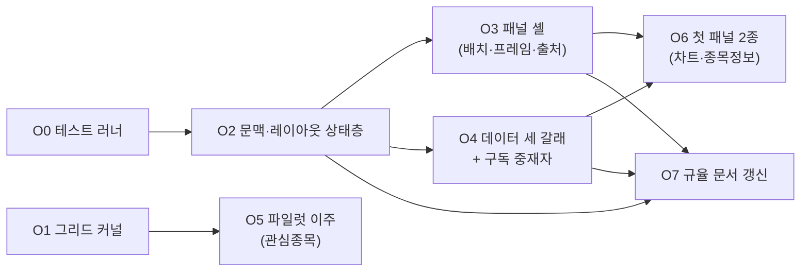

# M2 프론트엔드 워커 오더 세트 (초안)

**목표**: M2 터미널 골조를 구현 단위로 쪼갠 오더 8개. 설계 정본은 [`.docs/4-아키텍처/터미널-프론트엔드-구조.md`](../4-아키텍처/터미널-프론트엔드-구조.md).

> **정본 위치 주의** — 오더 인스턴스의 정본은 **이슈 코멘트**다(하네스 규약: `plan-label`·`plan-check` 자동화가 이슈 코멘트의 계획을 전제). 이 파일은 이슈에 붙이기 전의 **초안 묶음**이며, 오더가 이슈로 올라간 뒤에는 이슈 코멘트가 정본이다. 승인 절차는 이슈 코멘트 → `human: plan` → 승인.
>
> **승인 전 착수 금지.** 아래 오더는 아직 사람 승인을 받지 않았다.

**입력**: [PRD](prd.md) 사용자 스토리 1·2 · [터미널-프론트엔드-구조](../4-아키텍처/터미널-프론트엔드-구조.md) (FE-AD-1~14) · [트레이딩-터미널](../4-아키텍처/트레이딩-터미널.md) · [CONTEXT.md](../../CONTEXT.md) 결정 로그. 수행자는 자기 오더에 걸린 문서를 먼저 읽는다.

---

## 0. 의존과 실행 순서

| 묶음 | 오더 | 병렬 여부 |
|---|---|---|
| 1차 | O0 · O1 | **병렬 가능** — 파일이 겹치지 않는다 |
| 2차 | O2 | O0 이후(테스트를 쓰므로) |
| 3차 | O3 · O4 · O5 | **병렬 가능** — O3·O4 는 O2 이후, O5 는 O1 이후. 셋은 서로 파일이 겹치지 않는다 |
| 4차 | O6 · O7 | O6 은 O3·O4 이후. O7 은 O2·O3·O4 이후 |

**직렬이어야 하는 이유**: O2 가 타입 파일(`types/terminal/*`)을 전부 소유하므로 O3·O4·O6 이 그 타입을 import 한다. O7(규율 문서)은 마지막에 한 번에 land 시킨다 — 세 오더가 각자 `anti-patterns-frontend.md` 를 고치면 충돌한다.

**M2 범위 밖(목록만)**: O8 폼 프리미티브 내부 교체(`components/shared/ui/*` 23개) · O9 잔여 화면 확산 · O10 DevExtreme 의존성 제거. 설계 문서 §2.4 의 S3·S4 이고, 오픈소스 공개 전에 반드시 끝나야 한다.

**O11**: FR-006·FR-007(터미널 종목 사이드바와 브리핑 상태) — 이슈 #326, §10 갭 해소 참조. O3·O4·O5 완료 뒤 별도로 착수했다.

---

## 1. 전역 제약 (모든 오더에 암묵 포함)

아래는 **값 그대로 복사**한 것이다. 요약·의역하지 않는다.

**PRD 비기능 요구** [Source: `.docs/specs/prd.md#비기능-요구사항`]

- **NFR-001**: 화면에 표시되는 값은 실제 출처를 갖거나, 임시 데이터임이 표시되어야 한다
- **NFR-003**: 원시 시세 데이터는 저장소에 커밋되지 않아야 한다
- **NFR-005**: 사용자별·워크스페이스별 데이터는 서로 접근되지 않아야 한다
- **NFR-009**: 종목을 전환할 때 화면이 응답해야 한다

**CONTEXT 결정 로그** [Source: `CONTEXT.md#결정-로그`]

- 2026-07-28 UI 라이브러리=오픈소스 조합(그리드 · lightweight-charts · shadcn/ui) (DevExtreme 유지·Syncfusion Community 기각 — 오픈소스 배포와 상용 라이선스가 모순 / 평가판 배너 제거는 갈아타는 길뿐, React 19 라 다운그레이드 불가 실측)
- 2026-07-28 임시 데이터 규칙 — 실데이터가 있는 패널은 반드시 실데이터, 소스 미확보 패널은 후순위로 두되 골조는 만들고 임시 데이터임을 화면에 표시 (전면 mock 금지 기각 — 껍데기를 먼저 짓는 순서와 충돌 / 실데이터 연결이 그 패널의 완료 조건)

**프론트엔드 의존성 핀** [Source: `frontend/CLAUDE.md#환경`]

- **의존성 핀**: `better-auth` `1.6.11` / `kysely`(+`@better-auth/kysely-adapter`) `0.28.17` **정확 고정** (캐럿 `^` 금지 — 1.6.12 가 kysely 0.29 를 끌어와 `DEFAULT_MIGRATION_TABLE` 제거 → adapter 깨짐)

**네이밍** [Source: `CLAUDE.md#네이밍-규칙`]

- 파일: 컴포넌트 `PascalCase.tsx`, 훅/유틸 `camelCase.ts` · 클래스 `PascalCase` · 함수/변수 `camelCase`

**주석** [Source: `CLAUDE.md#주석-규칙`]

- 변경 이유·이력 설명 주석 금지 ("~를 위해 수정", "기존 X 를 Y 로 변경", "~ 때문에 추가") — 그건 커밋 메시지/PR 설명의 몫
- 내레이션 주석 금지 ("여기서 ~를 처리합니다", "위 함수와 동일")
- 주석은 코드만으로 드러나지 않는 제약·의도가 있을 때만, 깔끔한 한 줄로

**작업 보고** [Source: `CLAUDE.md#작업-보고-규칙-커밋pr문서`]

- 커밋 메시지·PR 본문·문서에 `$ 명령` 과 그 출력을 함께 적을 때는, **그 명령을 그대로 실행해서 나온 출력만** 적는다.

**항상 적용되는 프론트 룰** [Source: `.claude/docs/anti-patterns-frontend.md`]

- 룰 2 컴포넌트 위치 · 룰 3 Props camelCase · 룰 6 fetch/axios 직접 사용 금지 · 룰 8 API Route 인증 · 룰 9 codeStore · 룰 10 Zod helpers · 룰 12 `'use client'`

**실행 환경**

- 이미 떠 있는 포트(3000 · 3010 · 5432 · 8000~8010) 프로세스와 `sgt-demo-*` 컨테이너를 건드리지 않는다. 브라우저 확인이 필요하면 다른 포트(`PORT=3020 npm run dev`)로 띄운다.
- `npm run dev` 는 `env-cmd -f .env.development` 를 거친다. 환경 파일 없이 직접 `next dev` 를 호출하지 않는다.

**공통 증명 의무**

- 모든 오더는 `cd frontend && npx tsc --noEmit` 이 0 종료로 끝나야 한다.
- 모든 오더는 `cd frontend && npm run lint` 가 0 종료로 끝나야 한다.
- 화면을 바꾼 오더는 브라우저로 열어 확인한 경로와 본 것을 보고에 적는다. 열어보지 않았으면 "브라우저 확인 없음"이라고 적는다.

---

## 2. O0 — 테스트 러너 도입 (Vitest, 순수 로직 한정)

**목표**: 순수 TypeScript 로직을 자동 검증할 최소 러너를 놓는다. [Source: 설계 §6, 이슈 #222]

**범위**

- 포함: Vitest 설치 · `npm test` 스크립트 · 설정 파일 · 첫 테스트 1개(기존 `convertFilterToPrismaWhere`)
- 제외: jsdom · Testing Library · 컴포넌트 렌더 테스트 · 커버리지 게이트 · CI 연결 (설계 §6 "안 하는 것")

**선행조건**: 없음

**Files**

- Create: `frontend/vitest.config.ts`
- Create: `frontend/lib/grid/__tests__/filters.test.ts`
- Modify: `frontend/package.json` (`devDependencies` 에 `vitest` 추가, `scripts` 에 `"test": "vitest run"` · `"test:watch": "vitest"` 추가)

**Interfaces**

- Produces: `npm test` 명령. 테스트 파일 위치 규약 = 검사 대상 모듈과 같은 폴더의 `__tests__/<모듈명>.test.ts`
- Consumes: 없음

**태스크**

- T0-1 `vitest` 4.1.10 을 devDependency 로 추가한다. `include` 는 `["**/__tests__/**/*.test.ts"]`, `environment` 는 `"node"`(jsdom 아님), `alias` 로 `@` → `frontend` 루트를 매핑해 `@/lib/...` import 가 동작하게 한다.
- T0-2 `convertFilterToPrismaWhere` 테스트를 쓴다. 최소 케이스: ① 단일 조건 `["ticker","=","005930"]` ② AND 복합 ③ OR 복합 ④ `contains` 의 `%`·`_`·`\` 이스케이프(소스 주석이 설명하는 동작) ⑤ 문자열로 들어온 JSON ⑥ `null`·비배열 입력 → `{}`

**완료 조건**

- `cd frontend && npm test` 가 0 종료로 끝나고 6개 테스트가 통과한다
- `cd frontend && npx tsc --noEmit` 0 종료

**증명 의무**: `npm test` 의 실제 출력(통과 개수 포함)을 보고에 붙인다. 일부러 한 케이스를 깨뜨려 **실패가 비-0 종료로 보고되는지** 확인하고 그 출력도 함께 붙인다(러너가 통과만 하는 상태를 배제).

**위험**: Vitest 의 `@` alias 가 `tsconfig.json` 의 `paths` 와 어긋나면 import 가 런타임에만 깨진다 → T0-2 가 실제로 `@/lib/...` 경로로 import 해 이 위험을 즉시 노출시킨다.

---

## 3. O1 — 그리드 커널과 분할 화면 (새 이름으로 신설)

**목표**: DevExtreme 그리드를 대체할 커널을 **새 이름으로** 만든다. 기존 화면은 이 오더에서 건드리지 않는다. [Source: 설계 FE-AD-1·FE-AD-4·FE-AD-5, §2.2 교체 방식 표]

**범위**

- 포함: 컬럼·쿼리 타입 · 서버 테이블 훅 · 표시 컴포넌트(정렬·필터 로우·페이저·컬럼 리사이즈·고정·가상 스크롤·단일/다중 선택) · 엑셀 내보내기 · 분할 화면 래퍼
- 제외: 기존 `components/shared/DataGrid/*` 수정 · 기존 컨테이너 수정 · 트리 그리드(메뉴 화면 전용, O9)

**선행조건**: 없음 (O0 와 병렬 가능)

**전역 제약 추가**

- 서버로 나가는 필터·정렬 JSON 형식을 **바꾸지 않는다**. `frontend/lib/grid/filters.ts` 와 파이썬 3개 서비스(`backend-service`·`file-service`·`devactivity-service` 의 `app/utils/common/devextreme_utils.py`)가 같은 문법을 파싱한다. [Source: 설계 FE-AD-4]

**Files**

- Create: `frontend/types/grid.ts`
- Create: `frontend/hooks/shared/useServerTable.ts`
- Create: `frontend/hooks/shared/useTableExport.ts`
- Create: `frontend/components/shared/DataTable/DataTable.tsx`
- Create: `frontend/components/shared/DataTable/DataTablePager.tsx`
- Create: `frontend/components/shared/DataTable/DataTableFilterRow.tsx`
- Create: `frontend/components/shared/DataTable/index.ts`
- Create: `frontend/components/shared/Layout/SplitPane.tsx`
- Create: `frontend/hooks/shared/__tests__/useServerTable.query.test.ts`
- Modify: `frontend/package.json` (`@tanstack/react-table` 8.21.3 · `@tanstack/react-virtual` 3.14.8 · `react-resizable-panels` 4.12.2 추가)
- Modify: `frontend/components/shared/Layout/index.ts` (`SplitPane` 재export)

**Interfaces**

- Produces `frontend/types/grid.ts`:
  - `export interface GridLookup { items: unknown[]; valueField: string; displayField: string }`
  - `export interface GridColumn<T> { field: Extract<keyof T, string>; caption: string; width?: number; minWidth?: number; align?: "left" | "center" | "right"; dataType?: "string" | "number" | "date" | "datetime"; sortable?: boolean; filterable?: boolean; fixed?: "left" | "right"; lookup?: GridLookup; render?: (row: T) => React.ReactNode }`
  - `export interface GridSort { selector: string; desc: boolean }`
  - `export interface GridQuery { skip: number; take?: number; filter?: unknown[]; sort?: GridSort[] }`
- Produces `frontend/hooks/shared/useServerTable.ts`:
  - `export interface ServerTableState<T> { rows: T[]; totalCount: number; isLoading: boolean; query: GridQuery; pageIndex: number; pageSize: number; setPage: (index: number) => void; setPageSize: (size: number) => void; setSort: (sort: GridSort[]) => void; setFilter: (filter: unknown[] | undefined) => void; reload: () => void }`
  - `export function useServerTable<T>(params: { fetchGrid: (params: Record<string, unknown>) => Promise<{ items: T[]; total_count: number } | null>; pageSize?: number; clientSide?: boolean; dependencies?: unknown[] }): ServerTableState<T>`
  - **`fetchGrid` 에 넘기는 객체는 `{ skip, take, filter, sort }`** — 기존 서비스 함수(예: `selectWatchlistList`)가 받던 `loadOptions` 와 같은 키·같은 값 형태다. 서비스 함수는 수정하지 않는다.
  - `clientSide: true` 면 최초 1회 전체를 받아 클라이언트에서 정렬·필터·페이징한다(기존 `clientSidePaging` 대체, 7곳에서 쓰인다)
- Produces `frontend/components/shared/DataTable/DataTable.tsx`:
  - `export interface DataTableProps<T> { table: ServerTableState<T>; columns: GridColumn<T>[]; keyField?: string; height?: string; selectionMode?: "single" | "multiple" | "none"; selectedKeys?: Array<string | number>; onSelectionChange?: (keys: Array<string | number>, rows: T[]) => void; onRowClick?: (row: T) => void; emptyText?: string }`
  - `keyField` 기본값 `"rn"` (기존 그리드와 동일)
- Produces `frontend/hooks/shared/useTableExport.ts`:
  - `export function useTableExport<T>(params: { columns: GridColumn<T>[]; fetchAll: () => Promise<T[]>; fileName?: string }): { handleExcelDownload: () => Promise<void> }`
  - 워크북 생성은 기존 `devextreme-exceljs-fork`(MIT) 를 그대로 쓰고, `devextreme/excel_exporter` 는 쓰지 않는다. 파일명 타임스탬프 규칙은 기존 `useExcelExport` 와 동일(`{fileName}_{KST yyyy-MM-dd_HH-mm-ss}.xlsx`)
- Produces `frontend/components/shared/Layout/SplitPane.tsx`:
  - `export interface SplitPaneProps { orientation?: "horizontal" | "vertical"; initialSizes?: number[]; minSizes?: number[]; children: React.ReactNode[] }`
- Consumes: 없음

**완료 조건**

- `cd frontend && npx tsc --noEmit` 0 종료
- `cd frontend && npm test` 0 종료 — `useServerTable.query.test.ts` 가 다음을 검증한다: ① 페이지 이동이 `skip`/`take` 로 변환된다 ② 정렬 변경이 `sort: [{selector, desc}]` 로 변환된다 ③ 필터가 `["field","operator",value]` 배열 문법 그대로 전달된다 ④ 그 필터 배열을 `convertFilterToPrismaWhere` 에 넣으면 기대한 Prisma where 가 나온다(왕복 검증)
- `git grep -n "devextreme" -- frontend/types/grid.ts frontend/hooks/shared/useServerTable.ts frontend/components/shared/DataTable/ frontend/components/shared/Layout/SplitPane.tsx` 가 0 hit

**증명 의무**

- 위 4개 명령의 실제 출력을 붙인다.
- ④ 왕복 검증이 이 오더의 핵심 증명이다 — "백엔드는 0줄 변경"이라는 주장이 여기서만 증명된다.
- `useTableExport` 로 내려받은 `.xlsx` 를 실제로 열어 헤더·행이 맞는지 확인하고, 무엇으로 열었는지 적는다.

**위험**

| 위험 | 대응 |
|---|---|
| 컬럼 리사이즈·고정·가상 스크롤을 직접 만들어야 해 분량이 크다 | 태스크를 2단계로 나눈다 — 1단계(정렬·페이저·선택·필터 로우)에서 한 번 끊고 검증, 2단계(리사이즈·고정·가상 스크롤·엑셀) |
| `clientSide` 경로와 서버 경로의 동작이 갈린다 | 두 경로 모두 같은 `ServerTableState` 를 반환하게 하고, 테스트가 두 경로 모두를 통과시킨다 |
| 새 `DataTable` 과 옛 `DataGrid` 가 공존한다 | 의도된 마이그레이션 중간 상태다. O7 이 anti-patterns 룰 1 에 수명이 명시된 예외를 추가한다 |

---

## 4. O2 — 문맥·레이아웃 상태층

**목표**: 터미널 문맥과 레이아웃을 소유하는 상태층과 타입 계약을 놓는다. 이후 모든 패널 작업이 여기에 의존한다. [Source: PRD FR-002·FR-003·FR-004·FR-005, 설계 §3.1·§3.2·§3.4]

**수용 기준** [Source: PRD 사용자 스토리 1]

1. 종목을 바꾸면 문맥 구독자 전체가 그 종목으로 갱신된다 (FR-003)
2. 배치를 바꾸고 새로고침하면 그대로 열린다 (FR-005)
3. 워크스페이스를 바꾸면 그 워크스페이스의 배치가 나오고 다른 워크스페이스 배치는 보존된다 (FR-024)

**범위**

- 포함: 문맥 타입·스토어·읽기 훅·쓰기 액션 · 레이아웃 타입·스키마·마이그레이션·기본값·스토어 · 시장→지역 매핑 · 출처/가용성 **타입 선언** · 테스트
- 제외: 화면 컴포넌트 일체(O3) · 데이터 취득(O4) · 서버 저장(M2 밖)

**선행조건**: O0 완료(`npm test` 동작)

**Files**

- Create: `frontend/types/terminal/context.ts`
- Create: `frontend/types/terminal/layout.ts`
- Create: `frontend/types/terminal/panel.ts`
- Create: `frontend/types/terminal/provenance.ts`
- Create: `frontend/types/terminal/capability.ts`
- Create: `frontend/lib/terminal/market.ts`
- Create: `frontend/lib/terminal/layoutSchema.ts`
- Create: `frontend/lib/terminal/layoutDefaults.ts`
- Create: `frontend/lib/terminal/errors.ts`
- Create: `frontend/stores/terminal/contextStore.ts`
- Create: `frontend/stores/terminal/contextActions.ts`
- Create: `frontend/stores/terminal/layoutStore.ts`
- Create: `frontend/hooks/terminal/useTerminalContext.ts`
- Create: `frontend/lib/terminal/__tests__/layoutSchema.test.ts`
- Create: `frontend/lib/terminal/__tests__/market.test.ts`
- Create: `frontend/constants/terminal.ts`

**Interfaces**

- Produces `types/terminal/context.ts`:
  - `export type Region = "KR" | "US" | "UNKNOWN";`
  - `export type CandleInterval = "1m" | "5m" | "15m" | "30m" | "60m" | "1d" | "1M";`
  - `export interface SymbolRef { ticker: string; market: string; name?: string }`
  - `export interface DateRange { from: string; to: string }` — `YYYY-MM-DD`
  - `export interface TerminalContext { symbol: SymbolRef | null; interval: CandleInterval; range: DateRange | null; selectedBotId: string | null }`
  - 주기 목록 근거: FR-016 "주기(분·일·월)" + PRD 가정 "5·15·30·60분봉은 1분봉에서 합성한다"
- Produces `types/terminal/provenance.ts`:
  - `export type Provenance = { kind: "live" | "loaded"; source: string; asOf: string | null } | { kind: "placeholder"; source: string; note?: string } | { kind: "unavailable"; reason: string };`
  - `export interface PanelData<T> { data: T | null; isLoading: boolean; error: Error | null; provenance: Provenance }`
  - `unavailable` 이 `reason` 을 타입으로 요구하는 것이 FR-021 을 컴파일 단계에서 강제하는 수단이다
- Produces `types/terminal/capability.ts`:
  - `export type PanelCapability = "candles" | "quote" | "orderbook" | "financials" | "disclosure" | "news" | "flow" | "peers" | "positions" | "botState" | "researchDocs" | "aiConsole";` [Source: 트레이딩-터미널 §2 패널 목록]
  - `export type CapabilityVerdict = { available: true } | { available: false; reason: string };`
  - `export interface CapabilityContext { region: Region }` — 배포 모드 축이 FR-044 때 여기 더해진다
- Produces `types/terminal/panel.ts`:
  - `export interface PanelProps { instanceId: string; settings: Record<string, unknown>; onSettingsChange: (next: Record<string, unknown>) => void }`
  - `export interface PanelDefinition { type: string; title: string; capability: PanelCapability; needsSymbol: boolean; defaultSize: { w: number; h: number }; minSize: { w: number; h: number }; load: () => Promise<{ default: React.ComponentType<PanelProps> }> }`
- Produces `types/terminal/layout.ts`:
  - `export interface PanelInstance { instanceId: string; type: string; collapsed: boolean; settings: Record<string, unknown> }`
  - `export interface GridCell { i: string; x: number; y: number; w: number; h: number }`
  - `export interface TerminalLayout { schemaVersion: number; panels: PanelInstance[]; grid: GridCell[] }`
- Produces `lib/terminal/market.ts`:
  - `export function resolveRegion(market: string | undefined | null): Region`
  - 매핑 초기값: `KOSPI`·`KOSDAQ` → `"KR"`, `NASDAQ`·`NYSE` → `"US"`, 그 외 → `"UNKNOWN"` [Source: PRD 가정 "대상 시장은 국내(KOSPI/KOSDAQ)와 미국(NASDAQ/NYSE)이다"]. 비교는 대소문자 무시
- Produces `lib/terminal/layoutSchema.ts`:
  - `export const LAYOUT_SCHEMA_VERSION = 1;`
  - `export type LayoutMigration = (input: Record<string, unknown>) => Record<string, unknown>;`
  - `export const LAYOUT_MIGRATIONS: Record<number, LayoutMigration> = {};` — 키는 "적용하면 도달하는 버전". v1 이 최초라 지금은 비어 있다
  - `export function migrateLayout(raw: unknown, migrations?: Record<number, LayoutMigration>): { layout: TerminalLayout; recovered: boolean }` — `recovered: true` 는 기본 레이아웃으로 폴백했다는 뜻이며, 호출자가 사용자에게 알려야 한다
  - `export function pruneUnknownPanels(layout: TerminalLayout, knownTypes: string[]): { renderable: PanelInstance[]; preserved: PanelInstance[] }` — `preserved` 는 렌더하지 않지만 저장본에 남는다 [Source: 설계 FE-AD-8]
- Produces `lib/terminal/errors.ts`:
  - `export class EndpointNotReadyError extends Error { readonly endpoint: string; constructor(endpoint: string) }` [Source: 설계 FE-AD-13]
- Produces `hooks/terminal/useTerminalContext.ts`:
  - `export function useTerminalContext<T>(selector: (ctx: TerminalContext) => T): T`
  - `export function useTerminalSymbol(): SymbolRef | null`
  - `export function useTerminalInterval(): CandleInterval`
  - `export function useTerminalRange(): DateRange | null`
  - `export function useTerminalRegion(): Region` — `symbol.market` 을 `resolveRegion` 으로 변환
- Produces `stores/terminal/contextActions.ts`:
  - `export function setSymbol(symbol: SymbolRef | null): void`
  - `export function setInterval(interval: CandleInterval): void`
  - `export function setRange(range: DateRange | null): void`
  - `export function setSelectedBot(botId: string | null): void`
  - `export function subscribeSymbolChange(listener: (symbol: SymbolRef | null) => void): () => void` — O4 의 구독 중재자가 쓴다
- Produces `stores/terminal/layoutStore.ts`:
  - `export function useLayoutStore<T>(selector: (s: LayoutStoreState) => T): T`
  - `export interface LayoutStoreState { layout: TerminalLayout; workspaceId: string | null; recovered: boolean; setWorkspace: (workspaceId: string) => void; applyGrid: (grid: GridCell[]) => void; toggleCollapsed: (instanceId: string) => void; closePanel: (instanceId: string) => void; openPanel: (instance: PanelInstance, cell: GridCell) => void; updateSettings: (instanceId: string, settings: Record<string, unknown>) => void; dismissRecovered: () => void }`
  - 영속: zustand `persist` + `createJSONStorage(() => localStorage)`, 저장 키 `terminal-layout:{workspaceId}` [Source: 설계 §3.4]. 기존 `stores/shared/tabStore.ts` 의 `persist` 사용법을 따른다
  - `openPanel` 은 레지스트리를 모른다 — 크기는 호출자가 준다(O3 가 레지스트리에서 읽어 넘긴다)
- Produces `constants/terminal.ts`:
  - `export const GRID_COLUMNS_COUNT = 12;`
  - `export const MAX_INFLIGHT_REQUESTS = 6;`
  - `export const QUOTE_BATCH_INTERVAL_MS = 5000;`
- Consumes: 없음

**태스크**

- T2-1 타입 파일 5개 작성 (`types/terminal/*`). 다른 오더가 전부 여기서 타입을 가져가므로 이 태스크가 먼저 끝나야 한다.
- T2-2 `lib/terminal/market.ts` + 테스트. 케이스: 4개 시장 각각, 소문자 입력, `undefined`, 미등록 값 → `"UNKNOWN"`.
- T2-3 문맥 스토어·읽기 훅·쓰기 액션. 스토어 모듈은 `useTerminalContext.ts` 와 `contextActions.ts` 에서만 import 되게 두고, 다른 곳에서 쓸 수 있는 export 를 만들지 않는다.
- T2-4 레이아웃 스키마·마이그레이션·기본값 + 테스트. 테스트 케이스: ① 정상 v1 통과 ② `schemaVersion` 누락 → 폴백 + `recovered: true` ③ 배열이 아닌 `panels` → 폴백 ④ 알 수 없는 미래 버전(2) → 폴백 ⑤ 주입한 가짜 마이그레이션 2개가 순차 적용된다 ⑥ `pruneUnknownPanels` 가 모르는 타입을 `preserved` 로 분리하고 `renderable` 에서 뺀다 ⑦ 마이그레이션 함수가 예외를 던지면 폴백 + `recovered: true`
- T2-5 레이아웃 스토어 + `persist`. `setWorkspace` 가 저장 키를 바꾸고 그 워크스페이스의 저장본을 읽어온다.
- T2-6 기본 레이아웃(`layoutDefaults.ts`). 패널 타입 문자열은 O3 의 레지스트리 키와 일치해야 하므로 이 오더에서 **문자열 상수 목록을 확정**한다: `"chart"`, `"symbol-info"`, `"orderbook"`, `"news"`, `"bot-state"`, `"positions"`, `"peers"`, `"flow"`, `"research"`, `"ai-console"`. M2 기본 레이아웃에는 `"chart"` 와 `"symbol-info"` 둘만 배치한다(나머지는 닫힌 상태).

**완료 조건**

- `cd frontend && npm test` 0 종료 — 레이아웃 테스트 7 케이스 + 시장 매핑 5 케이스 통과
- `cd frontend && npx tsc --noEmit` 0 종료
- `git grep -n "contextStore" -- frontend/components/` 가 0 hit (아직 컴포넌트가 없으므로 당연하지만, 이후 오더의 기준선이다)

**증명 의무**

- `npm test` 실제 출력.
- 레이아웃 폴백 케이스는 **직접 만든 손상 입력**으로 검증한다. 정상 입력만 통과시키고 "동작한다"고 적지 않는다.

**위험**

| 위험 | 대응 |
|---|---|
| `persist` 가 SSR 에서 `localStorage` 를 건드려 hydration 오류 | 기존 `tabStore` 가 같은 미들웨어를 쓰고 있으니 그 구성을 따른다. 스토어를 쓰는 컴포넌트는 `'use client'`(룰 12) |
| 패널 타입 문자열이 O3 와 어긋난다 | T2-6 이 목록을 확정하고 O3 는 그것을 그대로 쓴다. O3 완료 조건에 문자열 대조가 들어간다 |
| 워크스페이스 식별자를 어디서 얻는가 | M2 는 워크스페이스 하나만 쓴다(FR-023). 세션의 워크스페이스 식별자를 그대로 쓰고, 없으면 `"default"` 를 쓴다 |

---

## 5. O3 — 패널 셸 (배치·프레임·레지스트리·출처 표시)

**목표**: 패널을 꽂고, 옮기고, 접고, 닫고, 다시 여는 틀과 출처 표시 장치를 만든다. [Source: PRD FR-001·FR-004·FR-019·FR-020·FR-021, 설계 §3.3·§3.5·§3.8·§4]

**수용 기준** [Source: PRD 사용자 스토리 1·2]

1. 패널을 드래그로 옮기고 크기를 바꿀 수 있다 (FR-004)
2. 패널을 닫고 목록에서 다시 열 수 있다 (FR-004)
3. 임시 데이터 패널에 그 표시가 뜬다 (FR-020)
4. 해당 시장에 없는 데이터의 패널은 이유와 함께 비어 있다 (FR-021)
5. 위 조작이 전부 키보드만으로도 가능하다 (WCAG 2.1 AA)

**범위**

- 포함: 패널 레지스트리 · 패널 프레임 · 배치 그리드 · 패널 목록/추가 UI · 출처 배지 · 불가 빈 상태 · 가용성 매트릭스 · 에러 경계 · 터미널 페이지 · **메뉴 등록**
- 제외: 개별 패널 구현(O6) · 데이터 취득(O4) · 종목 사이드바(§10 갭)

**선행조건**: O2 완료

**Files**

- Create: `frontend/lib/terminal/panelRegistry.ts`
- Create: `frontend/lib/terminal/capabilityMatrix.ts`
- Create: `frontend/components/features/Terminal/TerminalContainer.tsx`
- Create: `frontend/components/features/Terminal/PanelGrid.tsx`
- Create: `frontend/components/features/Terminal/PanelFrame.tsx`
- Create: `frontend/components/features/Terminal/PanelErrorBoundary.tsx`
- Create: `frontend/components/features/Terminal/PanelMenu.tsx`
- Create: `frontend/components/features/Terminal/PanelPicker.tsx`
- Create: `frontend/components/features/Terminal/ProvenanceBadge.tsx`
- Create: `frontend/components/features/Terminal/PanelUnavailable.tsx`
- Create: `frontend/components/features/Terminal/PanelSkeleton.tsx`
- Create: `frontend/components/features/Terminal/panelProvenanceBridge.ts`
- Create: `frontend/app/(product)/terminal/page.tsx` (착수 시점 경로는 `app/(main)/terminal/` — #73 S2 가 제품 셸로 옮겼다)
- Create: `frontend/lib/terminal/__tests__/capabilityMatrix.test.ts`
- Modify: `frontend/prisma/init/seed.sql` (메뉴 행 추가 — 아래 T3-8)
- Modify: `frontend/package.json` (`react-grid-layout` 2.2.3 추가)

**Interfaces**

- Consumes (O2 산출): `TerminalLayout` · `PanelInstance` · `GridCell` · `PanelDefinition` · `PanelProps` · `PanelCapability` · `CapabilityVerdict` · `CapabilityContext` · `Provenance` · `Region` · `useLayoutStore` · `useTerminalRegion` · `migrateLayout` · `pruneUnknownPanels` · `GRID_COLUMNS_COUNT`
- Produces `lib/terminal/panelRegistry.ts`:
  - `export const PANEL_REGISTRY: Record<string, PanelDefinition>`
  - `export function getPanelDefinition(type: string): PanelDefinition | undefined`
  - `export function listPanelDefinitions(): PanelDefinition[]`
  - 각 정의의 `load` 는 `() => import("@/components/features/<PanelFolder>/<PanelName>")` 형태의 동적 import 여야 한다 — 정적 import 를 쓰면 코드 분할이 무너진다
  - **이 오더는 레지스트리를 빈 객체로 land 한다.** 항목 2개는 O6 이 추가한다(아래 T3-2)
- Produces `lib/terminal/capabilityMatrix.ts`:
  - `export function resolveCapability(capability: PanelCapability, ctx: CapabilityContext): CapabilityVerdict`
  - 매트릭스 초기값은 [트레이딩-터미널 §2](../4-아키텍처/트레이딩-터미널.md) 표를 그대로 옮긴다. 최소한 다음은 `available: false` + 이유가 있어야 한다 — `orderbook` × `US`("미국 심층 호가는 확보된 소스가 없습니다"), `flow` × `US`("미국에는 투자자별 수급 개념이 없습니다 — 기관 보유·공매도 잔고로 대체 예정"), 모든 capability × `UNKNOWN`("시장 정보를 알 수 없는 종목입니다")
- Produces `components/features/Terminal/PanelFrame.tsx`:
  - `export interface PanelFrameProps { instance: PanelInstance; definition: PanelDefinition; provenance: Provenance | null; onToggleCollapse: () => void; onClose: () => void; onMove: (direction: "up" | "down" | "left" | "right") => void; onResize: (axis: "w" | "h", delta: number) => void; children: React.ReactNode }`
  - `provenance` 가 `null` 이면(패널이 아직 아무 데이터도 보고하지 않음) 헤더에 "출처 미상" 경고 배지를 띄운다 — 조용히 통과하지 않는다 [Source: 설계 §4]
  - `provenance.kind === "unavailable"` 이면 `children` 을 렌더하지 않고 `PanelUnavailable` 을 렌더한다
- Produces `components/features/Terminal/ProvenanceBadge.tsx`:
  - `export function ProvenanceBadge({ provenance }: { provenance: Provenance | null }): React.ReactElement`
  - 색만으로 구분하지 않는다 — 아이콘 + 텍스트를 함께 낸다
- Produces `components/features/Terminal/panelProvenanceBridge.ts`:
  - `export function usePanelProvenance(instanceId: string): (p: Provenance) => void` — 패널은 자기 데이터 훅이 준 `provenance` 를 이 함수로 한 번 올리기만 한다
  - `export function usePanelProvenanceValue(instanceId: string): Provenance | null` — 프레임이 읽는다

**태스크**

- T3-1 가용성 매트릭스 + 테스트. 케이스: 위에 열거한 3종 불가 + `candles`×`KR` 가용 + `candles`×`US` 가용.
- T3-2 레지스트리 골격. **자리표시 가짜 패널을 만들지 않는다** — 레지스트리는 빈 채로 두고 O6 이 두 항목을 추가한다. 이 오더의 검증은 빈 레지스트리로도 가능하다(패널 목록이 비어 있는 상태, 기본 레이아웃의 두 타입이 `preserved` 로 분리되는 상태).
- T3-3 `PanelGrid` — `react-grid-layout` 를 감싼다. 컬럼 수는 `GRID_COLUMNS_COUNT`, 레이아웃 변경 콜백이 `applyGrid` 를 호출한다. 라이브러리 타입을 밖으로 내보내지 않는다(`GridCell` 만 오간다).
- T3-4 `PanelFrame` + `PanelMenu` + `PanelErrorBoundary` + `PanelSkeleton`. 메뉴에는 이동 4방향·크기 2축·접기·닫기가 **버튼**으로 들어가 키보드로 도달 가능해야 한다.
- T3-5 `PanelPicker` — 닫힌 패널 목록에서 다시 여는 UI. `listPanelDefinitions()` 중 현재 레이아웃에 없는 것만 보여준다.
- T3-6 `ProvenanceBadge` · `PanelUnavailable` · `panelProvenanceBridge`.
- T3-7 `TerminalContainer` + `app/(product)/terminal/page.tsx`. 컨테이너는 레이아웃 스토어의 `recovered` 가 true 면 "저장된 배치를 읽지 못해 기본 배치로 열었습니다" 알림을 띄우고 `dismissRecovered` 로 닫는다.
- T3-8 **메뉴 등록.** 제품 셸(`app/(product)/layout.tsx`)은 DB 메뉴에 없는 경로를 fail-closed 로 막고 `/` 로 되돌린다 — 등록하지 않으면 화면이 아예 안 열린다 [Source: 설계 §3.8]. `frontend/prisma/init/seed.sql` 의 "3. 메뉴" 절 형식을 따라 `tn_menu` 에 행을 추가하고(`url` 값은 앞의 슬래시 없이 `admin/watchlist` 와 같은 형식), 같은 파일의 `tn_workspace_menu`·`tn_author_menu` 절에도 대응 행을 추가한다. 개발 DB 에는 그 INSERT 를 직접 실행해 반영한다.

**완료 조건**

- `cd frontend && npm test` 0 종료 (가용성 매트릭스 5 케이스 포함)
- `cd frontend && npx tsc --noEmit` 0 종료
- `git grep -n "devextreme" -- frontend/components/features/Terminal/ frontend/lib/terminal/ 'frontend/app/(product)/terminal/'` 0 hit
- `git grep -n "contextActions\|contextStore" -- frontend/components/features/Terminal/` 의 hit 가 `TerminalContainer.tsx` 밖에 없다(셸은 문맥을 바꿀 수 있다 — 패널이 못 바꾸는 것이 규약이다)
- 브라우저에서 터미널 경로를 열어 확인: 빈 격자가 뜨고(접근 거부 토스트가 뜨지 않고), 패널 목록 UI 가 열리며, `localStorage` 를 손으로 손상시킨 뒤 새로고침하면 기본 배치 + 알림이 뜬다

**증명 의무**

- 키보드만으로 패널 이동·크기·접기·닫기를 수행한 절차(누른 키 순서)를 보고에 적는다. 마우스로만 확인했으면 수용 기준 5 는 미달이다.
- `localStorage` 손상 케이스는 실제로 개발자도구에서 값을 깨뜨려 확인하고, 무엇을 어떻게 깨뜨렸는지 적는다.
- **메뉴 등록 전/후를 모두 확인한다** — 등록 전에는 접근 거부 토스트가 뜨고 `/` 로 튕기는지, 등록 후에는 열리는지. 이 대비가 T3-8 이 실제로 필요했다는 증거다.
- 터미널은 MDI 탭 iframe 안에서 렌더된다(설계 §3.8). 탭으로 열었을 때와 URL 직접 접근했을 때를 **둘 다** 확인한다.

**위험**

| 위험 | 대응 |
|---|---|
| `react-grid-layout` 2.2.3 의 React 19 실사용이 미검증이다 | 이 오더의 **첫 태스크**로 `PanelGrid` 최소 예제를 띄워 확인한다. 드래그·리사이즈·`ResizeObserver` 경고를 보고에 적는다. 동작하지 않으면 즉시 보고하고 멈춘다 — 대안(dockview·직접 구현) 판단은 리드의 몫이다 |
| iframe 안에서 높이가 0 으로 잡혀 격자가 안 보인다 | 탭 콘텐츠는 `h-screen` 컨테이너 안에서 렌더된다. 격자 컨테이너가 부모 높이를 100% 로 받는지 브라우저에서 확인한다 |
| 레지스트리가 비어 있어 화면이 허전하다 | 의도된 상태다. O6 이 두 패널을 등록하면 채워진다 |
| 프레임이 `provenance` 를 못 받으면 표시가 빠진다 | `null` 을 "출처 미상" 경고로 렌더해 빠짐이 눈에 띄게 한다 |

---

## 6. O4 — 데이터 세 갈래 훅과 구독 중재자

**목표**: 패널이 데이터를 가져오는 유일한 통로 셋과, 동시 1종목 구독을 보장하는 중재자를 만든다. [Source: PRD FR-047·FR-048·FR-049·NFR-009, 설계 §3.6·§3.7]

**수용 기준**

1. 패널이 몇 개 열려 있든 실시간 구독은 동시에 1종목이다 (FR-047)
2. 사이드바 다종목 시세는 일괄 조회 한 곳에서만 나간다 (FR-048)
3. 문맥이 바뀌면 이전 문맥의 인플라이트 요청이 취소된다 (NFR-009)
4. 백엔드 계약이 없는 경로는 임시 데이터로 표시된다 (NFR-001)

**범위**

- 포함: 세 갈래 훅 · 구독 중재자 + 전송 계층 인터페이스 · 요청 큐(동시 상한·취소) · 서비스 함수 골격 · 테스트
- 제외: 실제 웹소켓 구현(백엔드 계약 미확정) · 실제 REST 엔드포인트 배선(같은 이유) · 패널 구현(O6)

**선행조건**: O2 완료

**Files**

- Create: `frontend/lib/terminal/requestQueue.ts`
- Create: `frontend/lib/terminal/realtimeArbiter.ts`
- Create: `frontend/stores/terminal/realtimeStore.ts`
- Create: `frontend/services/terminal/marketService.ts`
- Create: `frontend/hooks/terminal/useLoadedSeries.ts`
- Create: `frontend/hooks/terminal/useRealtimeQuote.ts`
- Create: `frontend/hooks/terminal/useOnDemand.ts`
- Create: `frontend/hooks/terminal/useQuoteBatch.ts`
- Create: `frontend/lib/terminal/__tests__/requestQueue.test.ts`
- Create: `frontend/lib/terminal/__tests__/realtimeArbiter.test.ts`

**Interfaces**

- Consumes (O2 산출): `SymbolRef` · `CandleInterval` · `DateRange` · `Provenance` · `PanelData` · `EndpointNotReadyError` · `useTerminalSymbol` · `useTerminalInterval` · `useTerminalRange` · `subscribeSymbolChange` · `MAX_INFLIGHT_REQUESTS` · `QUOTE_BATCH_INTERVAL_MS`
- Produces `lib/terminal/requestQueue.ts`:
  - `export interface RequestQueue { enqueue<T>(group: string, task: (signal: AbortSignal) => Promise<T>): Promise<T>; abortGroup(group: string): void; inflightCount(): number }`
  - `export function createRequestQueue(maxInflight: number): RequestQueue`
  - `export const requestQueue: RequestQueue` — `createRequestQueue(MAX_INFLIGHT_REQUESTS)` 로 만든 앱 기본 인스턴스. 테스트는 자기 인스턴스를 만든다(전역 상태 누수 방지)
  - `group` 은 문맥 세대 키(`${ticker}:${interval}`)로 쓰인다
- Produces `lib/terminal/realtimeArbiter.ts`:
  - `export type RealtimeStatus = "idle" | "connecting" | "subscribed" | "unavailable" | "error";`
  - `export interface Quote { price: number; change: number; changeRate: number; volume: number; at: string }`
  - `export interface RealtimeTransport { subscribe(symbol: SymbolRef, onTick: (quote: Quote) => void, onError: (e: Error) => void): () => void }`
  - `export interface ArbiterState { status: RealtimeStatus; symbol: SymbolRef | null; quote: Quote | null; error: Error | null }`
  - `export interface Arbiter { getState(): ArbiterState; switchTo(symbol: SymbolRef | null): void; subscribe(listener: (s: ArbiterState) => void): () => void; dispose(): void }`
  - `export function createArbiter(transport: RealtimeTransport): Arbiter`
  - **불변식**: `switchTo` 는 이전 구독의 해제 함수를 반드시 호출한 뒤 새 구독을 건다. 어느 시점에도 살아 있는 구독은 0 또는 1개다
  - `export class NullTransport implements RealtimeTransport` — 항상 `unavailable`. M2 기본값이며, 실제 전송이 붙으면 교체된다
- Produces `stores/terminal/realtimeStore.ts`:
  - `export function useRealtimeState(): ArbiterState`
  - 모듈 로드 시 `subscribeSymbolChange` 로 문맥 종목 변경을 받아 `switchTo` 를 호출한다. **이 파일이 `switchTo` 를 호출하는 유일한 곳이다**
- Produces `services/terminal/marketService.ts`:
  - `export interface Candle { time: string; open: number; high: number; low: number; close: number; volume: number }`
  - `export async function selectCandles(params: { ticker: string; market: string; interval: CandleInterval; from: string; to: string }): Promise<{ items: Candle[]; source: string; asOf: string }>`
  - `export async function selectQuoteBatch(tickers: string[]): Promise<{ items: Record<string, Quote>; source: string; asOf: string }>`
  - **M2 구현**: 두 함수 모두 `throw new EndpointNotReadyError("<계약 미확정 엔드포인트 이름>")`. 백엔드 계약이 확정되면 이 함수 본문만 `apiCall` 호출로 바뀐다(룰 6 — `fetch`/`axios` 직접 사용 금지). 다른 파일은 바뀌지 않는다 [Source: 설계 FE-AD-13, §8]
- Produces `hooks/terminal/useLoadedSeries.ts`:
  - `export function useLoadedSeries(): PanelData<Candle[]>`
  - 문맥(종목·주기·기간)을 스스로 읽는다. `EndpointNotReadyError` 를 잡으면 `provenance = { kind: "placeholder", source: "임시 데이터" }` 와 `data: null` 을 낸다. 다른 예외는 `error` 로 낸다
  - 요청은 `requestQueue.enqueue(group, ...)` 를 거친다. 문맥이 바뀌면 이전 `group` 을 `abortGroup` 한다
- Produces `hooks/terminal/useRealtimeQuote.ts`:
  - `export function useRealtimeQuote(): PanelData<Quote>`
  - `status === "unavailable"` 이면 `provenance = { kind: "placeholder", source: "임시 데이터" }`
- Produces `hooks/terminal/useOnDemand.ts`:
  - `export function useOnDemand<T>(params: { group: string; enabled: boolean; source: string; fetcher: (signal: AbortSignal) => Promise<{ items: T; asOf: string }> }): PanelData<T>`
- Produces `hooks/terminal/useQuoteBatch.ts`:
  - `export function useQuoteBatch(tickers: string[]): { quotes: Record<string, Quote>; provenance: Provenance }`
  - 폴링 주기는 `QUOTE_BATCH_INTERVAL_MS`. 이 훅 밖에서 다종목 시세를 조회하지 않는다

**태스크**

- T4-1 `requestQueue` + 테스트. 케이스: ① 동시 실행이 상한을 넘지 않는다(작업 10개, 상한 6) ② `abortGroup` 이 대기 중 작업을 실행 없이 거절한다 ③ `abortGroup` 이 실행 중 작업의 `signal` 을 abort 한다 ④ 한 작업의 실패가 큐를 멈추지 않는다
- T4-2 `realtimeArbiter` + 테스트. 가짜 전송(FakeTransport)으로 검증: ① `switchTo(A)` → `subscribed` ② `switchTo(B)` 시 A 의 해제가 B 구독보다 **먼저** 호출된다 ③ 같은 종목으로 `switchTo` 하면 재구독하지 않는다 ④ `switchTo(null)` 이면 구독 0 ⑤ 전송 오류가 `error` 상태로 반영된다 ⑥ `dispose` 후 살아 있는 구독이 0이다
- T4-3 `realtimeStore` — 문맥 변경 구독 배선
- T4-4 `marketService` 골격 + 세 갈래 훅 + `useQuoteBatch`

**완료 조건**

- `cd frontend && npm test` 0 종료 (요청 큐 4 케이스 + 중재자 6 케이스)
- `cd frontend && npx tsc --noEmit` 0 종료
- `git grep -n "new WebSocket\|apiCall(" -- frontend/hooks/terminal/` 0 hit — 훅은 서비스 함수만 부른다
- `git grep -n "switchTo" -- frontend/` 의 hit 가 `realtimeArbiter.ts`·`realtimeStore.ts`·테스트 밖에 없다

**증명 의무**

- 중재자 테스트 ②(해제가 구독보다 먼저)는 **호출 순서를 기록하는 가짜 전송**으로 증명한다. "구독이 1개다"만 확인하는 테스트는 순서 역전을 못 잡는다.
- 요청 큐 ③은 `signal.aborted` 를 실제로 관찰해 증명한다.

**위험**

| 위험 | 대응 |
|---|---|
| 백엔드 계약이 없어 훅이 전부 임시 데이터만 낸다 | 의도된 상태다(FE-AD-13). 계약이 붙는 순간 `marketService` 본문만 바뀐다는 것이 이 설계의 값이며, 완료 조건이 그 경계를 검증한다 |
| `useQuoteBatch` 의 폴링이 화면을 벗어나도 계속 돈다 | 훅이 언마운트될 때 타이머를 정리한다. `document.hidden` 인 동안은 폴링을 멈춘다 |
| 큐가 전역 싱글턴이라 테스트 간 상태가 샌다 | `createRequestQueue` 팩토리를 export 하고 앱 인스턴스는 그 결과로 둔다. 테스트는 자기 인스턴스를 쓴다 |

---

## 7. O5 — 파일럿 이주: 관심종목 화면

**목표**: 새 그리드 커널과 분할 화면을 실제 화면 하나에서 증명한다. [Source: 설계 §2.4 S2]

**수용 기준**

1. 관심종목 목록의 서버 필터·정렬·페이징이 이주 전과 같은 결과를 낸다
2. 엑셀 내려받기가 이주 전과 같은 컬럼·행을 낸다
3. 공통코드 룩업(시장·섹터·통화·우선순위·사용여부)이 코드가 아니라 이름으로 보인다
4. 좌우 분할 크기 조절이 동작한다

**범위**

- 포함: `WatchlistContainer` 의 그리드·Splitter·엑셀을 새 커널로 교체
- 제외: `WatchlistDetailView`/`WatchlistDetailForm` (폼 래퍼는 O8 에서 내부 교체) · 다른 화면

**선행조건**: O1 완료

**Files**

- Modify: `frontend/components/features/Watchlist/WatchlistContainer.tsx`
- (필요 시) Modify: `frontend/services/watchlist/watchlistService.ts` — **수정이 필요하면 그 자체가 신호다.** 이 오더의 가설은 "서비스는 안 바뀐다"이므로, 바꿔야 했다면 무엇을 왜 바꿨는지 보고에 적는다

**Interfaces**

- Consumes (O1 산출): `GridColumn` · `useServerTable` · `ServerTableState` · `DataTable` · `useTableExport` · `SplitPane`
- Consumes (기존): `selectWatchlistList` · `selectWatchlist` · `createWatchlist` · `updateWatchlist` · `deleteWatchlist` · `useCodeStore` · `DetailPanel` · `MasterPanel` · `useMasterGridActions`
- Produces: 없음(화면 이주)

**완료 조건**

- `cd frontend && npx tsc --noEmit` 0 종료
- `git grep -n "devextreme" -- frontend/components/features/Watchlist/WatchlistContainer.tsx` 0 hit
- 브라우저에서 관심종목 화면을 열어 **이주 전후를 같은 조건으로 비교**한다: 같은 필터·같은 정렬에서 총 건수와 첫 페이지 행이 일치한다
- 엑셀 파일을 내려받아 열고 헤더·행 수를 이주 전과 대조한다

**증명 의무**

- 이주 전 상태는 `git stash` 나 별도 브랜치에서 실제로 띄워 비교한다. 기억에 의존한 비교는 증명이 아니다.
- 비교한 조건(필터 값·정렬 컬럼·페이지 크기)과 양쪽 결과(총 건수·첫 행 티커)를 보고에 적는다.

**위험**

| 위험 | 대응 |
|---|---|
| 서버 필터 문법이 미세하게 달라 결과가 조용히 바뀐다 | 완료 조건의 전후 비교가 이것만을 잡기 위한 것이다. O1 의 왕복 테스트와 합쳐 두 겹 |
| `DetailPanel` 이 DevExtreme 폼 래퍼를 계속 쓴다 | 의도된 상태다. 이 오더의 목표는 그리드 커널 증명이다 |

---

## 8. O6 — 첫 패널 2종 (차트 · 종목 정보)

**목표**: 패널 계약이 실제로 패널을 지탱하는지 두 개로 증명한다. [Source: PRD FR-016·FR-017·FR-019·FR-020, 설계 §3.5]

**수용 기준**

1. 차트 패널이 캔들과 거래량을 그리고 주기를 전환할 수 있다 (FR-016)
2. 차트 패널에 이동평균을 겹쳐 그릴 수 있다 (FR-017)
3. 두 패널 모두 헤더에 출처·기준 시각이 뜬다 (FR-019)
4. 데이터 소스가 없는 동안 두 패널 모두 임시 데이터 표시가 뜬다 (FR-020)

**범위**

- 포함: 차트 패널 · 종목 정보 패널 · 레지스트리 등록 · 이동평균 계산 + 테스트
- 제외: 매매 마커(FR-018 — 봇·체결 데이터가 P2 라 표시할 것이 없다) · 볼린저/RSI/MACD(같은 이유로 지표 확장은 후속) · 호가 패널(백엔드 실시간 계약 대기)

**선행조건**: O3·O4 완료

**Files**

- Create: `frontend/components/features/ChartPanel/ChartPanel.tsx`
- Create: `frontend/components/features/ChartPanel/ChartToolbar.tsx`
- Create: `frontend/lib/terminal/candleChart.ts`
- Create: `frontend/lib/terminal/indicators.ts`
- Create: `frontend/lib/terminal/sampleCandles.ts`
- Create: `frontend/components/features/SymbolInfoPanel/SymbolInfoPanel.tsx`
- Create: `frontend/lib/terminal/__tests__/indicators.test.ts`
- Modify: `frontend/lib/terminal/panelRegistry.ts` (`"chart"`·`"symbol-info"` 등록)
- Modify: `frontend/package.json` (`lightweight-charts` 5.2.0 추가)

**Interfaces**

- Consumes (O2·O3·O4 산출): `PanelProps` · `PanelDefinition` · `Candle` · `PanelData` · `useLoadedSeries` · `useRealtimeQuote` · `usePanelProvenance` · `useTerminalInterval` · `CandleInterval`
- Produces `lib/terminal/indicators.ts`:
  - `export function simpleMovingAverage(candles: Candle[], period: number): Array<{ time: string; value: number }>`
  - 기간보다 짧은 구간은 결과에서 제외한다(앞을 0 으로 채우지 않는다 — 차트에 가짜 선이 그려진다)
- Produces `lib/terminal/candleChart.ts`:
  - `export interface CandleChartHandle { setCandles(candles: Candle[]): void; setOverlay(id: string, points: Array<{ time: string; value: number }>): void; removeOverlay(id: string): void; resize(): void; destroy(): void }`
  - `export function createCandleChart(container: HTMLElement): CandleChartHandle`
  - 이 파일이 `lightweight-charts` 를 import 하는 **유일한 파일**이다. 라이브러리 타입을 밖으로 내보내지 않는다
  - 차트 옵션의 `layout.attributionLogo` 를 끄지 않는다 — 기본값(표시)을 유지한다 [Source: 설계 §7 판단 2 권고안]
- Produces `lib/terminal/sampleCandles.ts`:
  - `export const SAMPLE_CANDLES: Candle[]`
  - **`provenance.kind === "placeholder"` 인 분기에서만 쓴다.** 실데이터 경로에서 이 모듈을 import 하면 위반이다(O7 이 룰로 만든다)
- Produces: 레지스트리 항목 2개 — `{ type: "chart", capability: "candles", needsSymbol: true, defaultSize: { w: 8, h: 12 }, minSize: { w: 4, h: 8 } }` · `{ type: "symbol-info", capability: "quote", needsSymbol: true, defaultSize: { w: 4, h: 6 }, minSize: { w: 3, h: 4 } }`

**완료 조건**

- `cd frontend && npm test` 0 종료 — 이동평균 테스트 케이스: ① 기간 5, 캔들 10개 → 결과 6개 ② 기간이 캔들 수보다 크면 결과 0개 ③ 값이 손계산과 일치(캔들 3개·기간 3의 종가 평균) ④ 빈 배열 → 빈 배열
- `cd frontend && npx tsc --noEmit` 0 종료
- `git grep -n "lightweight-charts" -- frontend/` 의 hit 가 `lib/terminal/candleChart.ts` 와 `package.json` 밖에 없다
- `git grep -n "sampleCandles\|SAMPLE_CANDLES" -- frontend/` 의 hit 가 `ChartPanel.tsx` 의 placeholder 분기와 자기 파일 밖에 없다
- 브라우저에서 터미널을 열어: 두 패널이 뜨고, 헤더에 임시 데이터 배지가 보이고, 주기 전환 버튼이 동작하고, 이동평균 토글이 선을 켜고 끈다

**증명 의무**

- 차트가 뜬 상태에서 패널 크기를 바꿔 **차트가 따라 리사이즈되는지** 확인한다(캔버스 차트의 대표적 실패 지점).
- 종목을 바꿨을 때 차트가 새 데이터로 다시 그려지는지 확인한다. 문맥 전환은 이 오더가 처음으로 화면에서 검증하는 지점이다. 종목 사이드바가 아직 없으므로(§10 갭) 개발자도구에서 `setSymbol` 을 호출해 확인하고, 그 방법을 보고에 적는다.
- 임시 데이터 배지가 **두 패널 모두**에 뜨는지 확인한다. 하나라도 없으면 SC-005 위반이다.

**위험**

| 위험 | 대응 |
|---|---|
| 패널이 접혔다 펴질 때 차트 캔버스 크기가 0 으로 잡힌다 | `PanelFrame` 의 크기 변화에 `resize()` 를 연결하고, 접힘 상태에서는 차트를 마운트하지 않는다 |
| 샘플 캔들이 실데이터로 오인된다 | 배지 + grep 완료 조건 + O7 의 룰, 세 겹 |
| `lightweight-charts` 가 SSR 에서 `document` 를 만진다 | 패널은 동적 import 로만 로드되고 `'use client'` 다(룰 12). 레지스트리의 `load` 가 그 경계다 |

---

## 9. O7 — 규율 문서 갱신 (룰 추가·강화)

**목표**: 이 설계가 만든 규약을 리뷰가 기계적으로 검출할 수 있게 만든다. [Source: `.claude/docs/anti-patterns-frontend.md#헤더-일치-규칙`]

**범위**

- 포함: 룰 4 강화 · 신규 룰 14·15·16·17 · 룰 1 에 마이그레이션 예외 · 3곳 lockstep 갱신 · `frontend/CLAUDE.md` 의 재사용·스토어 목록 갱신
- 제외: 코드 변경

**선행조건**: O2·O3·O4 완료 (룰이 가리키는 경로가 실재해야 Detection 이 검증된다)

**Files**

- Modify: `.claude/docs/anti-patterns-frontend.md` (목차 · 룰 1 예외 · 룰 4 · 신규 룰 14~17)
- Modify: `frontend/CLAUDE.md` (체크리스트 · 재사용 훅/컴포넌트 · 스토어 목록에 `stores/terminal/` 추가)
- Modify: `.claude/agents/review-frontend.md` (출력 표의 룰 목록)

**추가할 룰 (4섹션 구조 — 예시 / 룰 / Detection / 예외)**

| 번호 | 룰 | Detection |
|---|---|---|
| 14 | 패널이 문맥을 직접 변경 | `git grep -nE "from ['\"]@/stores/terminal/(contextActions\|contextStore)" -- 'frontend/components/features/**/*.tsx'` → `Terminal/TerminalContainer.tsx`·종목 사이드바·AI 콘솔 외 hit 는 위반 |
| 15 | 패널이 데이터 세 갈래 훅을 우회 | `git grep -nE "\b(apiCall\(\|new WebSocket\()" -- 'frontend/components/features/*Panel/**'` → 1+ hit 위반 |
| 16 | 패널 데이터 훅이 `provenance` 없이 반환 | `git grep -nL "PanelData<" -- 'frontend/hooks/terminal/use*.ts'` → 반환 타입에 `PanelData` 가 없는 파일은 후보, Read 후 판정 |
| 17 | 샘플 데이터가 실데이터 경로에서 쓰임 | `git grep -nE "from ['\"].*[sS]ample[A-Z]" -- 'frontend/**/*.ts' 'frontend/**/*.tsx'` → hit 파일을 Read 해 `placeholder` 분기 밖 사용은 위반 |

**룰 4 강화**: 현재 문안은 "Admin CRUD 컨텍스트에선 래퍼 통과"다. 여기에 한 줄을 더한다 — **신규 코드(터미널·패널·새 화면)에서는 `devextreme` import 자체가 금지**이며, 기존 예외 5종은 이주 대기 중인 레거시에만 적용된다. Detection 에 경로 한정 명령을 추가한다: `git grep -nE "from ['\"]devextreme" -- 'frontend/components/features/Terminal/**' 'frontend/components/features/*Panel/**' 'frontend/hooks/terminal/**' 'frontend/lib/terminal/**' 'frontend/stores/terminal/**'` → 0 hit 여야 한다.

**룰 1 예외 추가**: `components/shared/DataTable/` 와 `components/shared/DataGrid/` 의 공존은 마이그레이션 중간 상태로 허용한다. 수명은 설계 §2.4 의 S4 까지이며, 그때 `DataGrid/` 를 삭제한다.

**완료 조건**

- 위 표의 Detection 명령을 **실제로 실행**해 각각의 현재 hit 수를 보고에 적는다(모두 0 이어야 한다 — 0 이 아니면 룰 위반이 이미 들어온 것이므로 코드를 고친다)
- `.claude/docs/anti-patterns-frontend.md` 의 `### N.` 헤더 텍스트가 `frontend/CLAUDE.md` 체크리스트, `.claude/agents/review-frontend.md` 출력 표와 **글자 단위로 일치**한다

**증명 의무**: 세 파일의 룰 목록을 나란히 놓고 대조한 결과를 적는다. "일치시켰다"가 아니라 대조 방법(예: 세 파일에서 룰명만 추출해 `diff`)과 그 출력을 적는다.

**위험**: Detection 명령이 실제로는 아무것도 잡지 못하는 경우가 흔하다 → 각 룰마다 **일부러 위반 코드를 한 줄 만들어 명령이 그것을 잡는지 확인하고**, 확인 후 되돌린다. 그 과정을 보고에 적는다.

---

## 10. 셀프 리뷰 3종 결과

**① 명세 커버리지** — PRD 의 P1 요구마다 태스크를 지목할 수 있는가.

| 요구 | 담당 | 비고 |
|---|---|---|
| FR-001 여러 패널 동시 표시 | O3 | |
| FR-002 공유 문맥 유지 | O2 | |
| FR-003 종목 변경 시 전 패널 갱신 | O2(상태) · O6(첫 검증) | |
| FR-004 이동·크기·접기·닫기·다시 열기 | O3 | |
| FR-005 워크스페이스별 저장·복원 | O2 | M2 는 브라우저 로컬 저장(설계 §3.4·판단요청 3) |
| FR-006 사이드바 종목 선택 | O11 | 이슈 #326 |
| FR-007 종목 미선택 시 브리핑 | O11 | 이슈 #326 |
| FR-016 캔들·주기 전환 | O6 | |
| FR-017 지표 오버레이 | O6 | 이동평균 1종으로 골조 충족 |
| FR-018 매매 마커 | **범위 밖** | 봇·체결 데이터가 P2 |
| FR-019 출처·기준 시각 | O3(장치) · O6(사용) | |
| FR-020 임시 데이터 표시 | O3(장치) · O6(사용) | |
| FR-021 시장 미제공 표시 | O3 | |
| FR-022 공시·뉴스 패널 | **범위 밖** | 벤더 미확정 — 패널 추가는 후속 오더 |
| FR-047 한 종목만 실시간 구독 | O4 | |
| FR-048 다종목 일괄 조회 | O4 | |
| FR-049 봇은 구독 아님 | **백엔드 범위** | 프론트 관심사 아님 |
| NFR-001 출처 또는 임시 표시 | O3 · O4 | |
| NFR-009 전환 시 응답 | O4 | 판단요청 7 미해결 |

**갭 1건 — 해소됨 (이슈 #326, O11)**

- **O11 터미널 종목 사이드바 (FR-006·FR-007)** — 관심종목/보유/스크리너 결과 3탭 + 종목 클릭 시 `setSymbol` + 종목 미선택 시 브리핑. 설계 FE-AD-14 에 따라 **터미널 페이지 안**에 산다(앱 메뉴 사이드바와 다른 물건). 선행조건은 O3(셸)·O4(`useQuoteBatch`)·O5(관심종목 데이터 경로)였고, 셋 모두 main 에 있는 상태에서 착수했다. 이번 오더 세트에 처음부터 넣지 않은 이유는 **M2 골조의 최소 증명 경로(셸 → 패널 2종)를 먼저 끝내는 편이 위험이 낮다**고 판단해서였다 — 리드가 골조 검증 뒤 진행을 지시했다(2026-08-02).
  - **관심종목·보유**는 실데이터(`selectWatchlistList`·`selectHoldingList`)다. 보유는 `tn_holding` 이 포트폴리오별로 나뉘어 있어(집계 엔드포인트 없음) 사이드바가 포트폴리오 목록을 먼저 받고 각 포트폴리오의 보유를 모아 합친다. `Holding` 에는 종목의 시장(market) 컬럼이 없어, 그 종목을 클릭하면 시장은 빈 문자열(`resolveRegion` 이 `UNKNOWN` 으로 판정)로 넘어간다 — 지어내지 않는다.
  - **스크리너**는 테이블·서비스가 없어(`screener` grep 0 hit) O3 의 출처 표시 장치(`PanelUnavailable`)로 이유와 함께 빈 상태를 보여준다.
  - **브리핑**(FR-007)은 O2 가 선언만 해두고 아무도 읽지 않던 `PanelDefinition.needsSymbol` 을 처음 소비한다 — `PanelSlot` 이 `needsSymbol` 패널의 종목 미선택 상태를 가용성 매트릭스(시장 축)보다 먼저 판정해, "시장 정보를 알 수 없는 종목입니다"로 오인시키지 않고 별도의 "브리핑" 이유를 보여준다. 브리핑 실내용(봇 성과·시그널)은 P2 라 이 오더의 범위 밖이다.

**② placeholder 스캔** — "TBD"·"추후 구현"·"적절히 처리"·"엣지 케이스 처리"·"Task N 과 유사하게" 패턴 없음. 범위 밖 항목은 전부 **이유와 함께** 명시했다(FR-018·FR-022 는 데이터 부재, 서버 저장은 요구 부재).

**③ 타입 일관성** — 뒤 오더가 쓰는 이름이 앞 오더 정의와 일치하는지 대조했다.

| 이름 | 정의 | 사용 |
|---|---|---|
| `PanelData<T>` · `Provenance` | O2 `types/terminal/provenance.ts` | O3(프레임) · O4(훅 반환) · O6(패널) |
| `PanelDefinition` · `PanelProps` | O2 `types/terminal/panel.ts` | O3(레지스트리) · O6(패널 등록) |
| `GridCell` · `PanelInstance` · `TerminalLayout` | O2 `types/terminal/layout.ts` | O3(배치·스토어 소비) |
| `CapabilityContext` · `CapabilityVerdict` | O2 `types/terminal/capability.ts` | O3(매트릭스) |
| `Candle` | O4 `services/terminal/marketService.ts` | O6(차트·지표) |
| `Quote` · `RealtimeTransport` | O4 `lib/terminal/realtimeArbiter.ts` | O4(스토어·훅) · O6(종목 정보) |
| `GridColumn` · `GridQuery` · `ServerTableState` | O1 `types/grid.ts`·`hooks/shared/useServerTable.ts` | O5(파일럿) |
| `subscribeSymbolChange` | O2 `stores/terminal/contextActions.ts` | O4(`realtimeStore`) |
| `usePanelProvenance` | O3 `components/features/Terminal/panelProvenanceBridge.ts` | O6(패널) |

`Candle` 의 소유자가 O4 인데 O2 의 타입 폴더가 아니라는 점이 유일한 비대칭이다 — 캔들은 서비스 응답 형태라 서비스 파일이 소유하는 것이 맞다고 판단했다. O6 은 `@/services/terminal/marketService` 에서 가져온다.
