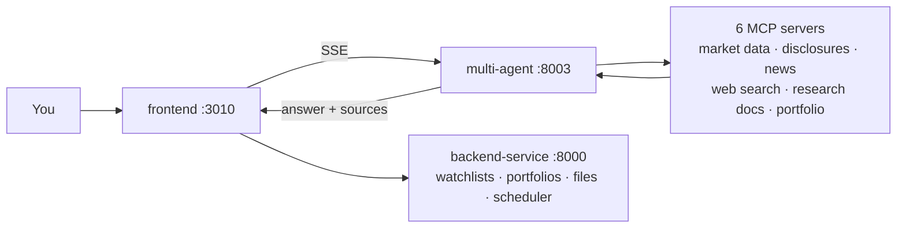

# trading-lab

Build trading bots, test them on past data, and run them — on your own machine, with your own
brokerage account. Open source and self-hosted. Not a service you sign up for.

> ⓘ For information only. Not investment advice.

## What works today

Log in and ask an investment question. A multi-agent pipeline gathers data from six financial
MCP servers and answers **with sources attached** — every number traces back to the tool call that
produced it, and unsourced figures are blocked.

Also working: watchlists, portfolios and holdings, a NAV time series, research documents, file
upload over SFTP, a weekly email summary, and an admin area.

**Bots, backtesting, and live trading are not built yet.** That's where this is going — see
[ROADMAP.md](ROADMAP.md) for the order.

## Run it

You need Python 3.12, Node 20+, [uv](https://docs.astral.sh/uv/),
[process-compose](https://github.com/F1bonacc1/process-compose), and Docker.

```bash
# 1. Create .env.development for every service (once).
#    Generates a shared JWT_SECRET and local database credentials.
python3 scripts/bootstrap_local_env.py

# 2. Install frontend dependencies (once).
cd frontend && npm install && cd ..

# 3. Start everything.
process-compose up
```

Then open <http://localhost:3010>.

**No API keys needed.** Every MCP server ships with mock financial data, so the whole stack boots
and the research chat answers out of the box. For real data, put your own key in that service's
`.env.development` and set `USE_REAL_API=true`.

For staging or production, use Docker Compose instead:

```bash
docker compose -f compose.staging.yaml up   # or compose.prod.yaml
```

Formatting and linting for the whole repo:

```bash
pre-commit run --all
```

## How the pieces fit



| Service | Port | What it does |
| --- | --- | --- |
| `frontend` | 3010 | UI, auth, and a proxy to everything else |
| `backend-service` | 8000 | Business data: watchlists, portfolios, NAV, files, scheduler |
| `multi-agent-service` | 8003 | Breaks a question into sub-tasks and calls MCP tools |
| `portfolio-mcp-service` | 8002 | Account and portfolio data (the only service that owns it) |
| `market-data-mcp-service` | 8004 | Prices, indices, FX |
| `disclosure-mcp-service` | 8005 | Filings and financials (DART, EDGAR) |
| `news-mcp-service` | 8006 | Financial news and sentiment |
| `web-mcp-service` | 8007 | Web search |
| `doc-search-mcp-service` | 8008 | Search over your own research notes (Milvus + BM25) |
| `template-mcp-service` | 8009 | Starting point for a new MCP server |
| `single-agent-service` | 8010 | A minimal agent, kept as a worked example |

The last two aren't in `process-compose.yaml` — start them by hand when you need them.

**One rule holds the design together:** no service calls an external financial API directly. It
goes through an MCP server. Adding a data source touches one place, and the agent's sources stay
traceable.

## Built with

FastAPI · LangChain · LangGraph · FastMCP · PostgreSQL · Milvus ·
Next.js · React · TypeScript · Prisma · Tailwind

## Layout

```
frontend/                 UI and API proxy
backend-service/          business data and background jobs
multi-agent-service/      the agent that answers questions
*-mcp-service/            one per data source
platform/                 nginx, sftp, logging
.docs/                    design notes and guides
```

More detail: [`CLAUDE.md`](CLAUDE.md) for conventions and data flow, [`.docs/`](.docs/) for design
notes, and a `CLAUDE.md` inside each service folder.

## Contributing

Issues and pull requests come here — there's no mirror or upstream. What you see is all there is.

- **Bugs** — include how to reproduce it and the relevant `process-compose` log.
- **Code** — branch, then open a PR against `main`. Run it locally first, and run
  `pre-commit run --all` before you commit. Conventions live in [`CLAUDE.md`](CLAUDE.md).
- **Keys stay yours.** This repo ships adapters, never credentials — some data providers forbid
  redistributing their data. Mock data means you don't need a key to contribute. Never commit a
  file with a key in it; `.env*` is gitignored and CI blocks credential patterns too.

Contributions ship under the MIT license below.

## License

[MIT](LICENSE) for the code in this repo. Dependencies keep their own licenses — see
[`THIRD-PARTY-NOTICES.md`](THIRD-PARTY-NOTICES.md).
