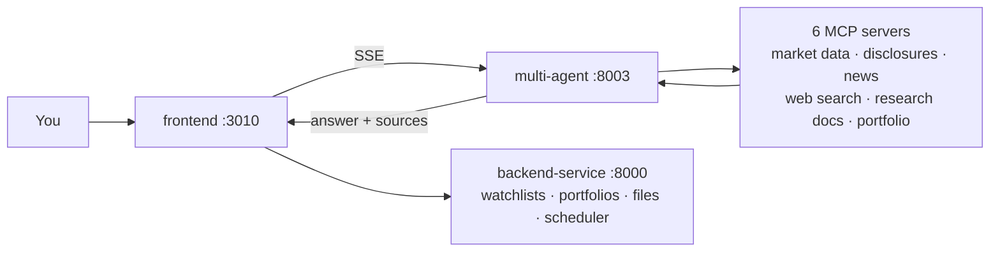

# trading-lab

Build trading bots, test them on past data, and run them — on your own machine, with your own
brokerage account. Open source and self-hosted. Not a service you sign up for.

> ⓘ For information only. Not investment advice.

## What works today

**Build a bot, then test it on past data.** Describe entry and exit rules in a form (or in a
readable strategy file), sweep a parameter grid, and every combination comes back with an equity
curve, drawdown, trade list, and ranked metrics. Costs are not hidden: the report states the fee,
slippage and transaction-tax assumptions it ran under, and what those costs actually took out of the
result.

**Load your own market data.** Point the ingest console at a source, watch the run history, and see
per-source capability — what you can pull now, what is blocked, and which blocks a key would unlock.

**Ask an investment question.** A multi-agent pipeline gathers data from six financial MCP servers
and answers **with sources attached** — every number traces back to the tool call that produced it.
Nothing is blocked: an answer with no tool evidence behind it still comes out, labeled
`no_evidence`, and figures that appear nowhere in the tool output are marked as unsourced in the
answer itself. The label is deterministic — it is read off the tool-call trace, not from the model.

**Describe a bot in plain words.** `bot-agent-service` embeds the Claude Agent SDK and turns the
conversation into the bot's settings — the form fills in as you talk, and what you save is what the
form shows. Local deployments only; it is never started in a hosted setup.

Also working: watchlists, portfolios and holdings, a NAV time series, research documents, file
upload over SFTP, a weekly email summary, and an admin area.

**Not built yet: running bots live.** No intraday signal engine, no order placement — the order path
is closed at the code level and only a strategy that passed verification will ever be promoted. See
[ROADMAP.md](ROADMAP.md) for the order.

## Run it

You need Python 3.12, Node 20+, [uv](https://docs.astral.sh/uv/),
[process-compose](https://github.com/F1bonacc1/process-compose), and Docker.

```bash
# 1. Create .env.development for every service (once).
#    Generates a shared JWT_SECRET and local database credentials.
python3 scripts/bootstrap_local_env.py

# 2. Install frontend dependencies (once).
cd frontend && npm install && cd ..

# 3. Start everything.
process-compose up

# 4. Seed the demo accounts (once, after the database is up).
docker exec -i fintech-pg psql -U fintech -d fintech < frontend/prisma/init/seed.sql
```

Then open <http://localhost:3010> and sign in:

| Account | Password | Role |
| --- | --- | --- |
| `admin@example.com` | `changeme1234` | System admin — sees `/admin` |
| `operator@example.com` | `changeme1234` | Operator — one workspace |

**These are demo credentials in a public repo.** Change them before exposing the app to anything
but your own machine.

Signing up through the UI works too, without a mail server: leave `EMAIL_HOST` empty in
`frontend/.env.development` (the default) and the verification code is printed to the frontend's
console instead of being emailed. Production never takes that path.

**No API keys needed for the data.** Every MCP server ships with mock financial data, so the whole
stack boots and every data tool answers out of the box. For real data, put your own key in that
service's `.env.development` and set `USE_REAL_API=true`.

**The research chat is the exception — it needs an LLM.** Mock data replaces the data sources, not
the model, so `bootstrap_local_env.py` leaves `ROUTER_LLM_API_KEY` and `GENERATOR_LLM_API_KEY` in
`multi-agent-service/app/.env.development` for you to fill in, and the shipped `*_LLM_BASE_URL`
defaults point at RFC 5737 documentation addresses that do not route. Set the base URL, model and
key for both roles before asking a question; `GET /agent/llm` says what is configured and
`POST /agent/llm/probe` says whether it actually answers.

For staging or production, use Docker Compose instead:

```bash
docker compose -f compose.staging.yaml up   # or compose.prod.yaml
```

Formatting and linting for the whole repo:

```bash
pre-commit run --all
```

## How the pieces fit



| Service | Port | What it does |
| --- | --- | --- |
| `frontend` | 3010 | UI, auth, and a proxy to everything else |
| `backend-service` | 8000 | Business data: watchlists, portfolios, NAV, files, scheduler |
| `multi-agent-service` | 8003 | Breaks a question into sub-tasks and calls MCP tools |
| `portfolio-mcp-service` | 8002 | Account and portfolio data (the only service that owns it) |
| `market-data-mcp-service` | 8004 | Prices, indices, FX |
| `disclosure-mcp-service` | 8005 | Filings and financials (DART, EDGAR) |
| `news-mcp-service` | 8006 | Financial news and sentiment |
| `web-mcp-service` | 8007 | Web search |
| `doc-search-mcp-service` | 8008 | Search over your own research notes (Milvus + BM25) |
| `template-mcp-service` | 8009 | Starting point for a new MCP server |
| `single-agent-service` | 8010 | A minimal agent, kept as a worked example |
| `bot-agent-service` | 8011 | Turns a conversation into a bot's settings (local deployments only) |

The last three aren't in `process-compose.yaml` — start them by hand when you need them; each one's
`README.md` has the command.

**Two data paths, one owner each.** The agent never reaches a financial API itself — it asks an MCP
server, which is what keeps its sources traceable. Market data ingestion is the other path, and it
calls vendors directly from source adapters under `backend-service/app/providers/<source>/` (Toss,
Alpaca, SEC, data.go.kr, OpenFIGI). So: a new source for the agent is a new MCP server; a new
source for ingestion is a new provider adapter. Nothing else opens a socket to a vendor.

## Built with

FastAPI · LangChain · LangGraph · FastMCP · PostgreSQL · Milvus ·
Next.js · React · TypeScript · Prisma · Tailwind

## Layout

```
frontend/                 UI and API proxy
backend-service/          business data and background jobs
multi-agent-service/      the agent that answers questions
*-mcp-service/            one per data source
platform/                 nginx, sftp, logging
.docs/                    design notes and guides
```

More detail: [`CLAUDE.md`](CLAUDE.md) for conventions and data flow, [`.docs/`](.docs/) for design
notes, and a `CLAUDE.md` inside each service folder.

## Contributing

Issues and pull requests come here — there's no mirror or upstream. What you see is all there is.

- **Bugs** — include how to reproduce it and the relevant `process-compose` log.
- **Code** — branch, then open a PR against `main`. Run it locally first, and run
  `pre-commit run --all` before you commit. Conventions live in [`CLAUDE.md`](CLAUDE.md).
- **Keys stay yours.** This repo ships adapters, never credentials — some data providers forbid
  redistributing their data. Mock data means you don't need a key to contribute. Never commit a
  file with a key in it. `.env*` is gitignored, and `pre-commit run --all` runs gitleaks over the
  tree — run `pre-commit install` so it runs on every commit. CI blocks credential patterns too
  (`test: repo` runs the same gitleaks version the hook pins), and GitHub push protection is
  a third net, but it only knows provider-format keys.

### What CI does — and what it doesn't

CI answers one question: **is the code correct?** It builds, runs every test suite, and runs the
repo-wide static scans and security scans. It does **not** decide who reviews a PR, whether the
review passed, or whether a PR may merge — an independent review agent posts its verdict as a PR
comment, a `review: passed` / `review: needs-work` label makes that verdict visible, and a bot
account turns it into a GitHub review so branch protection can act on it. Everything CI does runs
in three jobs — `test: backend`, `test: frontend`, `test: repo` — and where they run is one repo
variable: `CI_RUNNER`. Unset (the default) means GitHub-hosted `ubuntu-latest`; set it to a runner
label and the same three jobs move to self-hosted runners, with no other change to the workflow
files. **A pull request from a fork always runs on GitHub-hosted runners regardless of that
variable** — self-hosted runners are not exposed to code from forks. The review job is separate:
it always runs on a self-hosted runner, and it is skipped for fork pull requests, so a fork gets
the full build, test, and scan set but not the automated review.

Contributions ship under the MIT license below.

## License

[MIT](LICENSE) for the code in this repo. Dependencies keep their own licenses — see
[`THIRD-PARTY-NOTICES.md`](THIRD-PARTY-NOTICES.md).
